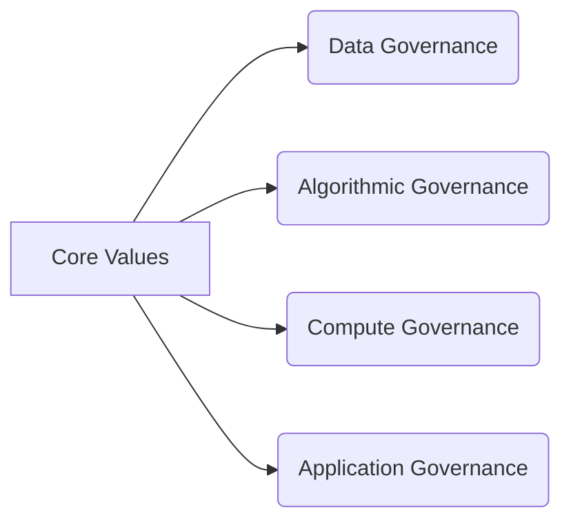
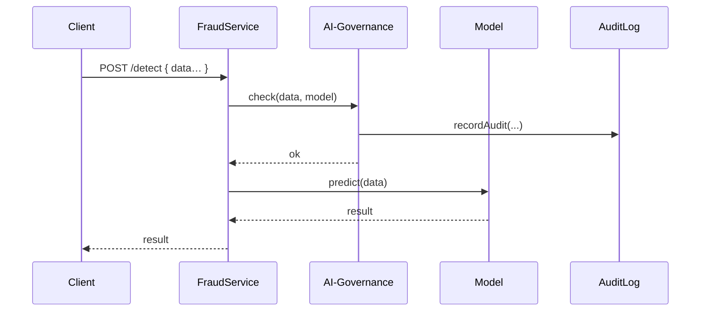

# Chapter 4: AI Governance Framework

In [Chapter 3: Business Logic Modules](03_business_logic_modules_.md) we learned how each service’s rules live in self-contained modules. Now we’ll step back and see **how we govern the entire AI lifecycle**—from data to algorithms to running models—just like a constitution that sets the rules for a country.

---

## 1. Motivation: Why an AI Governance Framework?

Imagine an agency uses an AI model to flag potential fraud in benefit applications. Without clear rules, the model might:

  - Use sensitive data without consent  
  - Make decisions that aren’t explainable  
  - Expose private information  
  - Behave unpredictably under heavy load  

We need a “constitution” for all AI in HMS-AGX to guarantee it’s **Transparent**, **Truthful**, **Safe**, **Ethical**, and **Privacy-respecting**. That’s the role of our **AI Governance Framework**.

---

## 2. Key Concepts

1. Core Values  
   - **Transparency**: decisions can be explained  
   - **Truth**: models use accurate, unbiased data  
   - **Safety**: no harmful outcomes  
   - **Ethics**: align with societal norms  
   - **Privacy**: protect personal data  

2. Institutional Structures  
   - **Policy Store**: where rules live (like a constitution)  
   - **Governance Module**: enforces rules at runtime  
   - **Audit Logs**: record every decision  

3. Governance Domains  
   - **Data Governance**: who can access or change data  
   - **Algorithmic Governance**: how models are trained and tuned  
   - **Compute Governance**: resource allocation and security  
   - **Application Governance**: how models are invoked in services  



---

## 3. Using the AI Governance Framework

Let’s see how to apply this when running an AI model for fraud detection.

### 3.1 Define Governance Policies

Create a simple config file with rules:

```js
// config/aiGovernanceConfig.js
module.exports = {
  data:   { allowSensitive: false },
  algos:  { requireExplainability: true },
  compute:{ maxThreads: 4 },
  app:    { requireAuditLog: true }
};
```
Each section maps to one domain of governance.

### 3.2 Governance Module

```js
// lib/aiGovernance/index.js
const policies = require('../../config/aiGovernanceConfig');

function check(data, modelName) {
  // 1. Data check
  if (data.containsSensitive && !policies.data.allowSensitive) {
    throw Error('Sensitive data is not allowed');
  }
  // 2. Algorithm check
  if (!modelName.isExplainable && policies.algos.requireExplainability) {
    throw Error('Algorithm must be explainable');
  }
  // 3. Compute check
  if (getThreadCount() > policies.compute.maxThreads) {
    throw Error('Compute limits exceeded');
  }
  // 4. Application check
  if (policies.app.requireAuditLog) {
    recordAudit({ data, modelName, timestamp: Date.now() });
  }
}

module.exports = { check };
```
Whenever a service runs a model, it calls `check()` to enforce policies.

### 3.3 Calling from a Service

```js
// services/fraudService.js
const aiGov = require('../lib/aiGovernance');
const model = require('../models/fraudModel');

function detectFraud(input) {
  aiGov.check(input, model);   // enforce the governance rules
  return model.predict(input);
}
```
If any rule is violated, an error is thrown and the call is blocked.

---

## 4. What Happens Under the Hood?

Here’s a minimal sequence when a client requests fraud detection:



1. **FraudService** calls **AI-Governance** to validate.  
2. Governance module records an audit entry.  
3. If all checks pass, the model runs and returns a result.

---

## 5. Internal Implementation Details

Let’s peek at how `recordAudit` could look:

```js
// lib/aiGovernance/audit.js
const fs = require('fs');
function recordAudit(entry) {
  // Append a JSON line to an audit log
  fs.appendFileSync('audit.log', JSON.stringify(entry) + '\n');
}
module.exports = recordAudit;
```
This simple logger gives us a trail of every AI decision—essential for accountability.

---

## 6. Conclusion

You’ve now seen how the **AI Governance Framework** acts like a constitution—defining core values, policies, and runtime checks to guarantee our AI is transparent, truthful, safe, ethical, and privacy-respecting.  

Next up, we’ll add a human guardrail around AI decisions in [Chapter 5: Human-In-The-Loop (HITL)](05_human_in_the_loop__hitl__.md).

---

Generated by [AI Codebase Knowledge Builder](https://github.com/The-Pocket/Tutorial-Codebase-Knowledge)