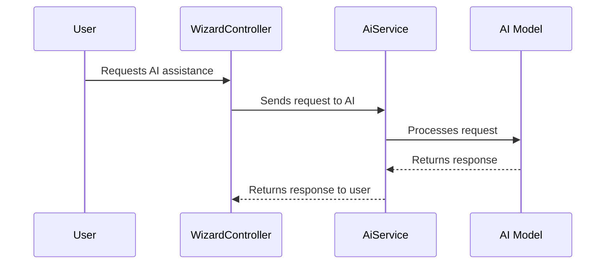

# Chapter 4: AI Integration

In the previous chapter, [Wizard](03_wizard.md), we learned how to use the Wizard to create Programs. This chapter will explore how **AI Integration** can supercharge your Program creation and provide smart recommendations. Think of it like having a helpful assistant that can suggest improvements and even generate parts of your Program for you.

## Why AI Integration?

Imagine you're creating a new Program to help people learn a new language. You know you want to include daily vocabulary exercises, grammar lessons, and pronunciation practice, but you're not sure how to structure it all.  AI Integration can help you generate a Program plan, create individual [Modules](02_modules.md), and even suggest relevant content.

## AI as Your Assistant

AI Integration in our app works behind the scenes, analyzing your Program goals and suggesting ways to achieve them.  It can:

* **Generate Program Plans:**  Suggest a sequence of [Modules](02_modules.md) based on your Program's goal.
* **Create Modules:**  Generate content for specific Modules, like writing a Nudge message or designing a Challenge.
* **Provide Recommendations:**  Suggest relevant resources, like articles or videos, to enhance your Program.

## Generating a Program Plan

Let's say your goal is to create a "7-Day Fitness Challenge" Program. You can use the AI to generate a basic plan:

```php
// Example usage (simplified)
$goal = "Help users improve their fitness in 7 days.";

$aiService = new AiService();
$plan = $aiService->getResponse(['goal' => $goal], AIRequestPrompts::plan);

// $plan will contain a JSON array outlining the Program steps.
```

This code snippet (simplified from `Models/Core/Wizard/CodifyWizardProgram.php`) uses the `AiService` to send a request to the AI. The `getResponse` function takes the user's goal and a predefined prompt (`AIRequestPrompts::plan`) as input. The AI then returns a JSON array suggesting a sequence of Modules for the 7-Day Fitness Challenge.

## Creating Modules with AI

You can also use the AI to generate content for individual Modules. For example, let's generate a Nudge message:

```php
// Example usage (simplified)
$context = "Remind users to drink water throughout the day.";

$aiService = new AiService();
$nudge = $aiService->getResponse(['context' => $context], AiPromptKeywords::NudgeModuleGeneration);

// $nudge will contain the generated Nudge message.
```

This code snippet (simplified) uses the `AiService` and a specific prompt (`AiPromptKeywords::NudgeModuleGeneration`) to generate a Nudge message based on the provided context.

## Internal Implementation

When you request AI assistance, the system sends your input to an AI model (defined in `Enums/AiModels.php`). The AI processes the request and returns a response.



The `AiService` (in `Services/AiService.php`) handles communication with the AI model. It uses different services based on the selected AI model (e.g., `Services/OpenAI.php`, `Services/Anthropic.php`, `Services/Mistral.php`).  The `AiPromptKeywords` enum (in `Enums/AiPromptKeywords.php`) defines the different prompts that can be used.

The `OpenAiResponse` model (in `Models/OpenAiResponse.php`) provides an example of how to interact with a specific AI model (OpenAI).

## Conclusion

In this chapter, we learned how AI Integration can assist in creating Programs and Modules. We saw how to generate Program plans and create Module content using the AI. We also explored how the system interacts with different AI models.

Next, we'll learn about [Multi-Tenancy](05_multi_tenancy.md), which allows multiple organizations to use the app simultaneously.


---

Generated by [AI Codebase Knowledge Builder](https://github.com/The-Pocket/Tutorial-Codebase-Knowledge)