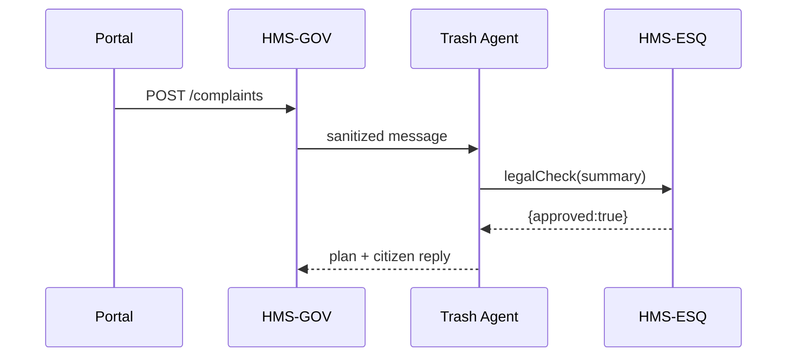

# Chapter 4: AI Representative Agent Framework (HMS-AGT)

[← Back to Chapter 3: Legal Reasoning Service (HMS-ESQ)](03_legal_reasoning_service__hms_esq__.md)

---

> “Chat-bots with badges.”

Imagine you phone your city and say  
“Trash pick-up missed my street again.”  
Within seconds a virtual clerk:

1. Reads your complaint,  
2. Checks the sanitation policy,  
3. Drafts a new pick-up route,  
4. Emails the supervisor **and** opens a ticket in the logistics system.

That virtual clerk is an **AI Representative Agent** and HMS-AGT is the starter kit that lets you build hundreds of them—one for every agency form, hotline, or back-office task.

---

## 1. Starter Use-Case – “Route My Trash Complaint”

We will build a **Trash-Complaint Agent** that:

1. Listens for a citizen complaint sent through the portal.  
2. Summarises the issue.  
3. Ensures the reply is legally sound by calling [HMS-ESQ](03_legal_reasoning_service__hms_esq__.md).  
4. Drafts an action plan (new route) and stores it.  
5. If risk is high, sends it to a human supervisor via the upcoming [Human-in-the-Loop Override](05_human_in_the_loop__hitl__override_.md).

You’ll see the whole round-trip in ~25 lines of code.

---

## 2. Key Concepts (Beginner Friendly)

| Term | “City Hall” Analogy | One-Line Job |
|------|--------------------|--------------|
| Agent Envelope | Employee ID badge | Holds credentials & permissions |
| Perception Hook | Clerk’s ears | Receives messages / events |
| Reasoning Kernel | Clerk’s brain | Figures out what to do next |
| Action Adapter | Clerk’s hands | Calls APIs, sends e-mails, writes DB rows |
| Dialogue Memory | Notebook on desk | Remembers past chats |

Keep these five parts in mind—every AGT agent is just a sandwich of them.

---

## 3. Creating Your First Agent

Below is a **minimal 18-line Node.js file** (`trashAgent.js`). Run it with `node trashAgent.js`.  
Lines are numbered in comments so we can discuss them.

```js
// trashAgent.js
import axios from 'axios';                        // 1
const AGENT_ID = 'AGT_TRASH_01';                 // 2

export async function handleComplaint(msg) {     // 3
  // --- Perception Hook ---
  const summary = `Citizen says: ${msg}`;        // 4

  // --- Legal Check via HMS-ESQ ---
  const esq = await axios.post('http://esq/advice', { // 5
     text: summary, regulationSet: ['MunicipalWaste'] // 6
  });                                               // 7
  if (!esq.data.approved) return escalate(msg);     // 8

  // --- Reasoning Kernel (toy) ---
  const plan = { route: 'R-12', priority: 'high' }; // 9

  // --- Action Adapter ---
  await axios.post('http://logistics/route', plan); // 10

  // --- Dialogue Memory (store) ---
  await axios.post('http://memory/save', {          // 11
     id: AGENT_ID, msg, plan                        // 12
  });                                               // 13

  return `✅ Scheduled extra truck on ${plan.route}`;// 14
}

function escalate(text){                            // 15
  // In real life call HITL service
  console.log('👩‍💼 Sent to supervisor:', text);      // 16
  return 'Your request is being reviewed.';         // 17
}
```

**Walk-through**

1-4  Perception: the raw citizen text becomes an internal summary.  
5-8  Safety net: we ask HMS-ESQ; if it raises a flag ➜ jump to `escalate`.  
9   Reasoning: here we hard-code a route; later you’ll swap in an ML model.  
10  Action: calls the city’s logistics API.  
11-13 Memory: stores everything for audits.  
14  Returns a citizen-friendly confirmation.

That’s a fully working (though tiny) agent!

---

## 4. Life of an AGT Agent



1. Portal request passes the front door ([HMS-GOV](01_governance_layer__hms_gov__.md)).  
2. AGT receives the cleansed payload.  
3. Legal filter via ESQ.  
4. Agent drafts and returns an action.  
5. GOV forwards the final reply to the citizen and the plan to back-office services.

---

## 5. Under the Hood – Folder Peek

```
/hms-agt
 ├─ agents/
 │    └─ trashAgent.js
 ├─ core/
 │    ├─ envelope.js      # Credentials + scopes
 │    ├─ memory.js        # Simple vector store
 │    └─ toolkit.js       # HTTP helpers, retry logic
 └─ README.md
```

### core/envelope.js (12 lines)

```js
// envelope.js
export function buildEnvelope({agentId, scopes}) {
  return {
    agentId,
    scopes,                  // e.g., ['read:complaints','write:routes']
    issuedAt: Date.now(),
    sign(){ /* cryptographic sig – skipped */ }
  };
}
```

Every outgoing call includes this envelope so downstream services know **which officer did what**.

---

### core/memory.js (16 lines)

```js
// memory.js
const store = new Map();

export function remember(id, entry){
  const list = store.get(id) || [];
  list.push({...entry, ts: Date.now()});
  store.set(id, list);
}

export function recall(id){
  return store.get(id) || [];
}
```

A **toy in-memory log**. In production this plumbs into  
[Activity Logging & Audit Trail](21_activity_logging___audit_trail_.md).

---

## 6. Extending the Agent (Two Tiny Tweaks)

1. **Plug in an LLM for smarter routing**

```js
import {chat} from 'openai-lite';
const route = await chat(`Best route for: ${summary}`);
```

2. **Add more guardrails**

Just add regulation sets:

```js
regulationSet: ['MunicipalWaste','EPA','OSHA']
```

No other code changes—the ESQ service already knows how to evaluate additional rules.

---

## 7. Frequently Asked Questions

**Q: How many agents can run at once?**  
A: Thousands—the framework is stateless; scale by adding containers.

**Q: Can one agent impersonate another?**  
A: No. Envelopes are signed and checked by HMS-GOV. Invalid signatures are rejected.

**Q: Where do complex multi-agent workflows live?**  
A: In [Agent Orchestration Service (HMS-ACT)](07_agent_orchestration_service__hms_act__.md).  
AGT focuses on the individual “civil servant,” ACT is their supervisor.

---

## 8. Key Takeaways

• HMS-AGT gives you a **plug-and-play skeleton** for building AI civil servants.  
• Five core parts—envelope, perception, reasoning, action, memory—keep the design simple.  
• Built-in hooks to [HMS-GOV](01_governance_layer__hms_gov__.md) and [HMS-ESQ](03_legal_reasoning_service__hms_esq__.md) ensure security and legality from day one.  
• With <20 lines of code you created an agent that listens, reasons, acts, and remembers.

---

### Up Next

Sometimes an agent must pause and ask a real human “Is this okay?”  
In the next chapter we’ll add that safety switch via the [Human-in-the-Loop (HITL) Override](05_human_in_the_loop__hitl__override_.md).

---

Generated by [AI Codebase Knowledge Builder](https://github.com/The-Pocket/Tutorial-Codebase-Knowledge)