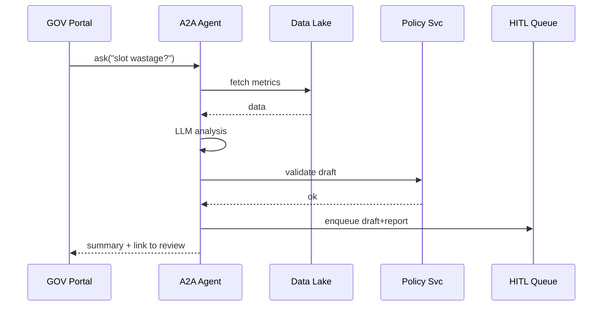

# Chapter 4: AI Representative Agent (HMS-A2A)

*(Follow-up to [Intent-Driven Navigation Engine](03_intent_driven_navigation_engine_.md))*  

---

## 1. Why Do We Need an “AI Intern” in Government IT?

Meet **Javier**, an operations officer at the *State Department of Motor Vehicles (DMV)*.

* Daily headache: more than 25 % of road-test appointments are **no-shows**.  
* Citizens complain about the 6-week waiting list.  
* Staff manually shuffle spreadsheets to free slots—an endless chore.

With **HMS-A2A** running in the background:

1. It reads live scheduling data from the Metrics Pipeline.  
2. Detects the “no-show” pattern.  
3. Auto-drafts a new **“overbook by 10 %”** queuing rule.  
4. Sends the draft to the portal for a quick human thumbs-up.  

Result: wait time drops to 2 weeks, and Javier finally gets a lunch break.

> Think of HMS-A2A as a **tireless civil-service intern** who watches every screen, learns every quirk, and politely suggests fixes before humans even notice a problem.

---

## 2. The Five Super-Powers of HMS-A2A

| # | Capability | Beginner Analogy | What It Does |
|---|------------|------------------|--------------|
| 1 | Listener | Stethoscope | Subscribes to event streams (APIs, logs, metrics). |
| 2 | Intent Parser | Language translator | Turns free-text like “renew my passport” into a machine intent for [the Navigation Engine](03_intent_driven_navigation_engine_.md). |
| 3 | Policy Drafter | Junior lawyer | Generates JSON/YAML policy proposals that slot straight into [Policy Modules](07_policy___process_modules__hms_svc__.md). |
| 4 | Workflow Optimizer | Traffic engineer | Simulates queues and suggests new routing rules (e.g., overbooking). |
| 5 | Service Liaison | Diplomat | Talks to “anything” (microservices, external APIs, databases) via the **A2A layer**. |

---

## 3. A 4-Minute Hands-On Demo

We’ll ask the agent to analyse DMV slots and propose a fix.

### 3.1 Spin Up the Agent Locally

```bash
npm install -g @hms-sme/a2a-cli
hms-a2a dev   # starts on http://localhost:7100
```

### 3.2 Fire a Query

```bash
# Ask for a bottleneck report
curl -X POST http://localhost:7100/ask \
  -d 'detect dmv slot wastage for last 14 days'
```

Sample JSON reply (truncated):

```json
{
  "summary": "Detected 27% average no-show rate.",
  "proposal": {
    "policyId": "dmv.overbook.v1",
    "description": "Overbook road-test slots by 10%.",
    "condition": "slot.type == \"road-test\"",
    "action":   "slot.allowOverbook(0.10)"
  },
  "confidence": 0.82,
  "nextStep": "Awaiting human review"
}
```

What happened?  
• The agent read metrics → matched a pattern → drafted a new `overbook` policy.  
• It wrapped the idea in a schema already understood by [HMS-GOV Portal](01_gov___admin_portal__hms_gov__.md).

---

## 4. Core Public APIs (Tiny Cheat-Sheet)

```ts
// 1. Free-text Q&A
POST /a2a/ask         body: "plain English"
         ↳ returns {summary, proposal?, answer?}

// 2. Intent Parsing for IDNE
POST /a2a/parse       body: "renew passport"
         ↳ returns {intent:"passport_renewal", confidence:0.93}

// 3. Policy Drafting (structured)
POST /a2a/draft       body: {type:"queueRule", data:{...}}
         ↳ returns {policyBlob, risks}
```

Each endpoint is **stateless**—just HTTP + JSON.  
Authentication uses the same JWT from [Role & Identity Management](10_role___identity_management__hms_sys_auth__.md).

---

## 5. How Does the Magic Work? (Step-by-Step)



Plain English:

1. The portal sends a question.  
2. A2A pulls fresh data.  
3. Runs an LLM prompt chain to spot patterns.  
4. Builds a policy blob and sanity-checks it.  
5. Queues everything for human approval (covered next chapter).  

---

## 6. Inside the Codebase (20 Lines Max Per Snippet)

### 6.1 Minimal “ask” Route

```ts
// src/routes/ask.ts
router.post('/ask', async (req, res) => {
  const q = req.body as string;
  const data = await getRelevantData(q);     // <10ms query plan
  const draft = await llm.analyse(q, data);  // OpenAI / HF / Local
  const validated = await svc.validate(draft.policy);
  await hitl.queue(validated);
  res.json(validated);
});
```

Explanation:

1. **getRelevantData** finds whatever tables match the question.  
2. **llm.analyse** returns both *explanation* and an optional *policy draft*.  
3. **svc.validate** calls [Policy Modules](07_policy___process_modules__hms_svc__.md) to ensure the blob is legal JSON.  
4. **hitl.queue** stores it for supervisor review.

---

### 6.2 Plug-in a New “Skill”

Want the agent to understand *Veterans Claims* data?

```ts
// plugins/veteransClaims.ts
export const veteransSkill = {
  trigger: /veteran|claim/i,          // basic regex
  fetchData: () => db.table('v_claims').last30d(),
  postProcess: (draft) => ({
    ...draft,
    tags: ['veterans', 'priority']
  })
};

a2a.registerSkill(veteransSkill);
```

Three lines of real logic—now HMS-A2A speaks “Veterans”.

---

## 7. Safety Nets & Governance

1. **Human-in-the-Loop**  
   Every draft is routed to [Human-in-the-Loop Oversight (HITL)](05_human_in_the_loop_oversight__hitl__.md) before activation.  

2. **Policy Guardrails**  
   The draft validator obeys the [AI Governance Framework](06_ai_governance_framework_.md) for bias checks, conflict detection, and rollback plans.  

3. **Audit Trail**  
   All prompts, data snapshots, and LLM outputs are logged to [Data Governance & Audit Trail](11_data_governance___audit_trail_.md).  

4. **Rate & Scope Limits**  
   The agent cannot call destructive actions (e.g., “delete citizen record”) without an explicit signed-off scope token issued via [Role & Identity Management](10_role___identity_management__hms_sys_auth__.md).

---

## 8. Extending A2A in Your Project

1. **Add Skill Plug-ins** – see 6.2.  
2. **Custom Prompts** – drop a `.prompt.md` file in `/prompts/` and reference it by name.  
3. **Schedule Autonomous Scans**

```yaml
# cron.yaml
- cron: "0 2 * * *"
  task: "scan_dmv_slots"
  prompt: "detect dmv slot wastage for last 14 days"
```

At 2 AM nightly, the agent scans and writes a report—no extra code.

---

## 9. Recap & What’s Next

You learned:

• Why HMS-A2A is the “smart intern” of the platform.  
• How to query it, read its JSON proposals, and plug in new skills.  
• The safety guardrails that keep AI suggestions human-approved and auditable.  

Next we’ll zoom in on that approval lane and see how real humans sign off on the agent’s ideas. 👉 [Human-in-the-Loop Oversight (HITL)](05_human_in_the_loop_oversight__hitl__.md)

---

---

Generated by [AI Codebase Knowledge Builder](https://github.com/The-Pocket/Tutorial-Codebase-Knowledge)