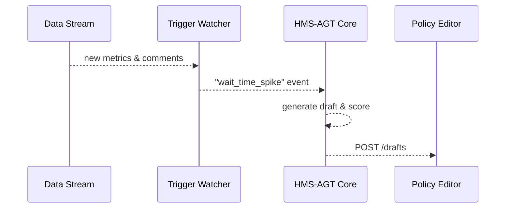

# Chapter 4: AI Representative Agent (HMS-AGT / HMS-AGX) 🤖

*Coming from [Policy Editor Interface](03_policy_editor_interface_.md)?  
Great! You just learned how a human edits a rule.  
Now meet the digital co-worker who drafts those edits automatically.*

---

## 0. Motivation – “Why can’t the computer do the boring part?”

Imagine the **U.S. Department of State** is flooded with tweets saying  
“📄 My passport took 18 weeks!”  

1. **Humans** must sift through thousands of complaints.  
2. **Analysts** crunch wait-time spreadsheets.  
3. **Junior staff** draft a new process (e.g., add an online photo checker).  

That is slow and expensive.  
The **AI Representative Agent (HMS-AGT)** is a 24 × 7 junior analyst that:

1. Reads usage logs & public comments.  
2. Spots pain-points («passport wait time»).  
3. Drafts a fix (new workflow, rule tweak).  
4. Sends the draft to the Policy Editor so a human can accept or reject.

Result: humans spend minutes reviewing instead of days researching.

---

## 1. HMS-AGT vs. HMS-AGX (one-liner difference)

| Name | Purpose | Think of it as |
|------|---------|----------------|
| HMS-AGT | **General** policy analyst agent included out-of-the-box. | “Intern” you get on day 1. |
| HMS-AGX | **Extended** or specialized agent you train for a single agency (e.g., FRA Rail-Safety bot). | “Intern with a master’s degree in rail safety”. |

> In this chapter we use **AGT**; replacing it with **AGX** later is just a config tweak.

---

## 2. Key Concepts (plain English)

| Term | What it really means |
|------|----------------------|
| Data Intake | Where the agent listens: API logs, survey CSVs, social-media feeds. |
| Trigger | Rule that tells the agent “time to think!” (e.g., 3 days above 8-week wait time). |
| Draft Blueprint | Machine-generated proposal: text edits + flowchart steps. |
| Confidence Score | 0-100 % guess of how sure the agent is that the draft is helpful. |
| Routing Target | Which human queue gets the draft (Policy Editor, Legal, Ops). |

---

## 3. Five-Minute Demo – Let the agent propose a passport fix

### 3.1 Send metrics & ask for a proposal

```js
// File: scripts/requestProposal.js  (Node, 14 lines)
import fetch from 'node-fetch'

const payload = {
  metric: 'passport_wait_days',
  last7days: [77, 78, 79, 80, 82, 83, 83],   // sample data
  comments: [
    "Still waiting for my passport!",
    "Why 18 weeks??"
  ]
}

const res = await fetch('/api/agt/propose', {
  method: 'POST',
  body: JSON.stringify(payload),
  headers: { 'Content-Type': 'application/json' }
})

console.log(await res.json())
```

Beginner explanation:

1. We POST the recent wait times + sample complaints.  
2. Endpoint `/api/agt/propose` belongs to HMS-AGT.  
3. The agent responds with a JSON draft (next section).

### 3.2 Typical JSON response

```json
{
  "draftId": "d-4821",
  "textDiff": "- citizens_wait_max: 18w\n+ citizens_wait_max: 10w",
  "workflowPatch": ["Add Step: 'Auto-validate photo upload'"],
  "confidence": 0.87
}
```

What happened?

• The agent suggests changing the max wait from **18 weeks → 10 weeks** and adding an auto-photo check to speed things up.  
• 87 % confidence means it found strong evidence in the data.

### 3.3 See it in the UI

1. On the [Policy Management Dashboard](01_policy_management_dashboard_.md) a blue badge “✍️ AI Draft” appears next to **Passport Issuance Rule**.  
2. A reviewer clicks it, landing in the [Policy Editor Interface](03_policy_editor_interface_.md) with the diff pre-loaded.  
3. The human either **Approve**, **Edit**, or **Reject**.

---

## 4. What actually fires inside HMS-AGT? (high-level)



1. **Data Stream** feeds fresh numbers.  
2. **Trigger Watcher** sees the spike.  
3. **AGT Core** calls an LLM, stitches a YAML diff + flowchart.  
4. Draft is stored and visible in the editor.

No humans touched anything up to this point.

---

## 5. Inside the Code (super-light peek)

### 5.1 Rule to detect a spike

```py
# File: agt/triggers/passport.py  (8 lines)
def should_fire(data):
    avg = sum(data['last7days']) / 7
    return avg > 60          # days

# Exposed to watcher registry
name = 'wait_time_spike'
```

Explanation: if the 7-day average > 60 days, we raise an event.

### 5.2 Draft generator (simplified)

```py
# File: agt/generators/passport.py (18 lines)
from openai import ChatCompletion

def build_draft(event):
    prompt = f"""
    You are a policy analyst. Citizens wait {event['avg']} days.
    Suggest one workflow step and edit the max_wait clause.
    Output JSON with keys textDiff, workflowPatch.
    """
    reply = ChatCompletion.create(
        model="gpt-4o-mini",
        messages=[{"role":"user","content": prompt}]
    ).choices[0].message.content
    draft = json.loads(reply)
    draft['confidence'] = 0.8  # placeholder scoring
    return draft
```

• We feed a short prompt to an LLM (OpenAI or local).  
• Result merged with a confidence score.

### 5.3 Routing the draft

```js
// File: agt/routes/postDraft.js  (10 lines)
export async function postDraft(draft) {
  await fetch('/api/editor/drafts', {
    method: 'POST',
    body: JSON.stringify(draft),
    headers: { 'Content-Type': 'application/json' }
  })
}
```

The Policy Editor now lists the draft for humans.

---

## 6. Configuring your own AGX specialist

```yaml
# File: config/agents/fra_rail_safety.yaml
extends: hms_agt
domain_knowledge: "Federal Railroad Regulations 2023"
custom_prompts:
  - id: rail_speed
    trigger: "average_delay_minutes > 15"
    instructions: |
      Propose schedule adjustments and safety notices.
```

Simply drop a YAML file; HMS-AGX will load at startup — no code needed.

---

## 7. Where does HMS-AGT connect to other pieces?

* Policy cards show draft badges (see [Policy Management Dashboard](01_policy_management_dashboard_.md)).  
* Drafts open inside the [Policy Editor Interface](03_policy_editor_interface_.md).  
* Message format between agent and editor follows the upcoming [Model Context Protocol](05_model_context_protocol__hms_mcp__.md).  
* Humans can veto drafts via [Human-in-the-Loop Oversight](11_human_in_the_loop_oversight__hitl__.md).  
* Advanced agents are published in the [Agent Marketplace](06_agent_marketplace__hms_mkt__.md).

---

## 8. Quick FAQ

**Q: What if the agent goes rogue?**  
A: All drafts require human approval unless explicitly toggled by high-grade admins, and every change is versioned.

**Q: Does it need internet to call OpenAI?**  
A: No. You can plug in a local LLM (e.g., Llama 3) by changing one line in `agt/config.yaml`.

**Q: How often does it run?**  
A: Default every 30 minutes or instantly on trigger events.

---

## 9. Summary & What’s Next

You learned:

1. The AI Representative Agent listens to real-world signals.  
2. It drafts policy or workflow changes with a confidence score.  
3. Drafts flow to human reviewers via familiar UI components.  
4. Swapping AGT for a specialized AGX is just configuration.

Next we zoom into **how the agent and the editor speak the same language**, a tiny but powerful contract called **MCP**.

➡️ Continue to [Model Context Protocol (HMS-MCP)](05_model_context_protocol__hms_mcp__.md)

---

Generated by [AI Codebase Knowledge Builder](https://github.com/The-Pocket/Tutorial-Codebase-Knowledge)