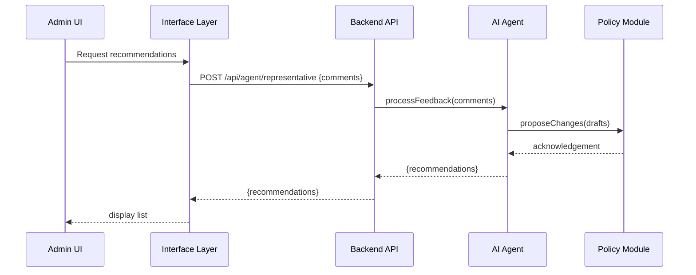

# Chapter 4: AI Representative Agent

In [Chapter 3: Intent-Driven Navigation](03_intent_driven_navigation_.md) we guided users through structured flows. Now we’ll meet our “expert consultant” – the **AI Representative Agent** – which analyzes citizen feedback, proposes process improvements, and pushes policy updates automatically.

---

## 4.1 Motivation: Your Digital City Council Consultant

Imagine the **Office of Minority Health** collects hundreds of open‐ended comments about a new outreach campaign:

- Citizens submit feedback through **HMS-MFE**.
- Manually reviewing every comment is slow.
- Policies and materials stay outdated.

Enter the **AI Representative Agent**:  
It’s like a seasoned policy analyst in a council chamber:

1. **Analyzes** all incoming feedback.  
2. **Drafts** refined outreach guidelines or ordinance tweaks.  
3. **Routes** proposed changes for final approval.

This ensures agile, data-driven updates—no more backlog.

---

## 4.2 Key Concepts

1. **Representative Agent**  
   An automated assistant authorized to review data, draft recommendations, and enact minor policy tweaks.

2. **Feedback Analyzer**  
   A module that ingests raw comments and extracts themes or pain points.

3. **Policy Optimizer**  
   Takes analyzer output and generates draft policy language or process changes.

4. **Change Enactor**  
   Pushes approved changes into the **[Policy/Process Module](07_policy_process_module_.md)** or flags major edits for human review.

---

## 4.3 Using the AI Representative Agent

Here’s how an administrator can ask the agent to process new feedback:

```js
// src/backend_api/routes/agent.js
const express = require('express');
const { processFeedback } = require('../agents/aiRepresentativeAgent');
const router = express.Router();

router.post('/agent/representative', express.json(), async (req, res) => {
  const recommendations = await processFeedback(req.body.comments);
  res.json({ recommendations });
});

module.exports = router;
```

This route:

1. Accepts `comments` (an array of strings).  
2. Calls our agent’s `processFeedback`.  
3. Returns structured `recommendations`.

### Example Request & Response

**Request**  
POST `/hms-gov/api/agent/representative`  
Body:  
```json
{ "comments": [
    "Need clearer forms on minority health grants.",
    "Application deadlines are confusing."
  ]
}
```

**Response**  
```json
{
  "recommendations": [
    "Revise grant form with step-by-step guidance.",
    "Publish a clear deadline calendar on homepage."
  ]
}
```

---

## 4.4 Under the Hood

When you invoke `processFeedback`, here’s what happens:



1. **Admin UI** calls the **Interface Layer**.  
2. It hits the **Backend API** route.  
3. The **AI Agent** analyzes feedback and drafts changes.  
4. It sends minor updates to the **Policy Module**.  
5. Finally, recommendations return to the UI.

---

## 4.5 Internal Implementation

### 4.5.1 Agent Orchestrator

File: `src/agents/aiRepresentativeAgent.js`

```js
async function processFeedback(comments) {
  const themes = await analyzeFeedback(comments);
  const drafts = await optimizePolicy(themes);
  await routeForApproval(drafts);
  return drafts;
}
module.exports = { processFeedback };
```

- `analyzeFeedback`: groups comments by topic.  
- `optimizePolicy`: generates draft text (e.g., form changes).  
- `routeForApproval`: pushes minor edits live or flags big ones.

### 4.5.2 Simplified Feedback Analyzer

```js
async function analyzeFeedback(comments) {
  // In real use: call an LLM or ML service
  return comments.map(c => c.includes('deadline')
    ? 'Deadline confusion'
    : 'Form clarity');
}
```

This example labels comments so the policy optimizer knows what to address.

---

## 4.6 What We Learned

- The **AI Representative Agent** is our automated policy consultant: it reviews feedback, drafts improvements, and enacts changes.  
- We saw how to call it via a simple **Backend API** route.  
- Under the hood, it breaks down into **analysis**, **optimization**, and **enactment** steps.  

Next up: we’ll dig into the **[Backend API](05_backend_api_.md)** that exposes these services to portals and other systems.

---

Generated by [AI Codebase Knowledge Builder](https://github.com/The-Pocket/Tutorial-Codebase-Knowledge)