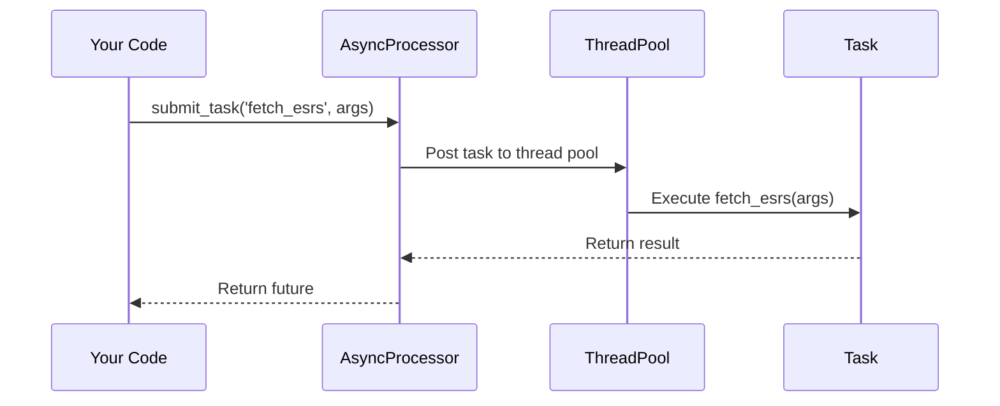

# Chapter 4: AsyncProcessor (Background Task Management)

Coming from our understanding of [Types (Data Structures)](03_types__data_structures__.md), we now need a way to manage long-running tasks efficiently. Imagine you need to fetch hundreds of [ESRs (Engineering Support Requests)](01_esr__engineering_support_request__.md) from JIRA. This could take a while, and if you do it directly in your main program, your application might freeze and become unresponsive.  That's where the `AsyncProcessor` comes in.

## What is AsyncProcessor?

The `AsyncProcessor` handles running tasks in the background, like a project manager delegating work. This prevents the main program from freezing while long tasks are running, such as fetching data from JIRA, processing large files, or training a machine learning model.

## Key Concepts

1. **Background Tasks:** These are operations that can run independently of the main program.

2. **Thread Pool:**  Imagine a pool of workers ready to take on tasks. The `AsyncProcessor` uses a thread pool to manage these background workers.

3. **Futures:** A future is like a placeholder for a result that will be available later.  You submit a task and get a future back.  You can then check if the future is complete and retrieve the result when it's ready.

## Use Case: Fetching ESRs from JIRA

Let's see how to use the `AsyncProcessor` to fetch ESRs from JIRA without blocking the main program.

```ruby
require_relative 'async_processor'

# Initialize the AsyncProcessor
AsyncProcessor.initialize

# Submit the task
future = AsyncProcessor.submit_task('fetch_esrs', { jql: 'project = MYPROJECT' })

# Do other things while the task is running...

# Check if the future is complete
if future.fulfilled?
  esrs = future.value # Get the result (an array of ESRs)
  puts "Fetched #{esrs.size} ESRs"
else
  puts "Task failed: #{future.reason}"
end

# Shutdown the processor when done
AsyncProcessor.shutdown
```

**Explanation:**

1. We initialize the `AsyncProcessor`.
2. We submit the `fetch_esrs` task with a JQL query.  This returns a `future`.
3. We can do other things while the task runs in the background.
4. We check if the `future` is fulfilled (completed successfully).
5. If it is, we retrieve the result using `future.value`.
6. If it failed, we can access the error using `future.reason`.
7. Finally, we shut down the `AsyncProcessor`.

## Internal Implementation

Here's a simplified sequence diagram showing how `submit_task` works:



The `AsyncProcessor` posts the task to the thread pool. A worker thread from the pool picks up the task and executes it.  The result is then returned, and the future is resolved.

## Code Example:  `async_processor.rb`

Let's look at a simplified snippet from `async_processor.rb`:

```ruby
# File: async_processor.rb (simplified)
module AsyncProcessor
  def self.submit_task(task_name, args = {})
    # ... (Code to create a future and post the task to the thread pool) ...
  end

  def self.execute_task(task_name, args)
    case task_name
    when 'fetch_esrs'
      # ... (Code to fetch ESRs using the JiraClient) ...
    # ... (Other task implementations) ...
    end
  end
end
```

The `submit_task` method handles creating a future and submitting the task to the thread pool. The `execute_task` method then determines which task to run based on the `task_name` and executes the corresponding code.  This might involve calling methods from other parts of the library, such as the [Client Libraries (API Wrappers)](02_client_libraries__api_wrappers__.md) to interact with external services.

## Conclusion

In this chapter, we learned about the `AsyncProcessor` and how it manages background tasks. We saw how to use it to fetch [ESRs (Engineering Support Requests)](01_esr__engineering_support_request__.md) from JIRA asynchronously and explored its internal implementation. In the next chapter, we'll delve into the [ESRClassifier (Machine Learning for ESRs)](05_esrclassifier__machine_learning_for_esrs__.md).


---

Generated by [AI Codebase Knowledge Builder](https://github.com/The-Pocket/Tutorial-Codebase-Knowledge)