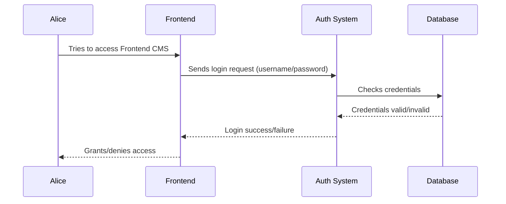

# Chapter 4: Authentication (Auth)

In the previous chapter, [Frontend CMS](03_frontend_cms_.md), we learned how to build and manage the content of our website.  But what if we want to restrict access to certain parts of our site, like admin controls or premium content? That's where Authentication (Auth) comes in.

## The Use Case: Protecting Admin Pages

Let's say you want only authorized administrators to access the Frontend CMS to edit the website content. Auth helps you lock down these pages and ensure only those with the correct credentials can get in.

## What Problem Does Auth Solve?

Without Auth, anyone could access any part of your application. This is a major security risk, especially for sensitive areas like admin panels or user profiles. Auth acts like a gatekeeper, verifying users' identities before granting them access.

## Key Concepts

1. **Credentials:** These are the pieces of information a user provides to prove their identity, typically a username and password.  Think of it like a key to unlock a door.

2. **Authentication:** The process of verifying the user's credentials.  This is like checking if the key fits the lock.

3. **Authorization:**  Determining what a user is allowed to do *after* they've been authenticated.  This is like checking if the key unlocks the specific door you're trying to open.  We'll cover Authorization in more detail in a later chapter on [Middleware](06_middleware_.md).

## Protecting Admin Pages: Step-by-Step

Here's how Auth helps protect your admin pages:

1. Alice, an administrator, tries to access the Frontend CMS.
2. The application prompts her to log in.
3. Alice enters her username and password.
4. The application verifies her credentials against the stored user data.
5. If the credentials are correct, Alice is granted access to the Frontend CMS.
6. If the credentials are incorrect, Alice is denied access.

## Under the Hood: Code Implementation

Here's a simplified look at how Auth works:



The `routes/tenant.php` file defines routes that require authentication:

```php
// File: routes/tenant.php (simplified)

// ... other code ...

Route::group(['middleware' => ['auth:api', 'role:'.config('common.superAdminRole')]], function (): void {
    // Routes within this group require authentication and the 'superAdmin' role
    Route::apiResources(['ws-frontend-cms-page' => FrontendCMSController::class]);
    // ... other protected routes ...
});

// ... other code ...
```

**Explanation:**

The `middleware` key specifies that the routes within this group require authentication using the `auth:api` middleware.  This middleware checks if the user is logged in. The `role` middleware further restricts access to users with the 'superAdmin' role.

The actual authentication logic is handled by Laravel's built-in authentication system.  When a user attempts to access a protected route, the `auth:api` middleware intercepts the request and checks for a valid authentication token.  If the token is present and valid, the request is allowed to proceed. Otherwise, the user is redirected to the login page.

## Example: Login Request

When Alice enters her credentials, the frontend sends a login request to the backend.  This request is handled by the `TenantLoginController`:

```php
// File: app/Http/Controllers/Tenant/Auth/TenantLoginController.php (simplified)

// ... other code ...

public function login(Request $request)
{
    // 1. Validate the request data (username/password).
    // ... validation logic ...

    // 2. Attempt to authenticate the user.
    if (Auth::attempt($request->only('email', 'password'))) {
        // 3. Create an authentication token.
        $token = $request->user()->createToken('api-token')->plainTextToken;

        // 4. Return the token.
        return response()->json(['token' => $token]);
    }

    // 5. Return an error if authentication fails.
    return response()->json(['message' => 'Invalid credentials'], 401);
}

// ... other code ...
```

**Explanation:**

1. The `login` method receives a request containing Alice's username and password.
2. It attempts to authenticate Alice using Laravel's `Auth::attempt` method.
3. If authentication is successful, it creates an API token for Alice.
4. It returns the token to the frontend.
5. If authentication fails, it returns an error message.

The frontend then stores this token and uses it for subsequent requests to protected routes.

## Conclusion

In this chapter, we learned about Authentication and how it helps protect sensitive areas of our application. We saw how credentials are used to verify user identities and how middleware is used to enforce authentication on specific routes. Next, we'll explore the concept of [Tenancy](05_tenancy_.md) to understand how to manage multiple separate instances of our application.


---

Generated by [AI Codebase Knowledge Builder](https://github.com/The-Pocket/Tutorial-Codebase-Knowledge)