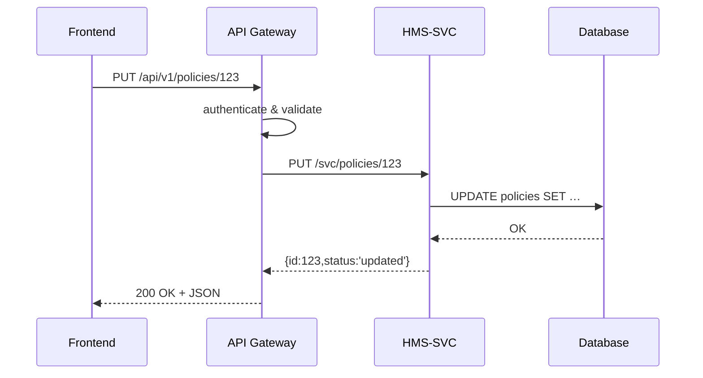

# Chapter 4: Backend API Gateway (HMS-API / HMS-MKT)

In [Chapter 3: Management Layer (HMS-SVC & HMS-ACH)](03_management_layer__hms_svc___hms_ach__.md) we saw how core services manage users, workflows, and payments. Now, imagine needing a central mailroom that routes every API request to the right department—validates it, secures it, and keeps everything flowing smoothly. That’s the job of our **Backend API Gateway**, made up of:

- **HMS-API**: routes policy updates, user actions, reporting calls  
- **HMS-MKT**: handles marketing, outreach, subscription workflows  

---

## 1. Why an API Gateway?

Use case: The Office of Community Planning and Development wants to:

1. Let a policy manager update a housing policy via a REST call.  
2. Let citizens subscribe to email updates about new programs.  

Instead of each client knowing every microservice’s address, they call one gateway:

- It authenticates and authorizes requests.  
- It enforces rate limits and versions (v1, v2).  
- It validates payloads against schemas.  
- It transforms or enriches messages.  
- It logs every request for monitoring.

Think of it as a postal sorting center: send all mail here, and it goes to the right office.

---

## 2. Key Concepts

1. **Routing**  
   Inspect the URL path and forward the call to the correct service (HMS-SVC, HMS-ACH, HMS-MKT).

2. **Validation**  
   Use JSON Schema (or similar) to check that request bodies match expected shapes.

3. **Security**  
   Authenticate callers with JWT tokens; enforce permissions.

4. **Transformation**  
   Modify headers or payloads to match downstream APIs.

5. **Rate Limiting & Versioning**  
   Protect services from overload and manage breaking changes with `/v1`, `/v2`, etc.

---

## 3. Calling the Gateway from a Client

A simple front-end call to update a policy:

```js
// hms-mfe/src/apiClient.js
async function updatePolicy(id, data) {
  const res = await fetch(`/api/v1/policies/${id}`, {
    method: 'PUT',
    headers: {
      'Content-Type': 'application/json',
      'Authorization': 'Bearer your_jwt_here'
    },
    body: JSON.stringify(data)
  })
  return res.json() // e.g. { id: 123, status: 'updated' }
}
```

And subscribing to marketing updates:

```js
// hms-mfe/src/subscribe.js
fetch('/mkt/v1/subscribers', {
  method: 'POST',
  headers: {'Content-Type': 'application/json'},
  body: JSON.stringify({ email: 'jane@doe.com' })
})
  .then(r => r.json())
  .then(console.log) // e.g. { id: 'abc123', subscribed: true }
```

Behind the scenes, these calls hit **HMS-API** or **HMS-MKT**, which do auth, validation, then proxy to the right microservice.

---

## 4. Sequence of Events



---

## 5. Under the Hood

### a) Main App Setup (hms-api/src/index.js)

```js
const express = require('express')
const rateLimit = require('express-rate-limit')
const auth = require('./middleware/auth')
const validate = require('./middleware/validate')
const policyRoutes = require('./routes/policy')

const app = express()
app.use(express.json())

// Apply rate limits: 100 calls/minute per IP
app.use(rateLimit({ windowMs: 60000, max: 100 }))

// Shared middleware
app.use(auth)
app.use(validate)

// Route traffic
app.use('/api/v1/policies', policyRoutes)

app.listen(3000, () => console.log('HMS-API running on port 3000'))
```

Explanation: We parse JSON, apply rate limits, authenticate, validate, then forward `/api/v1/policies` to our policy routes.

### b) Policy Route Proxy (hms-api/src/routes/policy.js)

```js
const express = require('express')
const fetch = require('node-fetch')
const router = express.Router()

router.put('/:id', async (req, res) => {
  // Proxy to HMS-SVC
  const svcRes = await fetch(
    `http://hms-svc/svc/policies/${req.params.id}`,
    { method: 'PUT',
      headers: { 'Content-Type': 'application/json' },
      body: JSON.stringify(req.body)
    }
  )
  const json = await svcRes.json()
  res.status(svcRes.status).json(json)
})

module.exports = router
```

Explanation: We simply forward the request and return the downstream response.

### c) Authentication Middleware (hms-api/src/middleware/auth.js)

```js
module.exports = (req, res, next) => {
  const header = req.headers.authorization || ''
  const token = header.split(' ')[1]
  // In real life: verify JWT signature and claims
  if (token !== 'valid-token') {
    return res.status(401).json({ error: 'Unauthorized' })
  }
  next()
}
```

Explanation: Reject calls without a valid JWT. Real deployments would verify signatures and scopes.

---

## 6. Why This Matters

- Beginners call one gateway URL—no need to learn many service endpoints.  
- Experts configure security, rate limits, schema validation, and versioning in one place.  
- Teams get consistent metrics, logging, and compliance checks centrally.

---

## Conclusion

You now know how **HMS-API** and **HMS-MKT** act as a “postal sorting center”—validating, securing, versioning, and routing requests to the right microservices. Next up: [Event Bus / Message Layer](05_event_bus___message_layer_.md), where we decouple services with asynchronous messaging.

---

Generated by [AI Codebase Knowledge Builder](https://github.com/The-Pocket/Tutorial-Codebase-Knowledge)