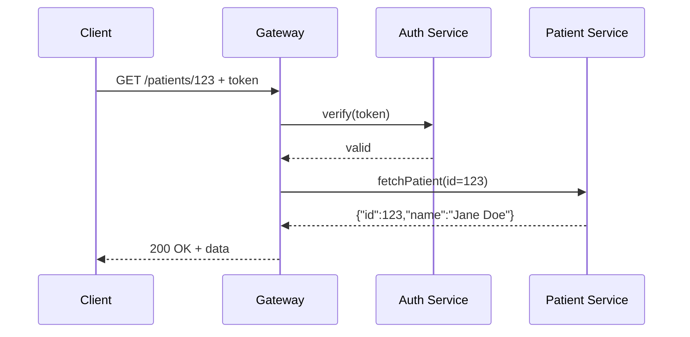

# Chapter 4: Backend API Gateway

In [Chapter 3: External System Synchronization](03_external_system_synchronization_.md), we saw how HMS-ETL keeps data in sync with outside systems. Now we'll secure and route all those calls through our **Backend API Gateway**.

---

## 1. Why a Backend API Gateway?

Imagine a federal health system that:

- Needs to let clinics update insurance policies.
- Exposes endpoints for patient record queries.
- Processes claims submissions from hospitals.

Without a gateway, each microservice would expose its own URL and security rules—chaos for clients and operators. The **API Gateway** acts like a secure service portal at a government building:

1. Verifies badges (auth tokens).  
2. Routes visitors (requests) to the correct office (microservice).  
3. Logs entries and enforces access levels.  

This centralizes routing, security, and monitoring, simplifying client integrations and operations.

---

## 2. Key Concepts

1. **Routing**  
   Maps incoming URLs and methods (GET, POST) to service handlers.  
2. **Authentication & Authorization**  
   Verifies identity and checks permissions before forwarding a request.  
3. **Rate Limiting / Throttling**  
   Prevents overload by capping calls per client.  
4. **Logging & Metrics**  
   Captures request details and performance for audits and alerts.  
5. **Load Balancing**  
   Distributes traffic across multiple service instances.

---

## 3. Using the Gateway

Below is a minimal example that:

- Registers two endpoints: one for patient queries, one for claim submissions.
- Starts an HTTP server on port 8080.

```python
# File: example_gateway.py
from hms_etl.gateway import BackendAPIGateway

gateway = BackendAPIGateway()

@gateway.route("/patients/{id}", methods=["GET"])
def get_patient(request):
    # pretend we call a patient microservice
    pid = request.path_params["id"]
    return {"status": 200, "data": {"id": pid, "name": "Jane Doe"}}

@gateway.route("/claims", methods=["POST"])
def submit_claim(request):
    # pretend we validate and forward the claim
    claim = request.json_body
    return {"status": 201, "data": {"claim_id": "CLM123"}}

gateway.start(port=8080)
```

Explanation:  
- `@gateway.route` ties a path and HTTP method to a Python function.  
- Each handler returns a simple JSON-like response.  
- `gateway.start()` spins up the HTTP listener.

---

## 4. Under the Hood: Request Flow

Here’s what happens when a client calls `GET /patients/123`:



1. **verify()** checks the token.  
2. Gateway looks up the route and calls the handler.  
3. Handler calls the microservice and returns data.  
4. Gateway logs the transaction and sends the response.

---

## 5. Inside `hms_etl/gateway.py`

Let’s peek at a simplified implementation.

### 5.1 Routing & Startup

```python
# File: hms_etl/gateway.py
class BackendAPIGateway:
    def __init__(self):
        self.routes = {}  # {(path, method): handler}

    def route(self, path, methods):
        def decorator(func):
            for m in methods:
                self.routes[(path, m)] = func
            return func
        return decorator

    def start(self, port):
        print(f"Gateway listening on port {port}")
        # Here you’d hook into an actual web server library
```

Explanation:  
- `self.routes` holds the mapping.  
- `route()` is a decorator that registers handlers.  
- `start()` would wire up a real HTTP server in production.

### 5.2 Handling Requests & Auth

```python
    def handle_request(self, request):
        key = (request.path, request.method)
        handler = self.routes.get(key)
        if not handler:
            return {"status": 404}
        if not self._authorize(request):
            return {"status": 403}
        response = handler(request)
        self._log(request, response)
        return response

    def _authorize(self, request):
        token = request.headers.get("Authorization")
        # Insert real token check here
        return token == "Bearer valid-token"

    def _log(self, request, response):
        print(f"AUDIT: {request.method} {request.path} -> {response['status']}")
```

Explanation:  
- `handle_request()` matches the route, enforces auth, then calls the handler.  
- `_authorize()` is a stub—replace it with real token or OAuth checks.  
- `_log()` prints an audit line. In real life, write to a log store.

---

## 6. Conclusion

You’ve learned how the **Backend API Gateway**:

- Centralizes routing, security, and logging.  
- Exposes friendly endpoints for clients (e.g., hospitals, clinics).  
- Forwards requests to the right microservice after checking permissions.  

Next, we’ll build on this foundation in the [Interface Layer](05_interface_layer_.md), where we shape data for frontend apps and external partners. Happy coding!

---

Generated by [AI Codebase Knowledge Builder](https://github.com/The-Pocket/Tutorial-Codebase-Knowledge)