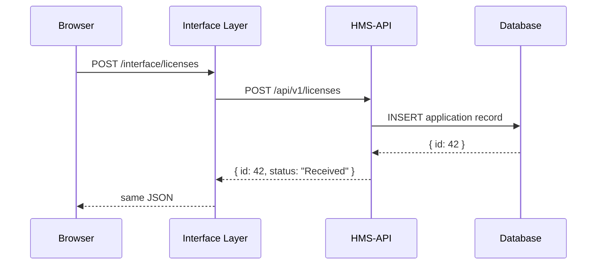

# Chapter 4: Backend API (HMS-API)

Welcome back! In [Chapter 3: Interface Layer](03_interface_layer_.md), you saw how frontends and portals forward requests. Now we’ll explore the **Backend API (HMS-API)**—the underground tunnel network that carries and manages those requests securely between departments.

---

## 1. Motivation & Central Use Case

Imagine **Maria**, a citizen applying for a small-business license online. She fills out her application form and clicks **Submit**. Behind the scenes:

1. The **Interface Layer** routes her request to HMS-API.
2. HMS-API validates the data, applies policies (e.g., “Is she eligible?”), saves it to the database, and returns a confirmation.
3. Other services (audit logs, notification email, payment processing) subscribe to HMS-API events.

Without HMS-API, each portal would have to talk directly to many services, leading to duplication, inconsistent rules, and security gaps. HMS-API centralizes all “front door” data operations, policy checks, and versioned, secure interactions.

---

## 2. Key Concepts

1. **Endpoints**  
   Defined URLs (e.g., `POST /api/v1/licenses`) where clients send requests or fetch data.

2. **Versioning**  
   Keeping `/v1/` and `/v2/` allows rolling out new features without breaking existing clients.

3. **Authentication & Authorization**  
   Middleware that checks tokens and user roles before allowing access.

4. **Data & Policy Management**  
   Central logic for CRUD operations, validation rules, and compliance checks.

5. **Secure, Logged Interactions**  
   Every request is logged for audit, and errors are handled uniformly.

---

## 3. Using HMS-API: A Simple Example

Let’s walk through a minimal HMS-API server that handles small-business license applications.

File: `hms-api/src/index.js`
```js
import express from 'express';
import licenseRoutes from './routes/licenses.js';
const app = express();
app.use(express.json());

// Mount all license-related endpoints under /api/v1/licenses
app.use('/api/v1/licenses', licenseRoutes);

app.listen(3000, () =>
  console.log('HMS-API listening on port 3000')
);
```
This sets up our main server and routes. Next, we define two endpoints:

File: `hms-api/src/routes/licenses.js`
```js
import express from 'express';
const router = express.Router();

// Apply a simple auth check
router.use((req, res, next) => {
  // Imagine a real JWT check here
  if (!req.headers.authorization) {
    return res.status(401).json({ error: 'Missing token' });
  }
  next();
});

// Submit a new application
router.post('/', (req, res) => {
  const application = req.body; // { name, businessType, ... }
  // …save to database (omitted)…
  res.status(201).json({ id: 42, status: 'Received' });
});

// Get application status
router.get('/:id', (req, res) => {
  const { id } = req.params;
  // …load from database (omitted)…
  res.json({ id, status: 'UnderReview' });
});

export default router;
```
Explanation:  
- `POST /api/v1/licenses` accepts JSON, creates a record, and returns an ID and status.  
- `GET /api/v1/licenses/42` returns the current state of the application.  
- A simple middleware checks for an `Authorization` header.

### Example Calls

Submit an application:
```
curl -X POST http://localhost:3000/api/v1/licenses \
  -H "Authorization: Bearer XYZ" \
  -H "Content-Type: application/json" \
  -d '{"name":"Maria","businessType":"Café"}'
```
→ Returns: `{ "id": 42, "status": "Received" }`

Check status:
```
curl http://localhost:3000/api/v1/licenses/42 \
  -H "Authorization: Bearer XYZ"
```
→ Returns: `{ "id": 42, "status": "UnderReview" }`

---

## 4. Internals Walkthrough

Here’s what happens step-by-step when Maria submits her form:



1. **Browser** calls the Interface Layer endpoint.  
2. Interface Layer forwards to **HMS-API**.  
3. **HMS-API** validates/authenticates, then writes to the **Database**.  
4. The new record ID flows back through the tunnel to Maria’s browser.

---

## 5. Inside HMS-API: Implementation Highlights

### a) Authentication Middleware

File: `hms-api/src/middleware/auth.js`
```js
export function checkAuth(req, res, next) {
  const token = req.headers.authorization;
  if (!token || !isValid(token)) {
    return res.status(401).json({ error: 'Invalid token' });
  }
  // Attach user info for later
  req.user = { id: 'user-123', role: 'applicant' };
  next();
}
```

### b) Versioning Strategy

- All routes live under `/api/v1/`.  
- When we change the data model, we’ll add `/api/v2/` with updated logic.  
- Clients pick which version to call—like choosing Tunnel A or Tunnel B.

---

## 6. What You’ve Learned

- Why we need a central **Backend API** to manage data, policies, and secure service-to-service calls.  
- How to define Express endpoints for creating and retrieving applications.  
- The role of **authentication middleware**, **versioning**, and **audit logging**.  
- A sequence diagram showing the flow from browser to database through HMS-API.

Next up, we’ll build and configure the underlying servers, networks, and storage for all these services in  
[Chapter 5: HMS-SYS Core Infrastructure](05_hms_sys_core_infrastructure_.md).

---

Generated by [AI Codebase Knowledge Builder](https://github.com/The-Pocket/Tutorial-Codebase-Knowledge)