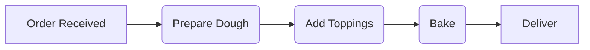
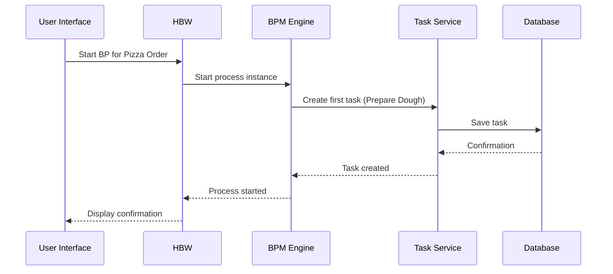

# Chapter 4: Business Process (BP)

Coming from learning about [Order Type](03_order_type.md)s, let's now explore how we can define the workflow for processing those orders. Remember Alice's pizza order?  There are several steps involved: preparing the pizza, baking it, and then delivering it.  We need a way to define and manage this sequence of steps. That's where the `Business Process (BP)` concept comes in.

## What is a Business Process (BP)?

A BP represents a workflow or sequence of steps, like the process of fulfilling a pizza order.  Think of it like a recipe.  Just like a recipe guides you through the steps of making a dish, a BP guides the system through the steps of processing an order. HOMS uses a BPM engine to manage the lifecycle of orders, assigning tasks to users at different stages.

## Key Concepts

* **Steps/Tasks:**  These are the individual actions within the process.  For a pizza order, steps might include "Prepare Dough", "Add Toppings", "Bake", and "Deliver".  Each step can be assigned to a specific user or group. You'll learn more about this in the [Task](05_task.md) chapter.
* **Workflow:** The order in which the steps are executed.  For a pizza order, "Prepare Dough" comes before "Add Toppings".
* **BPM Engine:** The software that manages the execution of the BP.  It keeps track of which step is currently active, who is responsible for it, and what the next step is.

## Alice's Pizza Order BP

Let's define a simple BP for Alice's pizza order:



This diagram shows the workflow for Alice's pizza order.  The order moves from "Order Received" to "Prepare Dough" to "Add Toppings" to "Bake" and finally to "Deliver".

## Using a BP

When Alice places her pizza order, the system starts the corresponding BP.  The BPM engine then creates the first [Task](05_task.md) – "Prepare Dough" – and assigns it to the chef.  Once the chef completes the task, the engine moves to the next step – "Add Toppings" – and creates a corresponding task for another user, and so on.

## Under the Hood

When an [Order](02_order.md) is created, the [Hydra BPM Widget (HBW)](08_hydra_bpm_widget__hbw_.md) interacts with the BPM engine to start the appropriate BP.



The `HBW::Widget` (located in `hbw/app/models/hbw/widget.rb`) handles the interaction with the BPM engine. The `start_bp` method is used to initiate a new process instance.

```ruby
# hbw/app/models/hbw/widget.rb (simplified)
@adapter.start_process(bp_code, current_user_identifier, entity_code, entity_class, initial_variables)
```

This code starts a new process instance for the given `bp_code` (e.g., "pizza_order_process").

The BPM engine uses the `HBW::Task` model (located in `hbw/app/models/hbw/task.rb`) to represent individual tasks within the process.

```ruby
# hbw/app/models/hbw/task.rb (simplified)
task = HBW::Task.get_task_by_id(id)
```

This code retrieves a specific task from the BPM engine based on its ID.

## Conclusion

You've learned about the `Business Process (BP)` concept and how it defines workflows for processing orders.  You've seen how it orchestrates different steps and assigns [Task](05_task.md)s to users. Next, let's explore those individual tasks in more detail. [Next: Task](05_task.md)


---

Generated by [AI Codebase Knowledge Builder](https://github.com/The-Pocket/Tutorial-Codebase-Knowledge)