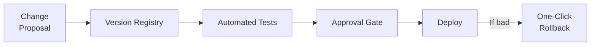
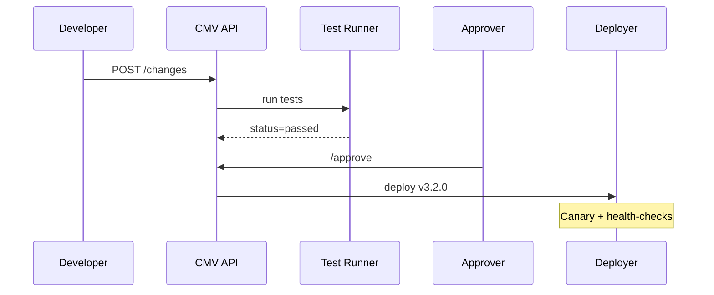
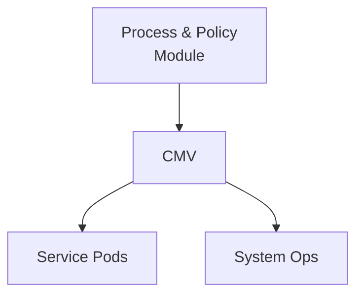

# Chapter 4: Change Management & Versioning
*Coming from [Process & Policy Module](03_process___policy_module_.md).*

---

## 1. Why Bother? – A 60-Second Story

Last night a federal judge ruled that the **Unemployment Insurance** formula must exclude *seasonal bonuses*—effective **tomorrow morning**.  
Without a safety net, dozens of microservices would need an emergency patch; one typo could mis-pay thousands of citizens.

**Change Management & Versioning (CMV)** gives every update a “seatbelt”:

1. Capture the change (like **“track changes”** in Word).  
2. Auto-run tests so we know it still works.  
3. Ask a human (or two) to approve.  
4. Let us **click once** to roll back if Congress or courts flip the rule again.

No drama, no 2 a.m. fire drills.

---

## 2. Bird’s-Eye View



Think of CMV as a moving sidewalk: once you step on, the system carries the change through every checkpoint automatically.

---

## 3. Five Key Concepts (Kid-Friendly Analogies)

| Concept | Real Meaning | Analogy |
|---------|--------------|---------|
| Version | Snapshot of code/rules | A new edition of a textbook |
| Change Set | The diff between versions | Red ink marks in the margins |
| Automated Test | Script that checks behavior | The textbook’s answer key |
| Approval Gate | Human sign-off | Teacher’s final stamp |
| Rollback | Restore previous version | Pull the old edition off the shelf |

---

## 4. Hands-On Walk-Through

We will:

1. Propose a change that removes *seasonal bonuses*.  
2. Watch tests run automatically.  
3. Approve & deploy.  
4. Roll back (just to prove we can).

### 4.1 Propose the Change

```python
# propose_change.py
import requests, json
change = {
  "target": "ui_formula.py",
  "diff": "- income += seasonal_bonus"
}
r = requests.post("https://scm.hms.gov/changes",
                  json=change)
print(r.json())  # ➜ {"changeId":"CH-501","version":"3.2.0"}
```

Explanation:  
We send a minimal JSON diff. CMV stores it as **version 3.2.0**.

### 4.2 Observe Test Results

```python
# poll_status.py
import time, requests
while True:
    s = requests.get("https://scm.hms.gov/changes/CH-501").json()
    print(s["status"])     # "testing", "failed", or "passed"
    if s["status"] != "testing": break
    time.sleep(3)
```

Behind the scenes CMV spun up a container, executed unit & integration tests, and updated the status.

### 4.3 Approve & Deploy

```python
# approve.py
requests.post("https://scm.hms.gov/changes/CH-501/approve",
              headers={"X-User":"director@labor.gov"})
```

Result: version **3.2.0** now powers every Unemployment Insurance calculation.

### 4.4 Instant Rollback (If Needed)

```python
# rollback.py
requests.post("https://scm.hms.gov/versions/3.1.4/activate")
```

With one call we’re back to version **3.1.4**—the pre-court-order logic.

---

## 5. What Happens Under the Hood?



Only five actors—easy to reason about, easy to debug.

---

## 6. Minimal Internal Code Snippets

### 6.1 Version Registry (file: `registry.py`)

```python
VERSIONS = {}          # id -> metadata

def save(change_id, diff):
    ver = _next_version()
    VERSIONS[ver] = {"change": diff, "status":"testing"}
    return ver
```

Stores version metadata in an in-memory dict for demo purposes.

### 6.2 Test Runner Stub (file: `runner.py`)

```python
import subprocess, registry
def run_tests(ver):
    # checkout code at 'ver' (skipped)
    ok = subprocess.call(["pytest","-q"]) == 0
    registry.VERSIONS[ver]["status"] = "passed" if ok else "failed"
```

Runs `pytest` and updates status.

### 6.3 One-Click Rollback (file: `rollback.py`)

```python
import registry, deployer
def activate(ver):
    if registry.VERSIONS[ver]["status"]!="passed":
        raise Exception("Unsafe version")
    deployer.switch_to(ver)   # abstracts K8s or Lambda routing
```

Bare-bones safety check before switching traffic.

(All files keep well under 20 lines.)

---

## 7. Where This Fits in the Grand Scheme

CMV glues together the policy-focused work from [Process & Policy Module](03_process___policy_module_.md) and the operational runtime we’ll explore next in [Management Layer (HMS-SVC & HMS-SYS)](05_management_layer__hms_svc___hms_sys__.md).



PPM decides **what** should change; CMV guarantees **how** it changes safely.

---

## 8. Quick Tips & Best Practices

1. Tag versions semantically (e.g., `major.minor.patch`).  
2. Keep tests short—fast feedback wins.  
3. Require at least **two** approvers for production.  
4. Store rollbacks for 90 days; auditors love history.  
5. Automate “post-deployment smoke tests” to catch surprises.

---

## 9. Recap

• CMV tracks every alteration like a meticulous librarian.  
• Automated tests + human gates mean fewer late-night emergencies.  
• Rollbacks are literally one API call.  
• The mechanism is lightweight enough to demo in ~60 lines of Python.

Ready to see how the running services read these versions at runtime?  
Head over to [Management Layer (HMS-SVC & HMS-SYS)](05_management_layer__hms_svc___hms_sys__.md).

---

Generated by [AI Codebase Knowledge Builder](https://github.com/The-Pocket/Tutorial-Codebase-Knowledge)