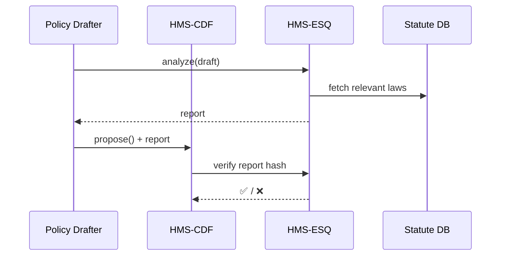

# Chapter 4: Compliance & Legal Reasoner (HMS-ESQ)

*(picks up from [Chapter 3: Policy Engine – HMS-CDF](03_policy_engine___hms_cdf__codified_democracy_foundation__.md))*  

---

## 1  Why do we need HMS-ESQ?

Picture the **Environmental Protection Agency (EPA)** drafting a new rule that says:

> “All citizen-submitted water-quality samples must be published within 7 days.”

Great for transparency!  
But wait …

* Are home addresses hidden (Privacy Act)?  
* Do national-security sites require redaction (FOIA Exemption 1)?  
* Does the 30-day public-notice statute, 5 U.S.C. § 553(c), apply?

Before any of this becomes law, HMS-ESQ acts as the EPA’s always-on in-house counsel.  
It scans the draft, flags conflicts, proposes safer wording, and attaches the exact legal citations an external auditor will ask for next year.

Think of it as:

```
Spell-checker  ➜ spelling errors
HMS-ESQ        ➜ legal & compliance errors
```

---

## 2  Key Concepts (Beginner Friendly)

| Idea | Analogy | Why it matters |
|------|---------|----------------|
| **Statute Graph** | Huge family tree | Links every § of U.S. Code, FOIA rule, privacy law. |
| **Risk Flag** | Yellow sticky note on a page | Marks “something might be illegal here.” |
| **Suggestion** | Lawyer’s red pen | Safer wording or process tweak. |
| **Citation Bundle** | Footnotes | Ready-made list of § references for auditors. |
| **Pre-Merge Gate** | Turnstile | No rule can enter production unless HMS-ESQ says ✅. |

---

## 3  Quick-Start: Run a Check on Your Draft Rule

We’ll reuse the **USPTO fee** proposal from last chapter and see HMS-ESQ in action.

### 3.1 Save the draft text

`draft_rule.txt`

```
§1.20(e) The renewal fee for small entities is lowered from $400 to $150.
The change is effective immediately on publication.
```

### 3.2 One-line analysis

```python
# file: run_check.py (18 lines)
from hms_esq import EsqClient      # ← tiny SDK

esq = EsqClient(agency="USPTO")

report = esq.analyze(
    text_path="draft_rule.txt",
    context=["FEE_CHANGE", "SMALL_ENTITY"]
)

print(report.as_markdown())
```

Explanation  
1. `analyze()` uploads the text plus optional *context tags*.  
2. The client waits ~5 s and downloads a rich report in markdown.

### 3.3 Sample output (truncated)

```markdown
## HMS-ESQ Compliance Report
Status: ❌ 2 High, ⚠️ 1 Medium, ✔️ 4 Passed

| Risk | Location | Reason | Suggested Fix |
|------|----------|--------|---------------|
| HIGH | line 2   | Violates 35 U.S.C. §41(h)(2) – 60-day notice required. | “effective 60 days after publication” |
| HIGH | line 1   | Fee < cost-recovery floor (OMB Circular A-25). | Set minimum $300 or provide subsidy justification. |
| MED  | overall  | FOIA reading-room update missing. | Auto-generate §552(a)(2) notice. |
```

Notice how HMS-ESQ already tells you *what* is wrong *and* *how* to fix it.

---

## 4  Fix, Re-run, and Merge

1. Edit the draft per suggestions.  
2. Re-run `analyze()` until the report is ✅.  
3. Attach the green report when submitting a **merge** in [HMS-CDF](03_policy_engine___hms_cdf__codified_democracy_foundation__.md).  
4. The Pre-Merge Gate checks the report hash; only green passes.

---

## 5  What Happens Behind the Curtain?

### 5.1 Bird’s-eye flow



Plain-English steps  
1. ESQ tokenizes the draft.  
2. It cross-references any phrase that matches a node in the **Statute Graph**.  
3. NLP rules + expert system decide risk levels.  
4. It returns a signed, versioned report (`sha256:abcd…`).  
5. HMS-CDF trusts only reports signed by ESQ.

### 5.2 Tiny peek at the rule-matcher

```python
# file: matcher.py (15 lines)
import re

def find_statutes(text):
    pattern = r'(\d+\s*U\.S\.C\.\s*§\s*\d+[a-z]*)'
    return re.findall(pattern, text)

# demo
print(find_statutes("See 5 U.S.C. § 553(c) and 35 U.S.C. §41(h)(2)."))
# ➜ ['5 U.S.C. § 553(c)', '35 U.S.C. §41(h)(2)']
```

Explanation  
A super-light regex grabs citations so ESQ knows which laws to pull into the reasoning engine.

### 5.3 Simple risk rule (pseudo)

```python
# file: risk_rules.py (12 lines)
def fee_change_too_low(amount):
    floor = 300        # from OMB Circular A-25
    if amount < floor:
        return {
            "level": "HIGH",
            "reason": "Fee below cost-recovery floor.",
            "citation": "OMB A-25 §6(b)"
        }
```

Every rule follows this tiny structure—easy for agency lawyers to extend.

---

## 6  How HMS-ESQ Fits into the Whole Stack

```
Drafter IDE ──► HMS-ESQ ──► green report ──► HMS-CDF merge
                    ▲
Citizen data ◄─────┘
```

* If **HMS-OPS** later detects a live error, the incident log already contains ESQ’s citation bundle for auditors.  
* **AI Representative Agents** (see [Chapter 11](11_ai_representative_agent_.md)) can draft rules but **cannot** bypass ESQ.

---

## 7  Beginner FAQ

**Q 1:** Do I need to know law jargon?  
*No.* ESQ’s suggestions are plain English with links to the source statute.

**Q 2:** Can ESQ auto-fix my draft?  
Yes. Pass `auto_fix=True` to `analyze()` and it will return an amended text file you can review.

**Q 3:** How big is the statute database?  
Roughly 15 GB compressed; shipped as a Docker volume updated monthly.

---

## 8  Recap & Next Steps

You learned how HMS-ESQ:

1. Scans any draft policy for conflicts with federal statutes, FOIA and privacy laws.  
2. Generates an actionable, signed report.  
3. Blocks unsafe rules from ever reaching production.

With legal safety nets in place, it’s time to see **where all the data actually lives and how it’s shared**. Continue to [Chapter 5: Data Core (HMS-DTA)](05_data_core__hms_dta__.md).

---

Generated by [AI Codebase Knowledge Builder](https://github.com/The-Pocket/Tutorial-Codebase-Knowledge)