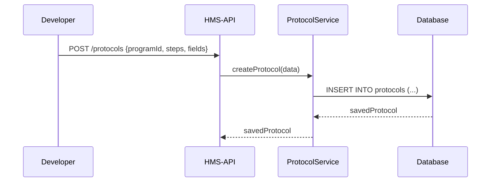
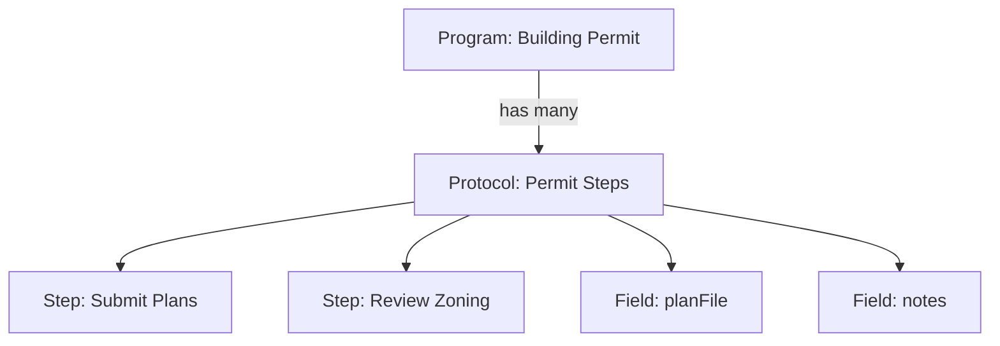

# Chapter 4: Core Protocol Model

In [Chapter 3: Core Program Model](03_core_program_model_.md) we learned how to create a **Program**—the project binder for an initiative. Now, we’ll define its **Protocol**—the detailed rulebook every program follows, like the formal process to approve a building permit.

---

## 1. Motivation: Formalizing Every Step

Imagine your “Building Permit Program” needs a multi-stage process:

1. Citizen submits plans.  
2. Plan reviewer checks zoning.  
3. Site inspector visits the lot.  
4. Manager approves the permit.  
5. System issues a permit document.

A **Protocol** stores these steps, the data fields each step needs, and links back to the parent **Program**. Frontends read the Protocol to render dynamic forms (`v-imask-input` for IDs, `textarea-addon` for comments), and backends enforce that you can’t skip steps.

---

## 2. Key Concepts

- Protocol  
  - A container of rules and workflows for a Program.  
- Step  
  - One stage in the workflow (e.g. “Site Inspection”).  
- Field  
  - A data input required at a step (e.g. “Inspector Notes”).  
- programId  
  - The foreign key linking back to the **Program** ([Chapter 3](03_core_program_model_.md)).

Analogy: Think of Protocol as a legislative rulebook; each Step is a clause, each Field is a required form entry.

---

## 3. Getting Started: Create & Fetch a Protocol

Here’s how to **create** a Protocol for your Building Permit Program, then **fetch** its details.

```js
// createProtocol.js
const { ProtocolService } = require('hms-api')

async function run() {
  const protocol = await ProtocolService.createProtocol({
    programId: 'program-456',
    name: 'Building Permit Process',
    steps: [
      'Submit Plans', 'Review Zoning', 'Site Inspection',
      'Manager Approval', 'Issue Permit'
    ],
    fields: [
      { step: 'Submit Plans', key: 'planFile', type: 'file' },
      { step: 'Site Inspection', key: 'notes', type: 'text' }
    ]
  })
  console.log('✅ Protocol created:', protocol.id)
}
run().catch(console.error)
```
This returns:
- `id`: unique Protocol ID  
- `steps` array  
- `fields` definitions  

Now fetch it:
```js
// getProtocol.js
const { ProtocolService } = require('hms-api')

async function run() {
  const p = await ProtocolService.getProtocol('protocol-789')
  console.log('Protocol Steps:', p.steps)
  console.log('Required Fields:', p.fields)
}
run().catch(console.error)
```

---

## 4. Under the Hood: Call Sequence

When you call `createProtocol`, here’s the minimal flow:



1. Dev hits `/protocols`.  
2. API routes to `ProtocolService.createProtocol`.  
3. Service inserts into DB and returns the record.

---

## 5. Internal Implementation

### 5.1 Service Layer (`src/services/protocol.service.ts`)
```ts
import { v4 as uuid } from 'uuid'
import { protocolRepo } from '../repositories/protocol.repo'

export async function createProtocol(data: {
  programId: string
  name: string
  steps: string[]
  fields: any[]
}) {
  const id = uuid()
  const record = await protocolRepo.insert({ id, ...data })
  return record
}
```
- `uuid()` generates a unique ID.  
- `protocolRepo.insert()` handles persistence.

### 5.2 Repository Layer (`src/repositories/protocol.repo.ts`)
```ts
// Pseudocode with your ORM
export const protocolRepo = {
  insert: async (rec) =>
    db.table('protocols').insert(rec).returning('*'),
  findById: async (id) =>
    db.table('protocols').where({ id }).first()
}
```
This module talks directly to your SQL or ORM.

---

## 6. Visualizing Protocol & Program



- The Protocol belongs to one Program.  
- It “has many” Steps and Fields.

---

## 7. Conclusion & Next Steps

You’ve learned how to:

- Define a **Protocol**: a step-by-step rulebook for any Program.  
- Create and fetch protocols with the HMS-API SDK.  
- Peek under the hood at service and repository code.  
- Visualize the link between Programs and Protocols.

Next up: dive into policy enforcement in **[Chapter 5: Policy Management API](05_policy_management_api_.md)**.

---

Generated by [AI Codebase Knowledge Builder](https://github.com/The-Pocket/Tutorial-Codebase-Knowledge)