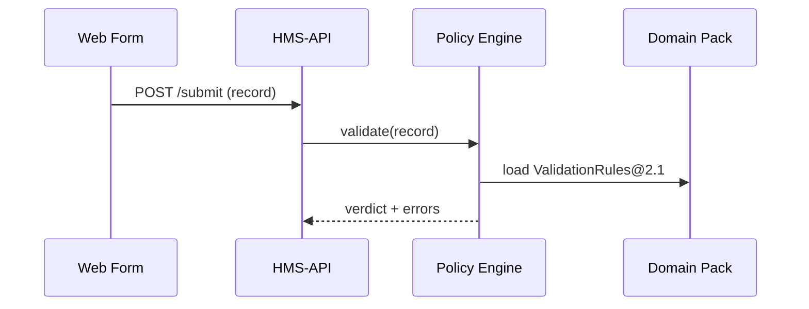

# Chapter 4: Domain Packs (Health, Finance, Education, etc.)

*(continuing from [Chapter 3: Process & Policy Engine](03_process___policy_engine_.md))*  

---

## 1. Why Bother With “Packs” at All?

Imagine the **Centers for Disease Control (CDC)** has 10 days to launch an online **Immunization Certificate** service so travelers can prove they’ve had their COVID booster:

1. Data must follow **HL7 FHIR** medical schemas.  
2. Forms must hide or mask fields that are *Protected Health Information (PHI)* under **HIPAA**.  
3. The AI chatbot that helps travelers must **never** reveal diagnoses.  
4. Auditors need a complete log—failure means federal fines.

You could spend weeks wiring all of this by hand—or you can unpack the **Health Domain Pack** and be 80 % done before lunch. That is the power of Domain Packs.

---

## 2. Mental Model: “Pre-Boxed LEGO Sets” 🧰

| LEGO Set | HMS Domain Pack Item | Why It Matters |
|----------|---------------------|----------------|
| Instruction booklet | **Schema Library** | Exactly which bricks (fields) you can use |
| Pre-printed bricks | **Smart Forms** | Auto-generated, accessible UI widgets |
| Stickers | **Validation Rules** | Keep parts where they belong (e.g., SSN format) |
| Mini-figures | **AI Micro-Models** | Ready-trained NLP for the domain |
| Extra safety sheet | **Compliance Templates** | “Do & Don’t” guardrails (HIPAA, FISMA, FERPA) |

Unbox a pack and you instantly get these five ingredients—already tested, versioned, and signed by Governance.

---

## 3. Meet the Flagship Packs

1. **Health Pack**  
   • HL7 FHIR schemas, HIPAA validators, de-identification AI.  
2. **Finance Pack**  
   • OFX / ISO-20022 schemas, anti-money-laundering checks, FISMA controls.  
3. **Education Pack**  
   • Common Education Data Standards (CEDS), FERPA privacy masks, plagiarism-detection AI.  

All packs live in the **Domain Pack Registry** (`hms://registry/packs`).

---

## 4. Quick-Start: Using a Pack in 6 Minutes

### 4.1 Install the Pack (CLI)

```bash
hms pack add health@2.1
```

Explanation—One command:  
1. Downloads **Health Pack v2.1**.  
2. Registers it with the [Governance Portal (HMS-GOV)](02_governance_portal__hms_gov__.md).  
3. Hot-reloads the [Process & Policy Engine](03_process___policy_engine_.md).

### 4.2 Generate a Form

```bash
hms pack form \
  --schema "ImmunizationRecord" \
  --out   "forms/immunization.html"
```

This scaffolds an accessible HTML form with PHI fields auto-masked.

### 4.3 Validate Incoming Data (Python, 12 lines)

```python
import hms_sdk as hms

doc = hms.load_json("sample_record.json")

result = hms.validate(
    pack="health",
    schema="ImmunizationRecord",
    data=doc
)

print(result.ok)        # ➜ True / False
print(result.errors)    # list of human-readable errors
```

• `validate()` applies both schema rules *and* HIPAA red-flags shipped in the pack.

### 4.4 Ship to Production

```bash
git add forms/ && git commit -m "Use Health Pack 2.1"
hms deploy
```

CI/CD verifies the pack’s digital signature before allowing deploy (no rogue code!).

---

## 5. Under the Hood—What Actually Fires?



Only four actors; the Domain Pack behaves like a plug-in library that PPE consults at run-time.

---

## 6. Anatomy of a Pack Folder

```
health_pack/
├─ schemas/
│   └─ ImmunizationRecord.yaml
├─ rules/
│   └─ hipaa_redflags.yml
├─ ai-models/
│   └─ deidentify.onnx
└─ manifest.yaml
```

`manifest.yaml` (excerpt, 17 lines):

```yaml
name: "health"
version: "2.1"
compliance:
  - HIPAA
schemas:
  - ImmunizationRecord
aiModels:
  deidentify:
    file: ai-models/deidentify.onnx
    purpose: "Mask PHI"
```

Manifest fields help Governance verify that every artifact matches required statutes before publication.

---

## 7. Extending or Overriding a Pack (2-Step Recipe)

1. **Fork the Rule File**

```bash
hms pack fork health/rules/hipaa_redflags.yml \
  --dest agency_overrides/
```

2. **Add Your Override**

```yaml
# agency_overrides/hipaa_redflags.yml
flags:
  - field: "contact.phone"
    maxLength: 10   # stricter than default (15)
```

During validation PPE merges agency overrides **after** base rules, producing predictable behavior.

---

## 8. How Packs Remain Compliant

• Digital signature from **HMS-GOV** guarantees integrity.  
• [Identity & Access Management (IAM)](06_identity___access_management__iam__.md) restricts *who* may publish or override a pack.  
• Each pack ships audit metadata so [Observability & Metrics Pipeline](14_observability___metrics_pipeline_.md) can trace failures back to the exact pack version.

---

## 9. Frequently Asked Beginner Questions

**Q: Do I need to understand HL7 to use the Health Pack?**  
A: Nope! The pack abstracts it away—just feed JSON that matches the sample template.

**Q: Can two packs be active at once?**  
A: Yes. PPE resolves pack namespacing (`health.ImmunizationRecord`, `finance.TaxForm`) to avoid collisions.

**Q: What if a regulation changes?**  
A: Governance publishes `health@2.2`; the hot-reload mechanism swaps it in under 60 s, just like a policy update.

---

## 10. Summary & What’s Next

You now know:

• **Domain Packs** are pre-boxed LEGO sets containing schemas, forms, rules, AI, and compliance guardrails.  
• Installing one line (`hms pack add health@2.1`) turbo-charges your project with domain expertise.  
• PPE and other HMS layers treat packs as plug-ins—no code rewrites needed.  

Next we’ll see how requests flow through a secure front door in [Chapter 5: API Gateway & Policy Endpoints (HMS-API)](05_api_gateway___policy_endpoints__hms_api__.md).

---

Generated by [AI Codebase Knowledge Builder](https://github.com/The-Pocket/Tutorial-Codebase-Knowledge)