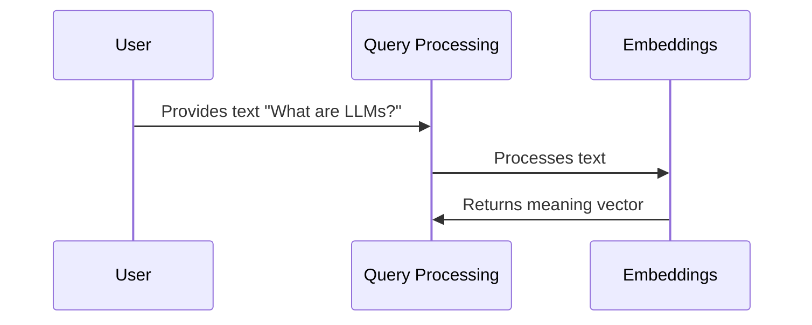

# Chapter 4: Embeddings

In the previous chapter, [Vector Store](03_vector_store_.md), we learned how our chatbot organizes information for efficient searching.  But how do we transform text into a format that the Vector Store can understand? This is where *Embeddings* come in.

Imagine you want to teach a computer about the meaning of words.  You can't simply give it a dictionary because it doesn't understand relationships between words. Embeddings solve this problem by representing words and phrases as vectors (lists of numbers).  These vectors capture the semantic meaning, allowing the computer to understand relationships between words.

## What are Embeddings?

Embeddings are like translating words into a numerical language that the "meaning library" (Vector Store) can understand.  Similar words have similar vectors, and dissimilar words have very different vectors.  This allows the chatbot to understand that "LLM" and "Large Language Model" are related, even if they aren't written exactly the same way.

## How Embeddings Work

Let's break down the process with a simple example:

1. **Text Input:** You provide a piece of text, like "What are LLMs?".

2. **Embedding Model:** An embedding model (like OpenAI's `text-embedding-3-small`) takes the text as input.

3. **Vector Output:** The model outputs a vector (a list of numbers) that represents the meaning of the input text.  This vector captures the essence of the question.



## Embeddings in Code

```python
# backend/embeddings.py (simplified)
from langchain_openai import OpenAIEmbeddings

def get_embeddings_model():
    return OpenAIEmbeddings(model="text-embedding-3-small", chunk_size=200)

# ... later in backend/retrieval.py ...
embedding_model = get_embeddings_model()
embeddings = embedding_model.embed_query("What are LLMs?")
# embeddings now contains the vector representation of the question
```

This code shows how to use the `OpenAIEmbeddings` model to generate an embedding for the question "What are LLMs?". The `chunk_size` parameter controls how much text is processed at a time.

## Looking Under the Hood: `embed_query`

When `embed_query` is called:

1. The input text ("What are LLMs?") is sent to the OpenAI API.
2. The OpenAI API uses its embedding model to generate a vector representation of the text.
3. This vector is returned by the `embed_query` function.

```python
# backend/retrieval.py (simplified)
from langchain_weaviate import WeaviateVectorStore

# ... other code ...

with retrieval.make_retriever(config) as retriever:
    # ... inside get_relevant_documents ...
    query_embedding = embedding_model.embed_query(query)
    # ... use query_embedding to search the Vector Store ...
```

This simplified code snippet from `retrieval.py` shows how the embedding model is used to generate an embedding for the `query` before searching the [Vector Store](03_vector_store_.md).

## Conclusion

Embeddings are the bridge between human language and the numerical representation used by the Vector Store. By converting text into meaning vectors, we enable the chatbot to understand the semantic relationships between words and phrases. This allows for more accurate and relevant retrieval of information. Now that we understand how embeddings work, let's explore how we add new information to our Vector Store in the next chapter: [Ingestion](05_ingestion_.md).


---

Generated by [AI Codebase Knowledge Builder](https://github.com/The-Pocket/Tutorial-Codebase-Knowledge)