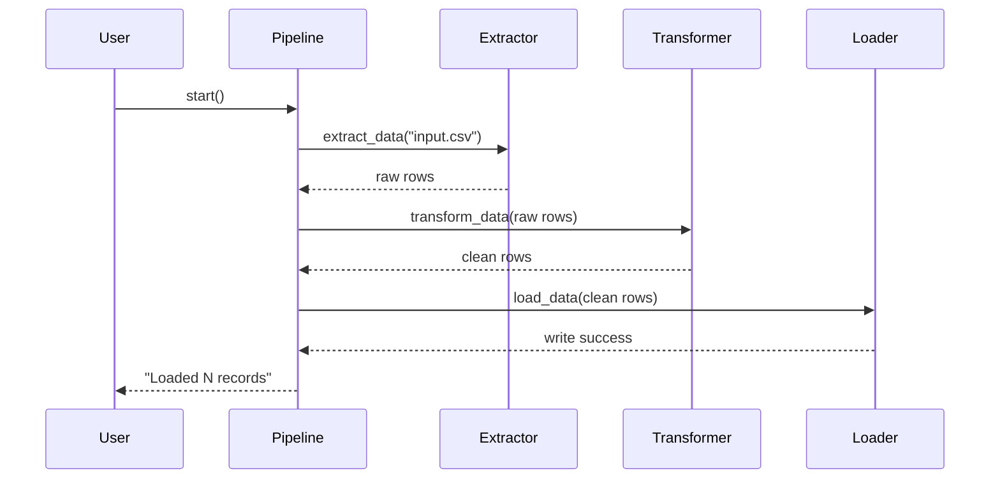

# Chapter 4: ETL Data Pipelines

In [Chapter 3: HMS-API Backend API Layer](03_hms_api_backend_api_layer_.md) we built a unified “reception desk” for microservices. Now we’ll dive into **ETL Data Pipelines**—the processes that Extract raw data, Transform it into a useful form, and Load it into a target system. Think of it like a water treatment plant: you pull in raw water, clean and enrich it, then send it on to where people drink.

---

## 1. Motivation: Why ETL Pipelines?

Imagine the U.S. Census Bureau gathers millions of raw survey files from local offices. Each file may have typos, missing fields, or inconsistent date formats. Before analysts can use this data to produce population reports, it must be:

1. **Extracted** from its source (CSV files, APIs, or databases).  
2. **Transformed** (cleaned, standardized, anonymized).  
3. **Loaded** into a central data warehouse for querying.

Without a clear pipeline, you’d end up with messy data, repeated code, and hard-to-trace bugs. An ETL pipeline automates and documents each step, making the whole process reliable and auditable.

---

## 2. Key Concepts

1. **Extract**  
   Read raw data from one or more sources—files, APIs, message queues.

2. **Transform**  
   Clean and convert data: drop bad rows, normalize formats, compute new fields.

3. **Load**  
   Write the cleaned data to the target system: a database, data lake, or analytics platform.

Analogy:  
- Extract = pump raw water in  
- Transform = filter out impurities, add chlorine  
- Load = send clean water into city mains

---

## 3. Building a Simple ETL Pipeline

We’ll create a minimal Python pipeline that:

- Extracts citizen records from a CSV  
- Transforms names to uppercase and filters out incomplete rows  
- Loads the clean records into a JSON file (simulating a data warehouse)

### 3.1 extract.py

```python
# extract.py
import csv

def extract_data(path):
    with open(path) as f:
        return list(csv.DictReader(f))
```

This function reads `input.csv` and returns a list of dictionaries, one per row.

### 3.2 transform.py

```python
# transform.py
def transform_data(rows):
    clean = []
    for r in rows:
        if r.get("id") and r.get("name"):
            r["name"] = r["name"].strip().upper()
            clean.append(r)
    return clean
```

We drop rows missing `id` or `name`, trim whitespace, and uppercase names.

### 3.3 load.py

```python
# load.py
import json

def load_data(rows, out_path):
    with open(out_path, "w") as f:
        json.dump(rows, f, indent=2)
```

This writes the cleaned data into `output.json`.

### 3.4 etl_pipeline.py

```python
# etl_pipeline.py
from extract import extract_data
from transform import transform_data
from load import load_data

def run_etl():
    raw = extract_data("input.csv")
    clean = transform_data(raw)
    load_data(clean, "output.json")
    print(f"Loaded {len(clean)} records")

if __name__ == "__main__":
    run_etl()
```

Run `python etl_pipeline.py` to go from `input.csv` to a cleaned `output.json`.

---

## 4. Under the Hood: Step-by-Step Flow

Here’s what happens when you run the pipeline:



1. **Pipeline** calls **Extractor**  
2. **Extractor** returns raw data  
3. Pipeline calls **Transformer**  
4. **Transformer** returns cleaned data  
5. Pipeline calls **Loader**  
6. **Loader** writes to disk and signals completion  

---

## 5. Internal Implementation Details

Let’s peek at each module file structure:

```
etl_pipeline/
 ├── extract.py        # Reads CSV
 ├── transform.py      # Cleans and normalizes
 ├── load.py           # Writes JSON
 └── etl_pipeline.py   # Orchestrator
```

Each file is intentionally simple:

- **extract.py** could be extended to read from a database or API.  
- **transform.py** can chain multiple cleaning steps (date parsing, anonymization).  
- **load.py** might connect to a cloud data warehouse (Amazon Redshift, BigQuery).

By separating concerns, you can test and evolve each step independently.

---

## 6. Conclusion

In this chapter you learned how to build a beginner-friendly ETL Data Pipeline:

- Extract raw records  
- Transform them for consistency and quality  
- Load them into your target system  

This pattern scales to dozens of data sources, complex transformations, and robust error handling in real government scenarios—like the Census, public health reporting, or election data aggregation.

Next up, we’ll see how to keep multiple systems in sync and react to changes in real time:

[Chapter 5: External System Synchronization](05_external_system_synchronization_.md)

---

Generated by [AI Codebase Knowledge Builder](https://github.com/The-Pocket/Tutorial-Codebase-Knowledge)