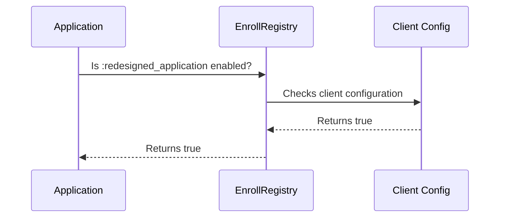

# Chapter 4: Feature Toggles (EnrollRegistry)

In the previous chapter, [Client Configuration (`client_config`)](03_client_configuration__client_config_.md), we learned how to customize our application for different clients.  Now, let's imagine that Maine wants to test a new feature, like a redesigned application flow, but only for a small group of users.  They don't want to release it to everyone until it's thoroughly tested. This is where feature toggles come in. Feature toggles are like light switches for your application's features. You can turn them on or off without deploying new code.  `EnrollRegistry` is the central place to configure these toggles.  Our central use case is enabling the redesigned application flow for Maine.

## `EnrollRegistry`: Your Application's Feature Switchboard

`EnrollRegistry` acts like a switchboard for all the feature toggles in your application.  It allows you to define toggles and check if they are enabled for a particular client.

## Enabling the Redesigned Application Flow

Let's say the redesigned application flow is controlled by a feature toggle called `redesigned_application`.  To enable this feature for Maine, we would configure it in the `client_config` directory, specifically within the `system/config/templates/features` subdirectory.

```yaml
# client_config/me/system/config/templates/features/enroll_app/application_flow.yml
registry:
  - namespace:
      - :enroll_app
    features:
      - key: :redesigned_application
        is_enabled: true
```

This snippet tells the application that the `redesigned_application` feature is enabled for Maine.

## Checking if a Feature is Enabled

In our application code, we can use `EnrollRegistry` to check if the feature is enabled:

```ruby
# app/controllers/applications_controller.rb
if EnrollRegistry[:enroll_app].feature(:redesigned_application).is_enabled
  # Use the redesigned application flow
  render 'redesigned_application'
else
  # Use the old application flow
  render 'application'
end
```

This code checks if the `redesigned_application` feature is enabled. If it is, it renders the `redesigned_application` view; otherwise, it renders the `application` view.

## How `EnrollRegistry` Works Under the Hood



The application asks `EnrollRegistry` if the feature is enabled. `EnrollRegistry` consults the [Client Configuration (`client_config`)](03_client_configuration__client_config_.md) for the current client. The Client Config returns `true`, and `EnrollRegistry` passes this back to the application.

## Internal Implementation

`EnrollRegistry` is initialized in the `config/initializers/enroll_registry.rb` file.  It loads feature configurations from YAML files located in the `client_config/CLIENT_STATE_ABBREVIATION/system/config/templates/features` directory.

```ruby
# config/initializers/enroll_registry.rb
EnrollRegistry.configure do |config|
  config.load_path = Rails.root.join('system', 'config', 'templates', 'features').to_s
end
```

The `EnrollRegistry` gem then parses these YAML files and stores the feature configurations.

## Conclusion

In this chapter, we learned how feature toggles, managed by `EnrollRegistry`, allow us to control the availability of features in our application. We saw how to enable a feature in the `client_config` directory and how to check if a feature is enabled in our application code.  This provides a powerful mechanism for testing, rolling out, and managing features.

Next, we'll explore how to manage the overall application configuration: [Application Configuration (`settings.yml`)](05_application_configuration__settings_yml_.md).


---

Generated by [AI Codebase Knowledge Builder](https://github.com/The-Pocket/Tutorial-Codebase-Knowledge)