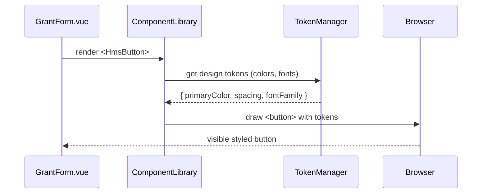

# Chapter 4: Frontend Component Library

Welcome back! In the previous chapter, we built screens and forms in the [Interface Layer](03_interface_layer_.md). Now it’s time to give our pages a consistent look and feel with the **Frontend Component Library**.

---

## Why a Component Library?

Imagine every federal agency builds its own button or form style from scratch:

- The U.S. Sentencing Commission site has blue “Submit” buttons.  
- The State Justice Institute portal uses green ones.  
- The Under Secretary for Public Diplomacy site goes red.  

This leads to an inconsistent experience for citizens. A **Component Library** is like a shared toolkit of Lego bricks—buttons, inputs, cards, dashboards—that every HMS-MFE project (and even HMS-GOV) can pick from. Advantages:

- Consistent branding (colors, fonts, spacing)  
- Built-in accessibility (keyboard navigation, ARIA labels)  
- Faster development (no reinventing buttons each time)

---

## Central Use Case

A citizen wants to apply for a grant from the State Justice Institute. We’ll build a small form using our library’s **Input** and **Button** components:

1. The page imports `HmsInput` and `HmsButton`.  
2. The form looks and behaves the same as other agencies’ forms.  
3. Accessibility features (e.g., focus outline, screen-reader labels) come automatically.

---

## Key Concepts

1. **Component**  
   A reusable UI block (e.g., `HmsButton`, `HmsInput`, `HmsCard`).  
2. **Props**  
   Parameters you pass to customize a component (e.g., `label`, `type`, `disabled`).  
3. **Design Tokens**  
   Shared color, typography, and spacing values (e.g., `--hms-primary-color`).  
4. **Composition**  
   Combining small components to build larger ones (e.g., putting an `HmsInput` and `HmsButton` into a search bar).

---

## 1. Using the Library

Here’s how you’d build a mini grant-application form in Vue:

```html
<template>
  <div>
    <h2>Grant Application</h2>
    <HmsInput
      v-model="applicant.name"
      label="Full Name"
    />
    <HmsInput
      v-model="applicant.project"
      label="Project Title"
    />
    <HmsButton @click="submit" label="Apply Now" />
  </div>
</template>

<script>
import { HmsInput, HmsButton } from '@/components'

export default {
  components: { HmsInput, HmsButton },
  data() { return { applicant: { name: '', project: '' } } },
  methods: {
    submit() {
      // send applicant data to the workflow
      console.log('Submitting', this.applicant)
    }
  }
}
</script>
```

Explanation:  
- We import `HmsInput` and `HmsButton` from our shared components folder.  
- The form fields and the button all share the same look & feel.  
- Accessibility (labels, focus styles) is built in.

---

## 2. What Happens Under the Hood?

Let’s see how rendering a component works, step by step:



1. The page asks the **Component Library** to render a button.  
2. The library fetches shared **design tokens** from the **Token Manager**.  
3. It applies those tokens to HTML (e.g., `<button style="background: #005ea2">`).  
4. The browser displays a consistent, accessible button.

---

## 3. Inside the Library: Button Example

Let’s peek at a simplified `HmsButton` implementation.

File: `components/Button.vue`
```html
<template>
  <button
    :class="['hms-button', type]"
    :disabled="disabled"
    @click="$emit('click')"
  >
    {{ label }}
  </button>
</template>

<script>
export default {
  name: 'HmsButton',
  props: {
    label: { type: String, required: true },
    type:  { type: String, default: 'primary' },
    disabled: { type: Boolean, default: false }
  }
}
</script>

<style scoped>
.hms-button {
  padding: 0.5rem 1rem;
  font-family: var(--hms-font);
  border: none;
  cursor: pointer;
}
.hms-button.primary {
  background: var(--hms-primary-color);
  color: white;
}
.hms-button.secondary {
  background: var(--hms-secondary-color);
  color: black;
}
.hms-button:disabled {
  opacity: 0.6; cursor: not-allowed;
}
</style>
```

Explanation:  
- Props let you set the `label`, `type` (style variant), and `disabled` state.  
- CSS variables (`--hms-primary-color`) come from a global token file.  
- Scoped styles ensure the component looks the same everywhere.

---

## 4. Design Tokens

Our token file defines shared values:

File: `components/tokens.css`
```css
:root {
  --hms-primary-color: #005ea2;   /* Government blue */
  --hms-secondary-color: #f0f0f0;
  --hms-font: 'Arial, sans-serif';
  --hms-spacing: 1rem;
}
```

Every component uses these variables so if we change `--hms-primary-color` in one place, every button and link updates.

---

## Conclusion

You’ve learned how the **Frontend Component Library**:

- Provides reusable, accessible UI blocks  
- Uses props and design tokens for customization  
- Ensures a consistent citizen experience across agencies  

Next up, we’ll explore how to guide users through our portal based on what they want to do in the **[Intent-Driven Navigation](05_intent_driven_navigation_.md)** chapter.

---

Generated by [AI Codebase Knowledge Builder](https://github.com/The-Pocket/Tutorial-Codebase-Knowledge)