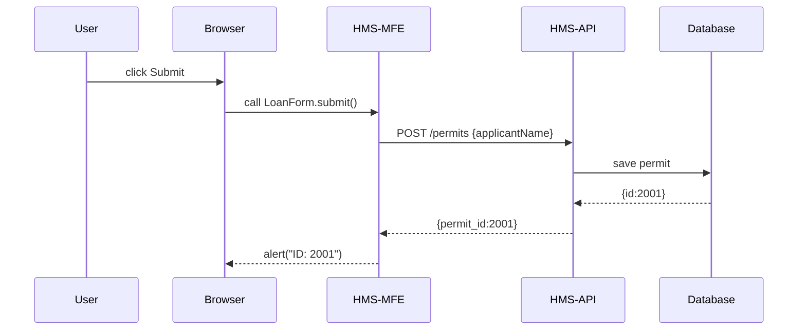

# Chapter 4: Frontend Interface (HMS-MFE)

Welcome back! In [Chapter 3: Backend API (HMS-API / HMS-MKT)](03_backend_api__hms_api___hms_mkt__.md) we built the server-side “permit clerk.” Now let’s create the **public service desk**—the **Frontend Interface (HMS-MFE)**—where citizens and businesses actually fill out forms, read announcements, or track requests in their browser.

---

## 1. Motivation: Why HMS-MFE?

Imagine a small business owner logging in to apply for a loan grant. They need:

1. A clear form with labels and hints.  
2. A consistent header showing agency branding.  
3. Instant feedback if they forgot a required field.  
4. A responsive layout that works on phones or desktops.  

Without a shared frontend layer, each service might reinvent buttons, colors, and error messages—leading to a confusing, disjointed user experience. **HMS-MFE** solves this by:

- Providing a **micro-frontend container** so each feature can ship independently.  
- Exposing a **shared UI library** (buttons, inputs, modals).  
- Enforcing a **common theme** (fonts, colors, spacing).  
- Handling **accessibility** and **mobile responsiveness** out of the box.  

Think of it as the lobby of a government office—every department desk looks and feels the same, even though they serve different requests.

---

## 2. Key Concepts

1. **Container App**  
   Hosts multiple micro-frontends (e.g., “Loan Form”, “Status Dashboard”).  

2. **Micro Frontend**  
   A self-contained feature (HTML/CSS/JS) that the container loads on demand.  

3. **Shared UI Components**  
   Pre-built React/Vue/Angular components for forms, tables, banners.  

4. **Theming & Styling**  
   A central theme file ensures consistent colors, fonts, and spacing.  

5. **Accessibility & Responsiveness**  
   Keyboard-friendly controls and mobile-first layouts are baked in.

---

## 3. Building a Simple Loan Application Page

Let’s make a minimal “Small Business Loan” form in React using HMS-MFE’s shared components.

### 3.1 Setup the Micro Frontend

```bash
# In your terminal
npx create-react-app loan-app --template hms-mfe
cd loan-app
npm start
```
This gives you a React shell already wired to the HMS-MFE container, shared UI library, and theming.

### 3.2 LoanForm.js (under 20 lines)

```jsx
import React, { useState } from 'react'
import { Input, Button } from '@hms/shared-ui'

export default function LoanForm() {
  const [name, setName] = useState('')
  const submit = () => {
    fetch('/api/permits', {
      method: 'POST', headers: {'Content-Type':'application/json'},
      body: JSON.stringify({ applicantName: name })
    }).then(r => r.json()).then(res => alert(`ID: ${res.permit_id}`))
  }
  return (
    <div>
      <h2>Apply for SBA Loan</h2>
      <Input label="Business Name" value={name} onChange={e => setName(e.target.value)}/>
      <Button onClick={submit}>Submit</Button>
    </div>
  )
}
```

Explanation:

- We use `<Input>` and `<Button>` from the **shared UI** library.  
- On click, we call our [Backend API](03_backend_api__hms_api___hms_mkt__.md) endpoint.  
- The theme (colors, padding) comes ready to go—no CSS hassle.

---

## 4. What Happens When You Click “Submit”?

Here’s a simple sequence of events under the hood:



1. User clicks the button in the browser.  
2. The HMS-MFE micro frontend sends data to **HMS-API**.  
3. The API saves to the database ([HMS-SYS](01_core_system_platform__hms_sys__.md)) and returns an ID.  
4. The UI shows a confirmation.

---

## 5. Inside HMS-MFE

### 5.1 File Structure

```
loan-app/
├─ src/
│  ├─ index.js      # registers with HMS-MFE container
│  ├─ App.js        # loads LoanForm micro-frontend
│  └─ components/
│     └─ LoanForm.js
```

### 5.2 index.js

```jsx
import { registerMFE } from '@hms/mfe-container'
import App from './App'

registerMFE({ name: 'loan-form', mount: el => ReactDOM.render(<App/>, el) })
```

Explanation:  
- The container calls `mount` when it’s time to show this micro-frontend.

### 5.3 Shared UI & Theme

```js
// package.json dependency
"@hms/shared-ui": "^1.0.0"
// theme is auto-loaded; you get GOV green buttons and accessible fonts
```

Your team never writes custom CSS variables—just import components and trust the look.

---

## 6. Conclusion

In this chapter you learned how **HMS-MFE** provides:

- A **container** for loading micro-frontends independently.  
- A **shared UI library** for consistent form controls, tables, and buttons.  
- Built-in **theming**, **accessibility**, and **responsiveness**.  

You built a tiny “Loan Application” page, saw the fetch flow to [HMS-API](03_backend_api__hms_api___hms_mkt__.md), and peeked at the container registration.  

Next up: specialized interfaces—how to tailor micro-frontends for domains like health, education, or transportation.

[Chapter 5: Specialized Domain Interfaces](05_specialized_domain_interfaces_.md)

---

Generated by [AI Codebase Knowledge Builder](https://github.com/The-Pocket/Tutorial-Codebase-Knowledge)