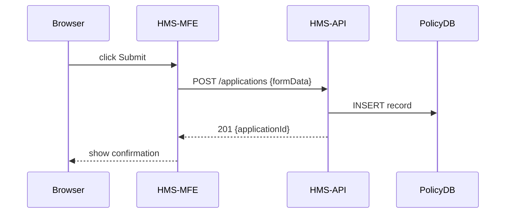

# Chapter 4: Frontend Interface Layer (HMS-MFE / HMS-GOV)

Welcome back! In [Chapter 3: Backend API Services (HMS-API / HMS-MKT)](03_backend_api_services__hms_api___hms_mkt__.md), we learned how our APIs store and sync data. Now it’s time to build the **user-facing side** of HMS-AGX: the **Frontend Interface Layer**. Here we create the portals citizens and officials use every day.

---

## 1. Why a Frontend Layer?

Imagine walking into a federal building.  
• One service counter helps **citizens** submit benefit requests.  
• Another counter lets **officials** review and approve proposals.

Without standard counters and forms, each office would invent its own desk layout and paperwork—confusing for both staff and visitors.  
The **Frontend Interface Layer** solves this by providing:

- HMS-MFE: A citizen portal with reusable UI widgets  
- HMS-GOV: An admin portal for policymakers and clerks  
- A consistent look and feel so users jump right in

---

### Central Use Case

A citizen wants to apply for a scholarship:

1. They log in on the **HMS-MFE** portal.  
2. They fill out a form and submit.  
3. An AI agent suggests missing fields.  
4. An official logs into **HMS-GOV**, reviews the application, and approves it.

Throughout, navigation, buttons, and form styles stay the same.

---

## 2. Key Concepts

1. **Micro-Frontends (MFE)**  
   Each major feature (login, form, dashboard) is its own small app—like a kiosk in a lobby.

2. **Reusable UI Components**  
   Buttons, inputs, tables that work the same in citizen and admin portals.

3. **Shell & Remotes**  
   A “shell” app (HMS-MFE or HMS-GOV) loads and mounts remote feature apps at runtime.

4. **Shared Design System**  
   A central style guide (colors, spacing, fonts) so everything feels unified.

---

## 3. Solving the Use Case

Let’s see how HMS-MFE shows the scholarship form.

```jsx
// HmsMfeApp.js (simplified)
import React from 'react'
import { LoginButton, FormInput, SubmitButton } from './components'

function ScholarshipForm() {
  return (
    <div>
      <h2>Scholarship Application</h2>
      <FormInput label="Full Name" name="name" />
      <FormInput label="Email" name="email" />
      <SubmitButton onClick={() => alert('Submitted!')} />
    </div>
  )
}

export default function HmsMfeApp() {
  return (
    <div className="shell">
      <LoginButton />
      <ScholarshipForm />
    </div>
  )
}
```

Explanation:  
- `LoginButton` handles citizen login (calls [HMS-SYS](01_core_system_platform__hms_sys__.md)).  
- `FormInput` and `SubmitButton` are shared UI components.  
- When submitted, the form posts to **HMS-API** behind the scenes.

---

## 4. Under the Hood: What Happens Step-by-Step

When a citizen clicks **Submit**:



1. **Browser** sends the click event to HMS-MFE.  
2. HMS-MFE POSTs to **HMS-API**.  
3. **HMS-API** saves to its database.  
4. HMS-MFE shows a confirmation message.

---

## 5. Inside the Frontend Shell

### a) File Structure

```
hms-mfe/
  public/
  src/
    components/
      Button.js
      Input.js
    HmsMfeApp.js
```

### b) A Reusable Button

```jsx
// components/Button.js
import React from 'react'
export function Button({ children, onClick }) {
  return (
    <button className="gov-button" onClick={onClick}>
      {children}
    </button>
  )
}
```

- Adds a `.gov-button` style from our design system.  
- Works the same in both MFE and GOV portals.

### c) Admin Portal Shell

```jsx
// HmsGovApp.js
import React from 'react'
import { Button, Table } from './components'
import ReviewRequests from './ReviewRequests'

export default function HmsGovApp() {
  return (
    <div className="shell gov">
      <h1>Admin Dashboard</h1>
      <ReviewRequests />
    </div>
  )
}
```

- `ReviewRequests` fetches pending applications via **HMS-API**.  
- Uses the same `Button` and `Table` components for consistency.

---

## 6. Summary

In this chapter you learned:

- Why we need separate citizen (**HMS-MFE**) and admin (**HMS-GOV**) portals  
- How micro-frontends and a shared design system keep UI consistent  
- A simple code sketch for mounting forms and lists  
- The step-by-step flow when a user submits an application  

Next, we’ll explore how to let users jump straight to the task they want with [Chapter 5: Intent-Driven Navigation](05_intent_driven_navigation_.md).

---

Generated by [AI Codebase Knowledge Builder](https://github.com/The-Pocket/Tutorial-Codebase-Knowledge)