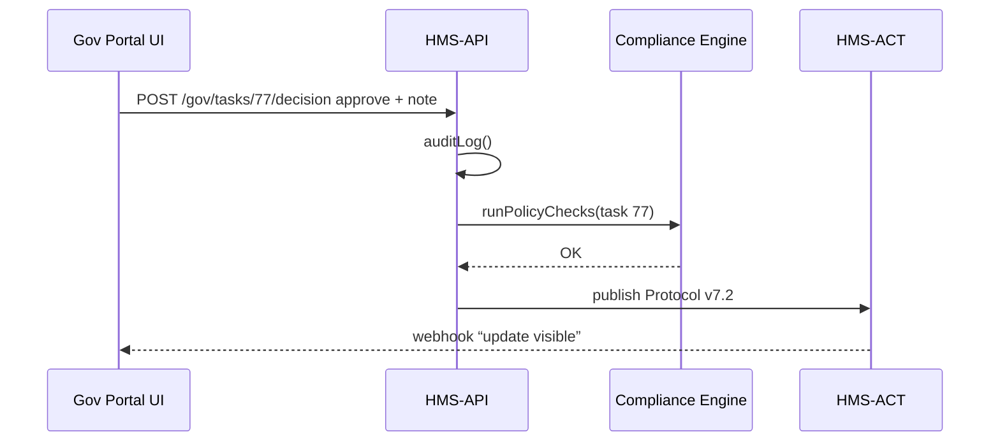

# Chapter 4: Governance Interface (HMS-GOV Portal)

*(Coming from [Chapter 3: Backend API Gateway (HMS-API / HMS-SVC)](03_backend_api_gateway__hms_api___hms_svc__.md)? Perfect—now we’ll see the **human face** that sits on top of that gateway.)*  

---

## 1. Motivation – “Give me the big red button!”

Picture a Deputy Secretary at the Department of Veterans Affairs.  
An AI agent just suggested:

> “Raise the auto-approval limit for rent invoices from \$250 → \$400.”

Before anything changes, federal law demands a **human sign-off** and often a short **public-comment period**.  
The officer needs:

* Live data: “How many invoices were delayed last month?”  
* The AI’s rationale: “Why \$400?”  
* A place to write a note: “Add 3-day public comment.”  
* An **Approve / Reject** button that fires the change through HMS-API.

That one web page is the **HMS-GOV Portal**.

> Analogy: It’s the **cockpit** of a policy airplane—dials, warnings, and a wheel the pilot (policy maker) can actually turn.

---

## 2. Hero Scenario — Step-by-Step

1. AI agent proposes a Protocol tweak (see [Protocol (Process Blueprint)](02_protocol__process_blueprint__.md)).  
2. HMS-API stores the proposal as a **“pending governance task.”**  
3. The GOV Portal shows it on the dashboard.  
4. The Deputy Secretary clicks **Approve**, adds “3-day comment,” and hits **Publish**.  
5. HMS-API updates the Protocol version and notifies downstream services.  

In the next 10 minutes you’ll build a **mini clone** of that flow.

---

## 3. Key Concepts (Portal Widgets)

| Widget | What the official sees | Behind-the-scenes object |
|--------|------------------------|--------------------------|
| Live Metrics Panel | Charts: processing time, error rate | Data from [Metrics & Monitoring](12_metrics___monitoring__hms_ops__.md) |
| AI Recommendation Card | Suggested change + confidence score | Record in `gov_tasks` table |
| Note Pad | Free-text field | `gov_tasks.comment` |
| Approve / Reject Buttons | Final call | POST `/gov/tasks/{id}/decision` |
| Audit Tray | “Signed by A. Jones, 2024-05-11 14:02” | Append-only log |

Keep these five in mind—every code sample will touch at least one.

---

## 4. Hands-On Lab – Approving a Task

We’ll write **extremely tiny React + fetch** code.  
Assume you already have a valid JWT from agency SSO.

### 4.1 Fetch pending governance tasks

```javascript
// gov-useTasks.js
export async function fetchTasks(jwt) {
  const res = await fetch(
    'https://api.hms.gov/gov/tasks?status=pending',
    { headers: { Authorization: `Bearer ${jwt}` } }
  );
  return res.json(); // [{id:77, title:'Raise auto-approval…', aiScore:0.92}]
}
```

Explanation  
1–3. Call the special **/gov/tasks** endpoint (exposed by HMS-API).  
4. The array contains all tasks waiting for a human.

---

### 4.2 Render one task card

```javascript
// TaskCard.jsx  (trimmed)
function TaskCard({task, onDecision}) {
  return (
    <div className="card">
      <h3>{task.title}</h3>
      <p>AI confidence: {Math.round(task.aiScore*100)}%</p>
      <textarea placeholder="Add note…" id={"note"+task.id}/>
      <button onClick={()=>onDecision(task.id,'approve')}>Approve</button>
      <button onClick={()=>onDecision(task.id,'reject')}>Reject</button>
    </div>
  );
}
```

Under 15 lines! Officers see clear info, add a note, then click.

---

### 4.3 Send the decision back

```javascript
// gov-decision.js
export async function sendDecision(id, action, note, jwt) {
  const res = await fetch(
    `https://api.hms.gov/gov/tasks/${id}/decision`,
    {
      method: 'POST',
      headers: {
        'Content-Type':'application/json',
        Authorization: `Bearer ${jwt}`
      },
      body: JSON.stringify({action, note})
    }
  );
  return res.ok;
}
```

What will happen:  
* `action` must be `"approve"` or `"reject"`.  
* On **approve** HMS-API will version-bump the Protocol and queue a **public-comment period** sub-task if your note asks for it.

---

#### Sample response for `GET /gov/tasks/77`

```json
{
  "id": 77,
  "program_id": 42,
  "protocol_id": 7,
  "title": "Raise auto-approval to $400",
  "ai_score": 0.92,
  "status": "pending"
}
```

After approval the task moves to `status:"completed"` and a new protocol version appears (`7.2`).

---

## 5. What Happens When “Approve” Is Clicked?



1. **auditLog** adds “Approved by A. Jones.”  
2. Compliance engine ensures change obeys statutes.  
3. HMS-ACT (see [Agent Action Orchestration](07_agent_action_orchestration__hms_act__.md)) rolls out the new recipe.

---

## 6. Inside the Codebase (Server Side)

### 6.1 Route

```php
// routes/gov.php
Route::post('/tasks/{id}/decision', DecideTaskController::class)
      ->middleware(['auth:api','role:gov_official']);
```

Middleware verifies JWT and checks the caller has the `gov_official` role.

### 6.2 Controller (≤15 lines)

```php
class DecideTaskController
{
    public function __invoke($id, Request $req)
    {
        $task = GovTask::findOrFail($id);

        $task->decision = $req->input('action');   // approve / reject
        $task->comment  = $req->input('note');
        $task->decided_by = $req->user()->id;
        $task->save();   // triggers model events

        return response()->noContent();
    }
}
```

The **model event** `GovTask::saved` contains heavier logic (version bump, notify ACT) but keeps the controller newbie-friendly.

---

## 7. UX & Accessibility Tips

* **Plain-Language labels** (“Approve change” vs. “Execute mutation”).  
* **Color-blind safe** charts (blue/orange, no red/green pairs).  
* **Key-board shortcuts**—government Section 508 compliance!  
* Always show the **Audit Tray** so officials feel safe (“My signature is logged.”).

---

## 8. Where HMS-GOV Sits in the Galaxy

```mermaid
graph TD
    GOV[Governance Portal<br/>(HMS-GOV)] --> API[HMS-API]
    API --> ACT[HMS-ACT]
    API --> ESQ[Compliance Engine<br/>(HMS-ESQ)]
    OPS[Metrics (HMS-OPS)] --> GOV
```

GOV only talks to HMS-API & OPS dashboards; it never edits the database directly.

---

## 9. Recap & Next Steps

You can now:

1. Explain why policy makers need a **Governance Portal**.  
2. Fetch pending tasks, render a decision card, and send **Approve/Reject** with a note.  
3. Trace what happens behind the button press—from audit log to protocol publish.  
4. Read the tiny server controller that powers the flow.

Next we’ll explore **how this GOV Portal—and the citizen portal, and the analytics dashboard—can share code without stepping on each other’s toes**:  
[Micro-Frontend Experience Layer (HMS-MFE)](05_micro_frontend_experience_layer__hms_mfe__.md)

Welcome to the cockpit—now you know how to fly!

---

Generated by [AI Codebase Knowledge Builder](https://github.com/The-Pocket/Tutorial-Codebase-Knowledge)