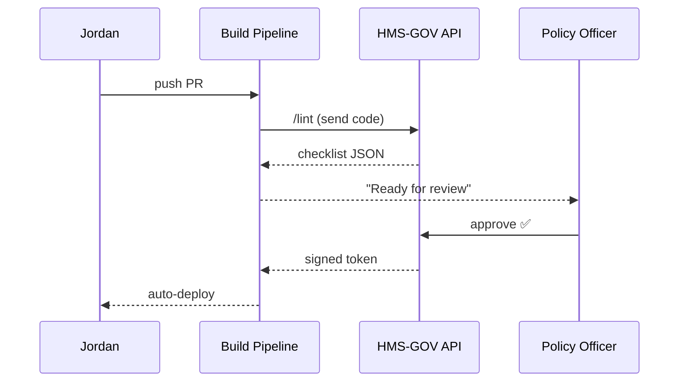

# Chapter 4: Governance Layer (HMS-GOV)

[← Back to Chapter 3: User Group Portal](03_user_group_portal_.md)

---

## 1. Why Does “City Hall for Code” Even Matter?

Imagine Jordan, a developer at the Department of Education.  
He just finished a shiny **“Child-Care Subsidy Calculator”** widget and wants to deploy it.

Questions pop up immediately:

1. Is the **color palette** accessible to citizens with low vision?  
2. Does the widget **collect only the data** the Privacy Office approved?  
3. Are its AI hints using the **same ethical guardrails** as every other tool?  

If Jordan answers *“I think so”*, the government is in trouble.  
**HMS-GOV** removes the guesswork by acting as City Hall: one place where officials publish binding rules, and one API every other layer must obey.

---

## 2. What Exactly Lives Inside HMS-GOV?

| Term | Plain-English Meaning |
|------|----------------------|
| **Policy** | A machine-readable rule (“No SSN in logs”, “Buttons must be #0B5FFF blue”). |
| **Design Token** | A constant value (color, font size) grabbed by widgets at runtime. |
| **Compliance Checklist** | Auto-generated TODO list each project must pass before deploy. |
| **Approval Workflow** | Click-button flow where an official signs off a release. |
| **Audit Log** | Tamper-proof history of who changed what and when. |

Think of **Policies** as city ordinances; **Design Tokens** as the building code.

---

## 3. Guided Tour: The Governance Dashboard

1. **Policy Editor Tab** – YAML form to add or tweak rules.  
2. **Design System Tab** – Live preview of colors, spacing, typography.  
3. **Release Queue Tab** – PRs waiting for approval, each with a red/green checklist.  

*(Screenshot would go here—trust us, it looks friendlier than most DMV forms!)*

---

## 4. Using Governance from a Widget (Jordan’s Story)

### 4.1 Grabbing Design Tokens

```js
// /widgets/childcare-calc/theme.js
import { getToken } from "@hms/gov-client";

export const colors = {
  primary: getToken("color.primary"),   // returns "#0B5FFF"
  danger:  getToken("color.error")      // returns "#D4351C"
};
```

Explanation:  
`getToken()` hits the HMS-GOV API, so Jordan’s widget **automatically** matches the official palette.

### 4.2 Auto-Checking a Policy

```bash
# in widget repo
npx hms-gov lint
```

Output (example):

```
✔  Uses approved color tokens
✔  No PII written to console
✖  Found disallowed third-party script: cdn.example-ads.com
```

Jordan can’t merge until every ❌ is gone—no debate needed.

---

## 5. What Happens Behind the Scenes?



A signed token from HMS-GOV is like a *building permit*; hosting refuses any release without it.

---

## 6. Peeking Inside the Code (Super-Light)

### 6.1 A Policy File

```json
// /governance/policies/no_ssn_logs.json
{
  "id": "NO_SSN_LOGS",
  "match": "REGEX",
  "pattern": "\\b\\d{3}-\\d{2}-\\d{4}\\b",
  "action": "BLOCK",
  "message": "Logging SSNs is prohibited."
}
```

• **match** – how to scan code or config.  
• **action** – `BLOCK` stops the build; `WARN` only flags.

### 6.2 Minimal Linter

```js
// /governance/api/lint.js
import fs from "fs";
import policies from "../policies/index.js";

export function lint(source){
  const errors = [];
  for (const p of policies){
    if (p.match==="REGEX" && new RegExp(p.pattern).test(source)){
      errors.push({id:p.id, msg:p.message});
    }
  }
  return errors;
}
```

This 10-line function is enough for our demo; real life adds caching and fancy parsing.

---

## 7. Integration Points with Other Layers

• **Interface Layer** – Widgets pull design tokens.  
• **Intent-Driven Navigation** – Journeys are validated so no step violates policy.  
• **Access & Authorization Framework** – HMS-GOV decides *who* may edit rules.  
• **Compliance & Audit Trail** – Stores immutable change logs for inspectors.

Cross-references:

* Design tokens in action? See [Interface Layer (HMS-MFE)](01_interface_layer__hms_mfe__sector_portals__.md)  
* How audit data is stored? Jump to [Compliance & Audit Trail](15_compliance___audit_trail_.md)

---

## 8. Common Pitfalls & Tips

1. **“My widget looks off”**  
   – You probably hard-coded colors; swap them for `getToken()` calls.

2. **Linter too strict**  
   – File a *Policy Waiver* request in the dashboard; officers can grant a one-time pass.

3. **Stale Policies**  
   – The client library auto-refreshes tokens every 24 h; override only for offline kiosks.

---

## 9. Try It Yourself in Five Minutes

```bash
# 1. scaffold a demo widget
npx create-hms-widget childcare-calc
cd childcare-calc

# 2. run the linter (should pass)
npx hms-gov lint

# 3. break a rule
echo "console.log('123-45-6789')" >> src/index.js
npx hms-gov lint   # now it fails
```

Fix the issue, re-run, and you’re cleared for deployment.

---

## 10. What You Learned

✔️ HMS-GOV is the **source of truth** for design, privacy, and AI ethics.  
✔️ Widgets consume **design tokens** and must pass an **auto-linter**.  
✔️ A signed approval token is mandatory before anything reaches citizens.

Next, we’ll open the door of the **Admin / Gov Portal**, where officials edit these rules and watch real-time compliance stats.

[→ Chapter 5: Admin / Gov Portal](05_admin___gov_portal_.md)

---

Generated by [AI Codebase Knowledge Builder](https://github.com/The-Pocket/Tutorial-Codebase-Knowledge)