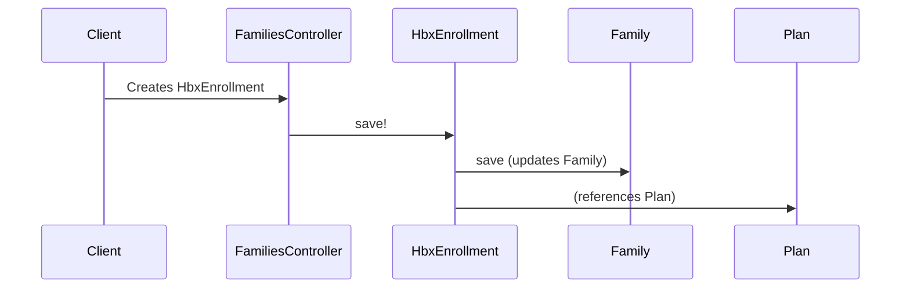

# Chapter 4: HbxEnrollment

In the previous chapter, [EmployerProfile/BenefitSponsorship/BenefitApplication](03_employerprofile_benefitsponsorship_benefitapplication_.md), we learned how employers offer health plans to their employees. Now, let's explore how employees *enroll* in these plans using the `HbxEnrollment` concept.

## Why do we need `HbxEnrollment`?

Imagine John Doe, an employee of Acme Corp, wants to enroll in the "Silver Saver Plan" offered through his employer's 2024 `BenefitApplication`.  We need a way to record this enrollment, including details like the chosen plan, effective dates, and costs.  This is where `HbxEnrollment` comes in.

## Key Concepts

* **HbxEnrollment:**  Think of `HbxEnrollment` as John's health insurance contract. It's like a digital record of his agreement with the "Silver Saver Plan".  It stores important information about the enrollment:
    * **Who:**  The [Person/Family/FamilyMember](01_person_family_familymember_.md) enrolled (John Doe).
    * **What:** The [Plan](02_plan_.md) they chose ("Silver Saver Plan").
    * **When:** The effective dates of the coverage (e.g., January 1st, 2024 - December 31st, 2024).
    * **How Much:** The costs associated with the plan (premiums, etc.).
    * **Status:** The current status of the enrollment (e.g., shopping, enrolled, terminated).

## Solving the Use Case: John Enrolling in a Plan

1. **Find the Plan:** First, we find the "Silver Saver Plan" [Plan](02_plan_.md) object.

2. **Create HbxEnrollment:**  Next, we create an `HbxEnrollment` object for John.

3. **Set Enrollment Details:** We set the important details of the enrollment:
    * John Doe (using his `Person` object)
    * "Silver Saver Plan" (using the `Plan` object)
    * Effective dates
    * Costs

```ruby
# Simplified example (actual implementation is more complex)

silver_saver_plan = Plan.find_by(name: "Silver Saver Plan")

john_enrollment = HbxEnrollment.new(
  family: john.primary_family, # John's Family object
  kind: "employer_sponsored", # Enrollment type
  effective_on: Date.new(2024, 1, 1),
  plan: silver_saver_plan
)

# ... set costs and other details ...

john_enrollment.save!
```

This code creates an `HbxEnrollment` object representing John's enrollment in the "Silver Saver Plan".

## Internal Implementation

When we call `john_enrollment.save!`, the system stores the enrollment information in the database.



1. The `families_controller.rb` (or a similar controller) receives the request to create the enrollment.

2. The `HbxEnrollment` model's `save!` method is called.

3. The `save!` method stores the `HbxEnrollment` data.  It also updates the associated [Family](01_person_family_familymember_.md) object to link the enrollment to the family.  The `Plan` object is referenced, but not directly modified.

The relevant code for saving an `HbxEnrollment` can be found in the appropriate controller (e.g., `insured/families_controller.rb` or `insured/plan_shoppings_controller.rb`) and the `HbxEnrollment` model.

```ruby
# insured/families_controller.rb (simplified)
def create
  @hbx_enrollment = HbxEnrollment.new(hbx_enrollment_params)
  @hbx_enrollment.save!
end
```

## Conclusion

This chapter introduced the `HbxEnrollment` concept, explaining how it represents a health insurance enrollment. We used the example of John Doe enrolling in a plan to illustrate how this concept works. We also looked at the internal implementation to understand the process of saving an enrollment.

Next, we'll explore the role of brokers in the system with [Broker/BrokerAgency/BrokerAgencyProfile](05_broker_brokeragency_brokeragencyprofile_.md).


---

Generated by [AI Codebase Knowledge Builder](https://github.com/The-Pocket/Tutorial-Codebase-Knowledge)