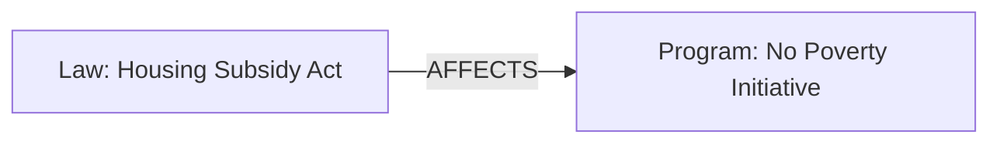
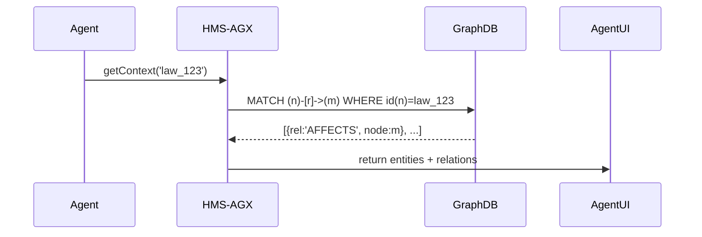

# Chapter 4: HMS-AGX (Knowledge Graph)

In [Chapter 3: Core Models (Program & Protocol)](03_core_models__program___protocol__.md) we learned how to define programs, protocols, and eligibility rules. Now we need a way to connect those models to laws, past outcomes, and expert notes so our agents and admins can get **richer context** when they make decisions—or answer citizen questions. That’s where **HMS-AGX** comes in: our knowledge graph.

---

## 1. Why a Knowledge Graph?

Imagine you’re an administrator working on the “No Poverty” program. A new law is passed about housing subsidies. You need to see:

- Which programs this law affects  
- Past program outcomes under similar laws  
- Expert analyses or user feedback on housing aid  

Like a research library that cross-indexes **laws**, **user needs**, and **program outcomes**, HMS-AGX surfaces these links instantly. No more hunting through spreadsheets or asking colleagues!

---

## 2. Key Concepts

We break the knowledge graph down into simple parts:

1. **Entity (Node)**  
   Anything we care about—e.g., a law, a program, a user feedback report.
2. **Relationship (Edge)**  
   A named link between two entities—e.g., `AFFECTS`, `PRECEDENT_OF`, `FEEDBACK_ON`.
3. **Triple**  
   The combination `(Subject, Relationship, Object)`—e.g., `(Law_123, AFFECTS, No_Poverty_Program)`.
4. **Query**  
   How we ask the graph to find related entities—e.g., “What programs does Law_123 affect?”

---

## 3. Using HMS-AGX in Code

Below is a minimal, in-memory version of our graph. In real life you’d use a graph database, but this keeps the idea simple.

```js
// src/graph/graph.js
class KnowledgeGraph {
  constructor() {
    this.nodes = new Map()     // id → { type, props }
    this.edges = []            // [ { from, rel, to } ]
  }

  addEntity(id, type, props = {}) {
    this.nodes.set(id, { type, props })
  }

  addRelation(from, rel, to) {
    this.edges.push({ from, rel, to })
  }

  getRelated(id, rel) {
    return this.edges
      .filter(e => e.from === id && e.rel === rel)
      .map(e => this.nodes.get(e.to))
  }
}

module.exports = KnowledgeGraph
```

_Explanation_:  
- `nodes` stores entities by ID.  
- `edges` stores triples.  
- `getRelated` finds all objects for a given subject and relationship.

---

### 3.1 Example: Linking a Law to a Program

```js
const KG = require('./graph/graph')
const graph = new KG()

// 1. Add entities
graph.addEntity('law_123', 'Law', { title: 'Housing Subsidy Act' })
graph.addEntity('no_poverty', 'Program', { name: 'No Poverty Initiative' })

// 2. Link them
graph.addRelation('law_123', 'AFFECTS', 'no_poverty')

// 3. Query
const affected = graph.getRelated('law_123', 'AFFECTS')
console.log(affected) 
// [{ type: 'Program', props: { name: 'No Poverty Initiative' } }]
```

Here we see that `law_123` **affects** the “No Poverty Initiative.”

---

### 3.2 Visualizing with Mermaid



This diagram shows our two nodes and the `AFFECTS` edge connecting them.

---

## 4. Under the Hood: Request Flow

When an agent asks “Show me context for law_123,” here’s what happens:



1. **Agent** calls `getContext` with an entity ID.  
2. **HMS-AGX** translates that to a graph DB query.  
3. **GraphDB** returns matching edges and nodes.  
4. **HMS-AGX** formats the results for the UI.

---

### 4.1 Internal Code Sketch

```js
// src/graph/operations.js
const GraphClient = require('./dbClient') // imagine Neo4j or similar

async function getContext(entityId) {
  const query = `
    MATCH (n)-[r]->(m) 
    WHERE n.id = $id 
    RETURN type(r) AS rel, m.id AS id, m.type AS type, m.props AS props
  `
  const rows = await GraphClient.run(query, { id: entityId })
  return rows.map(r => ({
    relationship: r.rel,
    entity: { id: r.id, type: r.type, props: r.props }
  }))
}

module.exports = { getContext }
```

_Explanation_:  
- We send a Cypher-style query to our graph database.  
- We return a simple array of `{ relationship, entity }` for the caller.

---

## 5. Conclusion & Next Steps

In this chapter you learned how **HMS-AGX** creates a web of interconnected entities—laws, programs, outcomes—that agents and admins can query for deep context. We saw:

- How to model nodes and edges in code  
- How to link laws to programs and query those links  
- What happens under the hood in our graph database  

Next up: powering the **legislative workflow** itself with rules and drafts in [Chapter 5: HMS-CDF (Legislative Engine)](05_hms_cdf__legislative_engine__.md).

---

Generated by [AI Codebase Knowledge Builder](https://github.com/The-Pocket/Tutorial-Codebase-Knowledge)