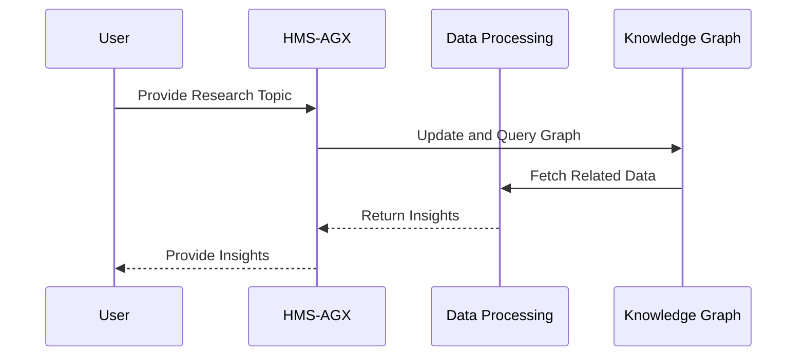

# Chapter 4: HMS-AGX

Welcome to Chapter 4, where we will explore the charming world of `HMS-AGX`! In our journey so far, we have traversed through [HMS-A2A](01_hms_a2a_.md), [HMS-MKT](02_hms_mkt_.md), and [HMS-MFE](03_hms_mfe_.md), learning how these systems simplify interactions with government services. Now, let's venture into the fascinating realm of knowledge graphs with `HMS-AGX`.

## What is HMS-AGX?

### Motivation and Use Case

Imagine you have a pile of books, and your task is to draft a new piece of legislation. You could manually sift through each book, gathering and connecting ideas. But wouldn’t it be splendid to have a librarian who not only knows where to find the information but also connects it for you, showing related concepts you might have missed? This is the magic of `HMS-AGX`.

`HMS-AGX` is your expert librarian, creating and leveraging knowledge graphs to research topics and assist A2A agents. It provides deeper insights for program improvement and legislative drafting by dynamically connecting information.

## Understanding Key Concepts

Let's uncover the core concepts of `HMS-AGX` one by one.

### Key Concept 1: Knowledge Graphs

Think of knowledge graphs as intricate maps of information. Each piece of data is a node, and connections between them are the lines. `HMS-AGX` uses these graphs to show related ideas, much like connecting the dots in a detective mystery.

### Key Concept 2: Dynamic Information Linking

`HMS-AGX` doesn’t just store information statically; it dynamically updates and links new data. As new books (or data) arrive, the librarian continuously updates her map, ensuring you have the freshest insights.

## How to Use HMS-AGX

Let's explore a simple example: using `HMS-AGX` to gather insights for drafting a new law.

```python
# Example usage of HMS-AGX to gather legislative insights

# Initializing the knowledge graph system
knowledge_graph = HMS_AGX()

# Providing a research topic
research_topic = "Environmental Policy Reform"

# Request insights from the librarian
insights = knowledge_graph.get_insights(research_topic)
```

### Explanation

- **Initialization**: We start by creating an instance of `HMS-AGX`, which sets up our knowledge graph system.
- **Provide Topic**: We define the topic we want insights about.
- **Request Insights**: By asking `HMS-AGX` for insights, we receive connections and related information pertinent to our topic.

## Behind the Scenes

Let's take a peek behind the curtain and see what happens when `HMS-AGX` gets to work.



### Step-by-Step Breakdown

1. **User Interaction**: You provide the research topic to be explored.
2. **Graph Update/Query**: `HMS-AGX` updates the knowledge graph with the topic.
3. **Data Processing**: It fetches related data and insights.
4. **Insight Delivery**: You receive comprehensive insights connected to your topic.

### Internal Implementation

Here's how `HMS-AGX` might be internally structured in a simplified way:

```plaintext
# Placeholder for HMS-AGX internal working
class HMS_AGX:
    def get_insights(self, topic):
        # Step 1: Query the knowledge graph with the topic
        # Step 2: Analyze related nodes and edges
        # Step 3: Compile insights to deliver
        return "Insights on the topic"
```

This representation shows that `HMS-AGX` queries its knowledge graph, analyzes connections, and delivers insights.

---

## Conclusion

In this chapter, you've journeyed through the innovative landscape of `HMS-AGX`, understanding how it acts like an expert librarian to provide deeper insights by utilizing knowledge graphs. You’ve learned how `HMS-AGX` links information dynamically to offer valuable assistance in legislative and program improvements.

Excited to explore further? Let's dive into [HMS-UHC](05_hms_uhc_.md) in the next chapter, where new adventures await in understanding user-centric approaches!

Keep the curiosity alive and join us in the next part of this exciting journey!

---

Generated by [AI Codebase Knowledge Builder](https://github.com/The-Pocket/Tutorial-Codebase-Knowledge)