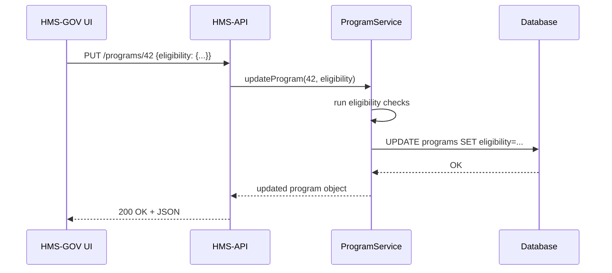

# Chapter 4: HMS-API (Backend API)

In [Chapter 3: HMS-MFE (Micro-Frontend Components)](03_hms_mfe__micro_frontend_components__.md), you learned how to plug UI widgets into our portals. Now let’s peek under the hood at **HMS-API**, the “records office” that processes every request and enforces all business rules.

---

## 1. Motivation & Central Use Case

Imagine a federal agency that runs the “No Poverty” program. Administrators need to:
1. Publish or hide programs.
2. Adjust eligibility criteria (e.g., income limits).
3. Read back applicant data.
4. Ensure every change passes policy checks.

Without a central engine, each portal would reinvent these rules. **HMS-API** solves this by offering:
- A single source of truth for program, user, policy, and tenant data.
- All Create, Read, Update, Delete (CRUD) endpoints.
- Core logic (eligibility checks, program rules, integrations) in one place.

**Use Case**  
An admin in **HMS-GOV** changes the max income for “No Poverty”:
1. Frontend calls `PUT /programs/42`.
2. HMS-API validates that the new limit is within legal bounds.
3. HMS-API updates the database.
4. All portals immediately see the new rule.

---

## 2. Key Concepts

1. **Endpoints**  
   RESTful URLs like `GET /programs`, `POST /users`, `DELETE /policies/:id`.

2. **Core Business Logic**  
   Eligibility checks, program rules, agent integrations live in services—not duplicated in each portal.

3. **Single Source of Truth**  
   Every portal (HMS-GOV, HMS-MKT, MFEs) reads/writes here, so data is always consistent.

4. **Tenant Settings**  
   Configuration per agency or region, kept in `/tenants` routes.

---

## 3. Using HMS-API in Your Frontend

Here’s how you’d adjust a program’s income limit from a client (e.g., **HMS-GOV**):

```js
// src/plugins/api.js (already set up)
this.$api.put(`/programs/${programId}`, {
  eligibility: { minIncome: 0, maxIncome: 25000 }
})
.then(response => {
  console.log('Updated program:', response.data)
  this.$snackbar.success('Eligibility updated')
})
.catch(err => this.$snackbar.error(err.message))
```
*This sends a PUT request. On success, the UI shows confirmation.*

To fetch programs:

```js
async function loadPrograms() {
  const res = await fetch('/api/programs')
  const programs = await res.json()
  return programs
}
// programs is an array of { id, name, eligibility, … }
```
*Simple GET to list all programs, returning JSON.*

---

## 4. What Happens Under the Hood

When `PUT /programs/42` arrives, HMS-API runs this flow:



1. **API** layer validates the request shape.  
2. **Service** layer applies business rules.  
3. **Database** layer persists the change.  
4. Response flows back to the UI.

---

## 5. Inside the Code

### 5.1 File Structure

```
hms-api/
└── src/
    ├── controllers/
    │   └── programController.js
    ├── services/
    │   └── programService.js
    ├── routes/
    │   └── programRoutes.js
    └── app.js
```

### 5.2 Defining Routes

```js
// src/routes/programRoutes.js
import express from 'express'
import { getAll, getById, update } from '../controllers/programController'
const router = express.Router()

router.get('/programs', getAll)
router.get('/programs/:id', getById)
router.put('/programs/:id', update)

export default router
```
*We map URLs to controller functions.*

### 5.3 Controller Layer

```js
// src/controllers/programController.js
import * as svc from '../services/programService'

export async function update(req, res) {
  const id = req.params.id
  const data = req.body.eligibility
  try {
    const updated = await svc.updateProgram(id, data)
    res.json(updated)
  } catch (e) {
    res.status(400).json({ error: e.message })
  }
}
```
*Controllers parse params and delegate to services.*

### 5.4 Service Layer & Business Logic

```js
// src/services/programService.js
import db from '../db' // imagine a simple query tool

export async function updateProgram(id, eligibility) {
  // 1. Check rules
  if (eligibility.maxIncome < 0) {
    throw new Error('Max income must be positive')
  }
  // 2. Save to database
  await db('programs')
    .where({ id })
    .update({ eligibility: JSON.stringify(eligibility) })
  // 3. Return fresh record
  const [program] = await db('programs').where({ id })
  return program
}
```
*Services enforce policy checks, then persist and return results.*

---

## 6. Conclusion & Next Steps

You’ve seen how **HMS-API** acts as the engine room:

- Offers REST endpoints for all CRUD operations  
- Houses core logic (eligibility, rules, integrations)  
- Serves every portal with a single source of truth  

Next up, we’ll explore how programs and protocols are defined in [Chapter 5: Program / Protocol](05_program___protocol_.md).  

Happy coding!

---

Generated by [AI Codebase Knowledge Builder](https://github.com/The-Pocket/Tutorial-Codebase-Knowledge)