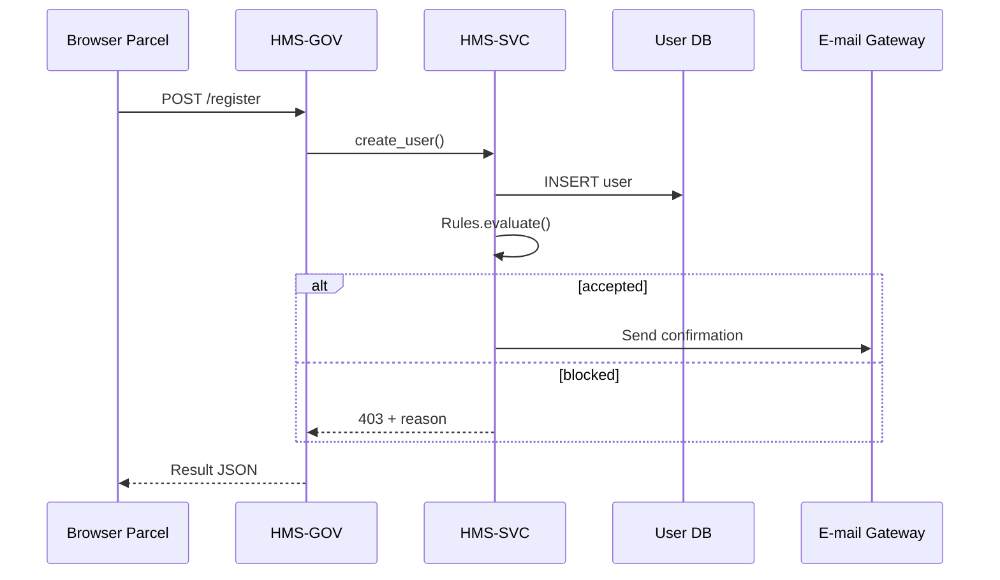

# Chapter 4: HMS-SVC (Core Backend Services)
*[← Back to Chapter 3: HMS-CDF](03_hms_cdf__codified_democracy_foundation_engine__.md)*  

---

## 1. Why Do We Need HMS-SVC?

Imagine three federal agencies go live on the same Friday:

1. The **Government Accountability Office (GAO)** opens a whistle-blower intake form.  
2. The **State Justice Institute (SJI)** launches a grant-application portal.  
3. A small **Parent Information & Resources Center** releases a newsletter signup.

Every site needs **the same boring plumbing**:

* Sign-up / sign-in  
* “You’ve got mail!” notifications  
* Business-rule checks (e.g., “one grant per nonprofit per year”)  
* An audit trail in case Congress asks questions

Without HMS-SVC each team would reinvent those wheels.  
With HMS-SVC they simply **plug into a shared utilities plant**—one consistent place for identity, rules, notifications, and audits.

---

## 2. Key Concepts (Plain English)

| Term | Friendly Analogy | One-Sentence Meaning |
|------|------------------|----------------------|
| Identity Service | Passport office | Issues and validates user tokens (OAuth 2 / JWT). |
| Notification Hub | Post office | Sends e-mail, SMS, or in-app alerts from any module. |
| Rule Engine | City zoning board | Evaluates “if X then Y” policies so agencies don’t hard-code them. |
| Audit Ledger | CCTV archive | Immutable record of who did what and when. |
| Service Bus | Underground cables | Lightweight message queue other modules use to talk to HMS-SVC pieces. |

---

## 3. A 5-Minute “Hello-SVC”

Goal:  
1) Create a GAO whistle-blower account.  
2) Run a simple rule that blocks disposable e-mails.  
3) Send a confirmation e-mail.

```python
# file: hello_svc.py
from hms_svc import Identity, Rules, Notify

# 1. Register the user (returns user_id)
user_id = Identity.create_user(
    email="anon123@mailinator.com",
    password="safe&sound!"
)

# 2. Run a rule: block disposable emails
decision = Rules.evaluate(
    rule_set="email_policies",
    context={"email": "anon123@mailinator.com"}
)

if decision.blocked:
    print("Registration rejected:", decision.reason)
else:
    # 3. Send confirmation
    Notify.email(
        to="anon123@mailinator.com",
        subject="Welcome to GAO Whistle-Blower Portal",
        template="welcome_gao.html"
    )
    print("All done – check your inbox!")
```

What will happen?  

1. `Identity.create_user` stores hashed credentials and returns a UUID.  
2. `Rules.evaluate` calls the central rule engine; in this case it returns `blocked=True`.  
3. Because the rule blocked the account, no e-mail is sent and the script prints a rejection message.

> Change the address to `j.smith@gmail.com` and the flow will pass, triggering an e-mail automatically.

---

## 4. Using HMS-SVC From Other Layers

HMS-GOV already knows how to forward requests to HMS-SVC.  
Below, a micro-frontend parcel calls the same utilities with **one line**:

```tsx
// inside a React parcel
bridge.post("/svc/notify/email", {
  to: form.email,
  template: "grant_submitted.html"
});
```

No SMTP config, no API keys—HMS-SVC hides the complexity.

---

## 5. What Happens Under the Hood?



Key points  
• HMS-GOV is just the **traffic cop**; HMS-SVC does the heavy lifting.  
• Each micro-service inside HMS-SVC talks over an internal **service bus**—no direct database sharing.

---

## 6. Peek at the Source

### 6.1 Identity Micro-Service (simplified)

```python
# file: svc/identity/service.py
from fastapi import APIRouter
from passlib.hash import bcrypt
from .store import users

router = APIRouter()

@router.post("/users")
def create_user(email: str, password: str):
    if users.exists(email):
        return {"error": "duplicate"}
    uid = users.next_id()
    users.save(uid, email, bcrypt.hash(password))
    return {"user_id": uid}
```

• Hashes the password, stores the record, returns a user ID.  
• The router is auto-mounted by HMS-SVC’s bootstrapper.

### 6.2 A Sample Rule (YAML)

```yaml
# file: rules/email_policies.yaml
- id: block_disposable
  when: "email ends_with 'mailinator.com'"
  then: "block 'Disposable email not allowed'"
```

• Non-developers can edit rules in plain YAML—no code deploy needed.  
• The rule engine converts the `when` clause to Python under a safety sandbox.

### 6.3 Notification Adapter

```python
# file: svc/notify/email.py
def send(to, subject, html):
    queue.publish("email_out", {
        "to": to, "subject": subject, "html": html
    })
```

• The service itself only publishes to a queue;  
• A separate worker consumes `email_out` and calls an SMTP provider (or SES, GovCloud, etc.).

---

## 7. FAQ & Troubleshooting

| Symptom | Likely Cause | Quick Fix |
|---------|--------------|-----------|
| `duplicate` error on user creation | E-mail already exists | Call `Identity.get_user(email)` before creating. |
| Rules never trigger | Wrong rule_set name | Verify the YAML file name matches `rule_set` argument. |
| E-mails stuck in queue | Worker not running | Start `python workers/email_worker.py`. |
| JWT token “expired” | Clock drift | Sync server time with NTP. |

---

## 8. What You Learned

You now know how HMS-SVC acts as the **shared backbone** for:

* User identity  
* Business rules  
* Notifications  
* Auditable logs  

All other modules—front-ends, legislation engines, AI agents—rely on this core to stay **consistent and DRY**.

Next we’ll see how entirely different government agencies can exchange data safely through the **Inter-Agency Exchange layer**.  

→ *Continue to* [HMS-A2A (Inter-Agency Exchange)](05_hms_a2a__inter_agency_exchange__.md)

---

Generated by [AI Codebase Knowledge Builder](https://github.com/The-Pocket/Tutorial-Codebase-Knowledge)