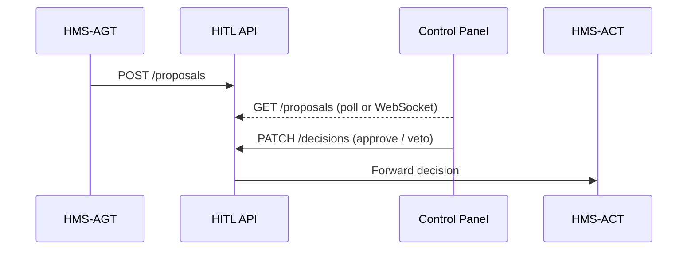

# Chapter 4: Human-In-The-Loop (HITL) Control Panel  
*(continues from [Intent-Driven Navigation Engine](03_intent_driven_navigation_engine_.md))*  

---

## 1. Why Do We Need a HITL Panel?

**Concrete story**

The City Transportation Bureau just received an AI-generated suggestion to:

> “Shift Bus 12’s departure by 10 minutes to reduce peak congestion by 7 %.”

Before anything changes on the street, **Ms. Dorsey**, the Transportation Statistics Director, must:

1. Preview the data that led to this idea.  
2. Lower the “tolerance for delay” slider (the mayor hates late buses).  
3. Either *Approve*, *Request revision*, or *Veto*.  
4. Sign her name so credit—and accountability—are clear.

The **HITL Control Panel** is her cockpit.  
It turns raw AI proposals from [HMS-AGT](01_ai_representative_agent__hms_agt__.md) into human-readable cards with big, friendly buttons.

---

## 2. Key Concepts (plain words)

| Term                        | What it really means | Analogy |
|-----------------------------|----------------------|---------|
| Proposal Card               | One AI action waiting for approval. | “Inbox” email message |
| Risk Slider                 | A knob that limits how bold the AI may be. | Volume control |
| Audit Trail                 | Timestamped record of who changed what. | Black-box flight recorder |
| Veto / Approve / Amend      | The three buttons every card shows. | Red, green, yellow traffic lights |
| Confidence Heat-map         | Visual cue where the model is least certain. | Weather radar patches |

---

## 3. Quick Start — Launch a Local Panel in 12 Lines

The panel is just another micro-frontend brick that you can spin up next to other agency tools.

```bash
# terminal
npm create hms-hitl my-hitl-panel
cd my-hitl-panel
npm start         # opens http://localhost:5173
```

Under the hood this scaffolds:

```
my-hitl-panel/
 ├─ index.html
 ├─ hitl.js          <-- main code (shown below)
 └─ style.css
```

Open the browser and you’ll see an empty inbox that says  
*“No pending proposals…”*—we’ll fill it next.

---

## 4. Your First Approval Flow

### 4.1 Simulate an incoming AI proposal

```python
# send_fake_proposal.py
import requests, json, datetime
requests.post("http://localhost:4000/proposals", json={
    "id":"bus-12-shift",
    "text":"Shift Bus 12 departure by 10 min",
    "impact":"+7 % throughput / +2 min avg wait",
    "created":datetime.datetime.utcnow().isoformat()
})
```

Explanation  
1-3  Simple POST to the HITL service (runs automatically when you started the panel).  
4-6  Payload contains an ID, human summary, and metrics.

Refresh the panel—**a new card pops up**.

### 4.2 Approve it with one click

In the UI click **Approve**.  
Result:

* The button turns green.  
* A toast “Logged in ledger ✓” appears.  
* The proposal disappears from the inbox.

### 4.3 What did the backend receive?

```json
{
  "proposal_id": "bus-12-shift",
  "action": "approve",
  "approver": "dorsey@city.gov",
  "timestamp": "2024-05-14T13:02:45Z",
  "risk_setting": 0.3
}
```

That JSON is forwarded to the [Activity Orchestrator (HMS-ACT)](07_activity_orchestrator__hms_act__.md), which schedules the timetable change only after a final governance check.

---

## 5. What Happens Behind the Scenes?



1. HMS-AGT thinks up an optimization and posts it.  
2. Panel UI shows it instantly.  
3. A manager decides; the choice is patched back.  
4. HMS-ACT executes (or discards) accordingly.

All messages are logged by the [Observability & Metrics Stack](14_observability___metrics_stack__hms_ops__.md) for audits.

---

## 6. A Peek Inside the HITL Code

### 6.1 UI Brick (`hitl.js`) — 19 Lines

```javascript
import {html, render} from 'lit-html';

async function fetchProposals(){
  return fetch('/proposals').then(r=>r.json());
}
function decision(id,action){
  fetch('/decisions', {
    method:'PATCH',
    headers:{'Content-Type':'application/json'},
    body:JSON.stringify({id,action})
  });
}
function Card(p){ return html`
  <article class="card">
    <h3>${p.text}</h3>
    <small>${p.impact}</small>
    <section>
      <button @click=${()=>decision(p.id,'approve')}>Approve</button>
      <button @click=${()=>decision(p.id,'amend')}>Amend</button>
      <button @click=${()=>decision(p.id,'veto')}>Veto</button>
    </section>
  </article>`;}

setInterval(async ()=>{
  const data = await fetchProposals();
  render(data.map(Card), document.body);
}, 3000);
```

Beginners’ tour  
1-4  Poll the backend every 3 s (keeping it simple).  
6-12 `decision()` sends the chosen button to the server.  
14-24 `Card()` renders title, impact, and buttons.  
26-29 Periodic refresh redraws the full list.

### 6.2 Minimal Server (`server.py`) — 18 Lines

```python
from flask import Flask, request, jsonify
app = Flask(__name__)
PROPOSALS, DECISIONS = {}, []

@app.post('/proposals')
def add_prop():
    p = request.get_json()
    PROPOSALS[p['id']] = p
    return '', 204

@app.get('/proposals')
def list_prop():
    return jsonify(list(PROPOSALS.values()))

@app.patch('/decisions')
def decide():
    d = request.get_json()
    DECISIONS.append(d)
    PROPOSALS.pop(d['id'], None)
    # forward to HMS-ACT (stub)
    # requests.post('http://act/execute', json=d)
    return '', 204

app.run(port=4000)
```

Explanation  
• In-memory dicts keep it demo-friendly.  
• Replace the *stub* POST with a real HTTP call to HMS-ACT in production.

---

## 7. Tuning Risk Tolerance (Sliders)

Every agency can define **sliders** mapped to numeric thresholds.  
Example YAML (stored in [Central Data Repository](12_central_data_repository__hms_dta__.md)):

```yaml
transport:
  max_wait_minutes:
    default: 3
    range: 1-10
  budget_variance_pct:
    default: 2
    range: 0-15
```

The UI auto-renders each key as an HTML `<input type="range">`.  
Changing a value fires `PATCH /settings`, and the next AI proposal already respects the new numbers—no redeploy needed.

---

## 8. Frequently Asked Questions

**Q: Can multiple managers view the same inbox?**  
A: Yes. The backend stores one copy; WebSockets broadcast changes in real time.

**Q: What if no one acts on a proposal?**  
A: You can set an *auto-expire* window (default 48 h). After that, HMS-ACT treats it as “veto.”

**Q: How is the audit trail protected?**  
A: Every decision is also hashed and written to the immutable ledger in the [Secure Infrastructure Core](15_secure_infrastructure_core__hms_sys__.md).

---

## 9. Wrap-Up

In this chapter you:

• Discovered why **humans must stay in the loop** for public policy AI.  
• Spun up a dashboard, injected a fake proposal, and approved it.  
• Peeked at the ultra-simple Flask API that powers the panel.  
• Learned how risk sliders and audit trails keep your agency safe—and transparent.

Next we zoom out to see the *rules* that keep the AI honest:  
[Governance Layer & AI Values Framework](05_governance_layer___ai_values_framework_.md)

Happy approving!

---

Generated by [AI Codebase Knowledge Builder](https://github.com/The-Pocket/Tutorial-Codebase-Knowledge)