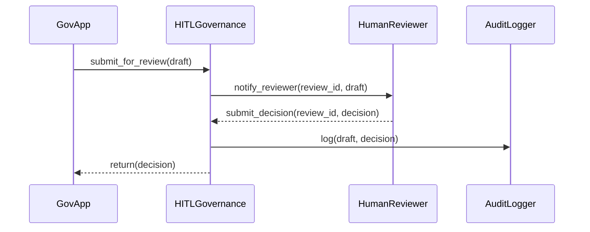

# Chapter 4: Human-in-the-Loop (HITL) Governance

Continuing from our [AI Governance Framework](03_ai_governance_framework_.md), we now add a human quality-control step. In **Human-in-the-Loop (HITL) Governance**, every AI-generated proposal is reviewed, adjusted, and explicitly approved by an administrator before it can go live.

---

## 1. Why We Need HITL Governance

Imagine the Department of Agriculture’s AI suggests new loan-eligibility criteria overnight. Without human review, a modeling glitch could introduce unfair bias or break a regulation. By inserting a “quality control manager”:

- An admin inspects the AI draft  
- Tweaks parameters or content  
- Stamps it **Approved** or **Rejected**  

we ensure transparency, safety, and accountability—meeting public-sector audit requirements and legal standards.

---

## 2. Key Concepts

1. **Review Queue**  
   A holding area for AI proposals awaiting human inspection.

2. **Review Interface**  
   A simple dashboard where reviewers see draft details, change fields, and choose “Approve” or “Reject”.

3. **Approval Decision**  
   The outcome object (`status`, `comments`) that flows back into the system.

4. **Audit Trail**  
   A timestamped record of who reviewed what, when, and why.

---

## 3. Using the HITL Abstraction

Here’s how a government app might ask for human sign-off:

```python
# file: submit_for_review.py
from hms_utl.hitl import HITLGovernance

engine = HITLGovernance()

# AI generated draft
draft = {
    "id": "proposal42",
    "content": "Increase permit fee by 10%",
    "generated_by": "ProposalEngine"
}

# Send draft to human reviewer
decision = engine.submit_for_review(draft)

# Check result
if decision.status == "approved":
    print("✅ Ready for deployment")
else:
    print("❌ Rejected:", decision.comments)
```

Beginner-friendly explanation:
- We call `submit_for_review()` with a draft.
- The system notifies a human reviewer.
- After review, we get back a `decision` object telling us **approved** or **rejected**.

---

## 4. Under the Hood: Step-by-Step Flow



1. **GovApp** calls `submit_for_review()`.  
2. **HITLGovernance** queues the draft and alerts a human reviewer.  
3. **HumanReviewer** inspects, adjusts, and replies with a decision.  
4. **AuditLogger** records the draft, reviewer ID, and final decision.  
5. Decision is returned to the calling app.

---

## 5. Internal Implementation Highlights

### 5.1 hms_utl/hitl.py

```python
# file: hms_utl/hitl.py
from .review_queue import ReviewQueue
from .audit_logger import AuditLogger

class HITLGovernance:
    def __init__(self):
        self.queue = ReviewQueue()
        self.audit = AuditLogger()

    def submit_for_review(self, draft):
        review_id = self.queue.add(draft)
        # In real life, system waits until human clicks Approve/Reject…
        decision = self.queue.get_decision(review_id)
        self.audit.log(draft, decision)
        return decision
```

Explanation:
- We wrap a `ReviewQueue` and an `AuditLogger`.
- `submit_for_review()` enqueues the draft, fetches the decision once made, then logs it.

### 5.2 hms_utl/review_queue.py

```python
# file: hms_utl/review_queue.py
class ReviewQueue:
    def __init__(self):
        self._pending = {}

    def add(self, draft):
        review_id = draft["id"]
        self._pending[review_id] = {"draft": draft}
        print(f"🔔 Draft {review_id} queued for human review")
        return review_id

    def get_decision(self, review_id):
        # Placeholder: automatically approve after queuing
        return type("Decision", (), {
            "status": "approved",
            "comments": ""
        })()
```

Explanation:
- `add()` stores the draft, simulating a notification.
- `get_decision()` returns a fake “approved” decision for our minimal example.

### 5.3 hms_utl/audit_logger.py

```python
# file: hms_utl/audit_logger.py
class AuditLogger:
    def log(self, draft, decision):
        # In production, write to tamper-proof audit store
        print(f"📝 Audit | id={draft['id']} | status={decision.status}")
```

Explanation:
- Every review step (draft + decision) is recorded for future audits.

---

## Conclusion

You’ve learned how **Human-in-the-Loop Governance** puts a human reviewer in charge of every AI proposal—ensuring safety, transparency, and regulatory compliance. Next up, we’ll see how approved policies get packaged and rolled out in the [Policy Deployment Pipeline](05_policy_deployment_pipeline_.md).

---

Generated by [AI Codebase Knowledge Builder](https://github.com/The-Pocket/Tutorial-Codebase-Knowledge)