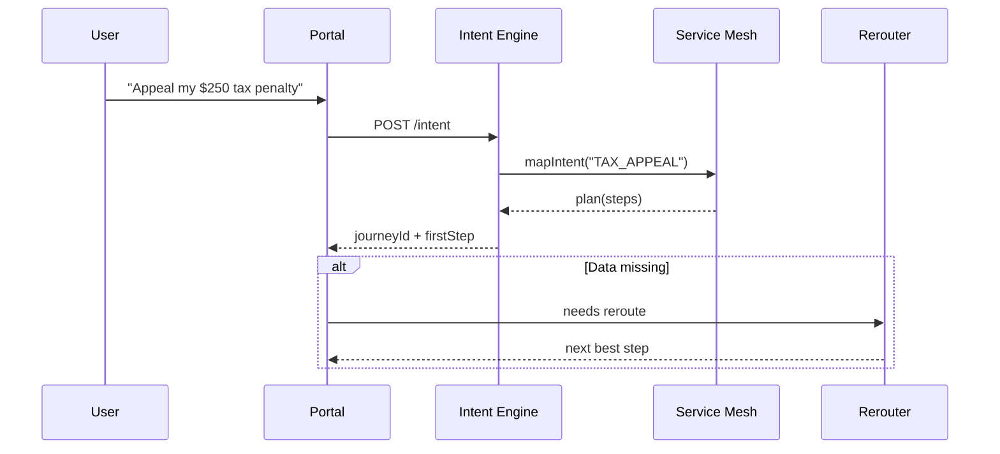

# Chapter 4: Intent-Driven Navigation (AI-Guided Journeys)

_In the last chapter, the [Access & Authorization Matrix](03_access___authorization_matrix_.md) gave every user a color-coded badge that says **what** they may do.  
Now we’ll help them figure out **how** to do it—without making them dig through dozens of menus._

---

## 1. The Pain We’re Solving

### Use-Case: “I Need to Appeal a Tax Penalty”  
Rosa just received a $250 late-filing penalty from the IRS.  
She opens the **citizen portal** and types:

> “Appeal my $250 tax penalty.”

Instead of forcing Rosa to hunt through “Payments → Disputes → Form 843,” the system becomes her personal GPS:

1. Detects her **intent** (“appeal penalty”).  
2. Generates a **journey** (upload notice → verify identity → pick appeal reason → e-sign).  
3. **Reroutes** if she misses a turn—e.g., if she can’t find the notice number, the AI offers to fetch it automatically.  

Result: Rosa finishes in minutes, not hours.

---

## 2. Key Concepts (Plain English)

| Concept | Analogy | 1-Sentence Description |
|---------|---------|------------------------|
| Intent | Destination on a GPS | A short goal statement like “appeal penalty.” |
| Journey Planner | GPS route builder | Breaks the goal into ordered steps (waypoints). |
| Semantic Map | Street map | Links intents ↔ microservices ↔ UI screens. |
| Rerouting Engine | “Recalculating…” | Adjusts the journey when data or rules change. |
| Waypoint UI | Road signs | The screen or API call the user sees at each step. |

---

## 3. Quick Tour: From Intent to Action

```mermaid
flowchart LR
  A[User Intent<br/>"Appeal Penalty"] --> B[Intent Engine]
  B --> C[Journey Planner]
  C --> D[UI Waypoints<br/>(screens/forms)]
  D --> E[Backend Calls<br/>(penalties, docs, e-sign)]
  C -- rules changed --> F[Rerouting Engine]
  F --> D
```

5 boxes—no more, no less.

---

## 4. Hands-On Example (10 Lines!)

Below is the entire **front-end** code to start Rosa’s journey.

```javascript
async function startJourney(text) {
  // 1) Ask the Intent Engine to plan a route
  const {journeyId, firstStep} = await api.post("/intent", {text});
  // 2) Render the first waypoint (a React component name)
  renderWaypoint(firstStep.ui, firstStep.data);
}
startJourney("Appeal my $250 tax penalty");
```

What happens?

1. `/intent` detects the goal, picks “TAX_APPEAL” as the intent.  
2. It replies with a `journeyId` and the first waypoint (e.g., `UploadNoticeForm`).  
3. `renderWaypoint()` mounts the UI component; Rosa sees “Upload your penalty notice.”

---

## 5. A Peek Under the Hood (Step-By-Step)



Only five participants—easy to follow.

---

## 6. Inside the Intent Engine

### 6.1 Mini Semantic Map (YAML, 15 Lines)

```yaml
# file: maps/tax.yaml
TAX_APPEAL:
  description: "Appeal a federal tax penalty"
  steps:
    - id: upload_notice
      ui: UploadNoticeForm
      service: docs.save
    - id: verify_id
      ui: IdentityCheck
      service: auth.verify
    - id: select_reason
      ui: AppealReasonPicker
      service: penalties.validate_reason
    - id: e_sign
      ui: ESign
      service: signatures.sign
```

Beginners’ takeaways:  
• One intent ➜ a list of **step IDs** with matching UI + microservice.  
• Business teams can edit this YAML without touching code.

---

### 6.2 Journey Planner (Python, 14 Lines)

```python
# file: engine/planner.py
import yaml, uuid

def plan(intent_code):
    m = yaml.safe_load(open(f"maps/tax.yaml"))
    steps = m[intent_code]["steps"]
    jid = str(uuid.uuid4())
    db.insert("journeys", {"id": jid, "steps": steps})
    return {"journeyId": jid, "firstStep": steps[0]}
```

Explanation:  
1. Loads the YAML map.  
2. Generates a unique `journeyId`.  
3. Stores steps for later rerouting.

---

### 6.3 Rerouting Engine (Python, 12 Lines)

```python
# file: engine/reroute.py
def next_step(journey_id, current_state):
    j = db.get("journeys", journey_id)
    steps = [s for s in j["steps"] if not current_state.done(s["id"])]
    if not steps:
        return {"ui": "JourneyComplete"}
    # Example: skip ID check if already verified today
    if steps[0]["id"] == "verify_id" and current_state.id_ok():
        return next_step(journey_id, current_state.mark_done("verify_id"))
    return steps[0]
```

In plain words: _“Find the next unfinished step; skip what’s already satisfied.”_

---

## 7. How Does This Connect to Other Layers?

• The **first API call** originates from the [Interface Layer](02_interface_layer__user___admin_portals__.md).  
• Backend calls inside each step are protected by the [Access & Authorization Matrix](03_access___authorization_matrix_.md).  
• Any new or modified journey definition must be approved by the [Governance Layer](01_governance_layer__hms_gov__.md).  
• Actual business logic (e.g., `penalties.validate_reason`) lives in the [Backend Microservices Mesh](08_backend_microservices_mesh__hms_svc__.md).

---

## 8. Mini FAQ

**Q: What if a user types something unknown like “fix weird letter”?**  
A: The Intent Engine falls back to “HUMAN_HELP” and routes to a live chat—powered by [Human-in-the-Loop Oversight](06_human_in_the_loop_oversight__hitl__.md).

**Q: Can two intents share steps?**  
A: Yes—steps are modular; `verify_id` is reused in dozens of journeys.

**Q: How is privacy handled?**  
A: Each step calls back-end services through signed tokens issued by the Access Matrix, so users only see data they’re allowed to.

---

## 9. Checklist Before You Move On

✅ Users express a goal in plain language.  
✅ YAML maps translate the goal into steps.  
✅ Planner saves a journey; Rerouter keeps it on track.  
✅ All screens and service calls remain secure and governed.

---

## 10. Conclusion & What’s Next

You now know how HMS-ACH turns a single sentence like “Appeal my tax penalty” into a guided, self-adjusting journey—no menu diving required.

In the next chapter we’ll meet the digital tour guide who can even _speak_ those directions for you: the [AI Representative Agent (A2A Node)](05_ai_representative_agent__a2a_node__.md).

---

Generated by [AI Codebase Knowledge Builder](https://github.com/The-Pocket/Tutorial-Codebase-Knowledge)