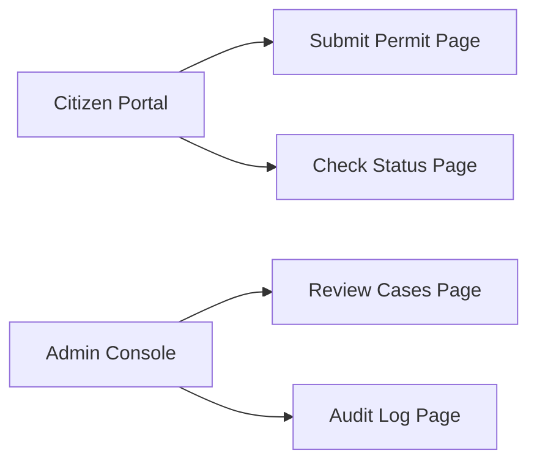
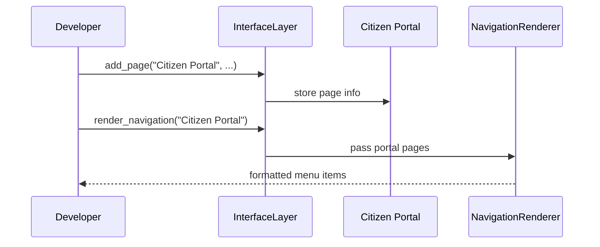

# Chapter 4: Interface Layer

In the previous chapter, we saw how the [Management Layer](03_management_layer_.md) registers services, applies policies, and runs workflows. Now it’s time to give real users—citizens and officials—a friendly “service counter” to interact with our system. Welcome to the **Interface Layer**!

---

## 1. Why an Interface Layer?

Imagine you’re building a statewide health‐care permit system. Two audiences need simple portals:

- **Citizens**: They log into the **HMS-MFE Citizen Portal** to fill out and submit permit forms.  
- **Officials**: They use the **HMS-GOV Admin Console** to review, approve, or reject applications.

Without a clear interface, users get lost: citizens can’t find the right form, and officials struggle to see pending cases. The **Interface Layer** is our “public service counter”—the set of portals, pages, and UI components that guide each user’s journey.

---

## 2. Key Concepts

1. **Portal**  
   A top‐level entry point (e.g. “Citizen Portal” or “Admin Console”).  
2. **Page**  
   A specific screen within a portal (e.g. “Submit Permit,” “Review Cases”).  
3. **Component**  
   Reusable UI building block (forms, tables, buttons).  
4. **Route**  
   The URL path that maps to a page (e.g. `/citizen/form`, `/admin/cases`).  

Mermaid diagram of our two portals and a couple of pages:



---

## 3. Building Your First Portal

Below is a minimal example using a fictitious `InterfaceLayer` class. We’ll:

1. Register two portals.  
2. Add pages under each portal.  
3. Render a navigation menu for citizens.

```python
# File: app.py
from hms_ach.interface_layer import InterfaceLayer

# 1. Create the interface layer
ui = InterfaceLayer()

# 2. Register portals
ui.register_portal(name="Citizen Portal", route="/citizen")
ui.register_portal(name="Admin Console", route="/admin")

# 3. Add pages to each portal
ui.add_page("Citizen Portal", "Submit Permit", "/citizen/form")
ui.add_page("Citizen Portal", "Check Status", "/citizen/status")
ui.add_page("Admin Console", "Review Cases", "/admin/cases")
ui.add_page("Admin Console", "Audit Logs", "/admin/logs")

# 4. Render navigation for citizens
print(ui.render_navigation("Citizen Portal"))
```

What happens here?

- We built two entry points: `/citizen` and `/admin`.  
- We added four pages with human‐friendly titles.  
- Calling `render_navigation("Citizen Portal")` might output a menu like:
  
  ```
  • Submit Permit (/citizen/form)
  • Check Status  (/citizen/status)
  ```

---

## 4. Under the Hood: Step‐by‐Step Flow

When you call `ui.add_page(...)` and later `ui.render_navigation(...)`, here’s a simple sequence:



1. **Page Registration**: `add_page` tells the portal which pages to show.  
2. **Navigation Rendering**: `render_navigation` collects stored pages and formats them for display.

---

## 5. Peek at the Code

Let’s look at a simplified `interface_layer.py` to see how this is wired up.

### 5.1 Portal & Page Storage

```python
# File: hms_ach/interface_layer.py

class InterfaceLayer:
    def __init__(self):
        self.portals = {}  # portal name -> route
        self.pages   = {}  # portal name -> list of (title, route)

    def register_portal(self, name, route):
        self.portals[name] = route
        self.pages[name] = []

    def add_page(self, portal, title, route):
        # Append a page under the given portal
        self.pages[portal].append((title, route))
```

- `self.portals` keeps track of each portal’s base URL.  
- `self.pages` groups pages by portal name.

### 5.2 Rendering Navigation Menus

```python
# continue in interface_layer.py

    def render_navigation(self, portal):
        items = self.pages.get(portal, [])
        # Build a simple bullet list
        menu = "\n".join(f"• {t} ({r})" for t, r in items)
        return menu or "No pages registered."
```

- We fetch the list of pages for a portal.  
- We join them into a human‐friendly bullet list.

---

## 6. Conclusion

In this chapter you learned how to:

- Define **Portals** and **Pages** in the [Interface Layer](04_interface_layer_.md).  
- Register user‐facing routes like `/citizen/form` and `/admin/cases`.  
- Render a simple navigation menu for end users.

Next up, we’ll make these menus even smarter by following the user’s intent in [Intent-Driven Navigation](05_intent_driven_navigation_.md).

---

Generated by [AI Codebase Knowledge Builder](https://github.com/The-Pocket/Tutorial-Codebase-Knowledge)