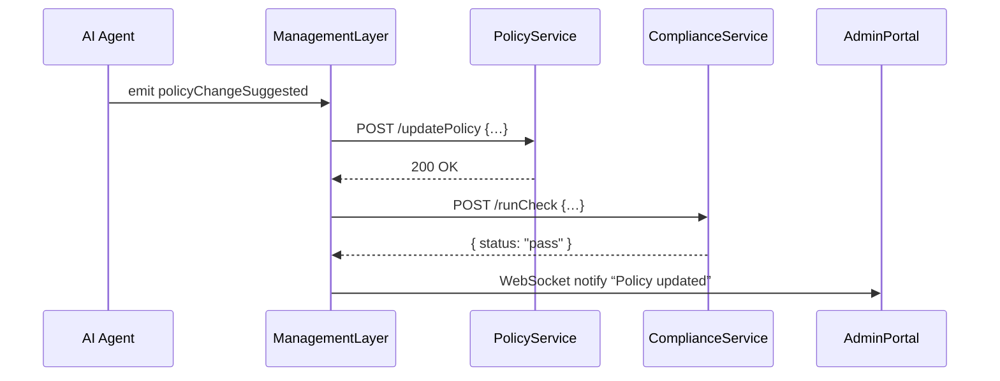

# Chapter 4: Management Layer (Service Orchestration)

In [Chapter 3: Backend API Layer (HMS-API / HMS-MKT)](03_backend_api_layer__hms_api___hms_mkt__.md) we saw how individual services expose HTTP endpoints. Now, what happens when you need to coordinate several services together—like routing a call to firefighters, ambulances, and police in an emergency? That’s the job of our **Management Layer**.

## Why a Management Layer?

Imagine a 911 dispatcher center. A citizen dials “emergency,” and the dispatcher decides which responders to send. In HMS-CUR, the Management Layer plays that dispatcher role:

- It **listens** for events (from UIs, AI agents, schedulers).  
- It **executes** multi‐step workflows across backend services.  
- It **keeps everything in sync**, sending notifications and status updates.

### Central Use Case: AI-Driven Policy Change

1. An **AI Agent** analyzes data and suggests a policy update.  
2. The Management Layer picks up a `policyChangeSuggested` event.  
3. It calls the **Policy Service** to apply changes.  
4. Then it calls the **Compliance Service** to run checks.  
5. Finally, it notifies the **Admin Portal** of success or failure.

## Key Concepts

- Service Orchestration  
  Defining and running **multi‐step workflows** across services.

- Event Bus  
  A channel (e.g. Kafka, Redis Pub/Sub) for publishing and subscribing to domain events.

- Workflow Definition  
  A simple list of “steps” that say “call Service X with Action Y.”

- Task Runner  
  The engine that takes a workflow, invokes each step in order, and handles errors.

- Notification Dispatcher  
  Sends updates back to UIs or other systems (via WebSocket, email, etc.).

## Defining a Workflow

Here’s a minimal workflow that updates a policy, checks compliance, then notifies administrators:

```js
// src/management/workflows/policyChange.js
module.exports = {
  name: 'policyChange',
  steps: [
    { service: 'PolicyService', action: 'updatePolicy' },
    { service: 'ComplianceService', action: 'runCheck' },
    { service: 'NotificationService', action: 'sendUpdate' }
  ]
};
```
This JSON‐like object says “when a policyChange happens, run these three tasks in order.”

## Listening for Events and Executing

We register workflows and listen for events from our event bus:

```js
// src/management/orchestrator.js
const bus = require('./eventBus')
const core = require('./orchestratorCore')
const policyWF = require('./workflows/policyChange')

core.register(policyWF)

// When the AI Agent suggests a policy change...
bus.on('policyChangeSuggested', data => {
  core.execute('policyChange', data)
})
```
- `bus.on` listens for events.  
- `core.execute` runs our defined steps with the incoming data.

## Sequence Walkthrough

What really happens when a `policyChangeSuggested` event arrives?



1. **Event** from AI Agent.  
2. **Call** PolicyService API.  
3. **Call** ComplianceService API.  
4. **Notify** Admin Portal via WebSocket.

## Under the Hood: Orchestrator Core

Here’s a super‐simple orchestrator that registers workflows and runs them:

```js
// src/management/orchestratorCore.js
const axios = require('axios')
const workflows = {}

// Store workflow definitions
function register(wf) {
  workflows[wf.name] = wf.steps
}

// Run each step in order
async function execute(name, data) {
  const steps = workflows[name] || []
  for (const s of steps) {
    const url = `http://${s.service}/${s.action}`
    await axios.post(url, data)
  }
}

module.exports = { register, execute }
```

- `register` adds our workflow to an in-memory map.  
- `execute` loops through each step and makes HTTP calls.

In a production system you’d add error handling, retries, and dynamic service discovery—but this gives you the core idea.

## Putting It All Together

1. **Define** workflows under `src/management/workflows`.  
2. **Register** them in `src/management/orchestrator.js`.  
3. **Listen** on the event bus for triggers.  
4. **Execute** steps via HTTP calls to your backend services.  
5. **Notify** portals or other systems when work completes.

## Conclusion

You’ve seen how the **Management Layer** acts as a central dispatcher, coordinating events and calling multiple services in order. This orchestration ensures that AI agents, UIs, and backend services stay in sync. Next, we’ll drill down into the individual services that the Management Layer calls in [Backend Services (HMS-SVC)](05_backend_services__hms_svc__.md).

---

Generated by [AI Codebase Knowledge Builder](https://github.com/The-Pocket/Tutorial-Codebase-Knowledge)