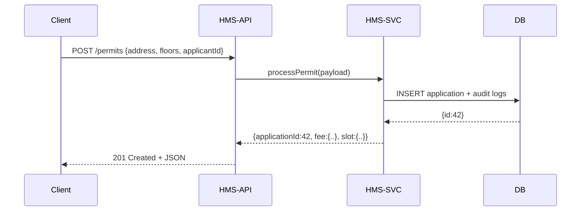

# Chapter 4: Management Services (HMS-SVC)

Welcome back! In [Chapter 3: Market & Policy API (HMS-API/HMS-MKT)](03_market___policy_api__hms_api_hms_mkt__.md), we saw how clients and portals talk to a simple REST API. Now it’s time to explore **Management Services (HMS-SVC)**—the “public works” department where the real business logic lives.

---

## 1. Why Management Services? A Real-World Use Case

Imagine a citizen applies for a **building permit** through the portal. Several steps must happen in order:

1. **Calculate permit fees** (Finance department)  
2. **Schedule an inspection** (Scheduling department)  
3. **Store application details** (Records department)  

Each of these domains is its own microservice under HMS-SVC, enforcing rules (e.g., fee schedules, working hours, data retention) and coordinating together to approve or reject that permit.

---

## 2. Key Concepts

1. **Domain-Specific Microservices**  
   - financeSvc: fee calculation, payment rules  
   - scheduleSvc: available slots, inspector assignment  
   - recordsSvc: citizen data, application history  

2. **Orchestration Layer**  
   A thin “conductor” that calls each domain service in the right order.

3. **Business Rules & Workflows**  
   Each service validates inputs (e.g., “Zone A building >3 floors needs extra fee”) and outputs a standardized result.

4. **Governance & Audit**  
   HMS-SVC logs every step so auditors can see who approved what, when.

---

## 3. Processing a Building Permit

Below is a minimal example showing how `processPermit` orchestrates the permit workflow.

### 3.1 Orchestration Service

File: `server/services/permitService.js`
```js
const finance = require('./financeService')
const schedule = require('./scheduleService')
const records  = require('./recordsService')

// Main function called by the API layer
async function processPermit(application) {
  // 1. Calculate the fee
  const feeInfo = await finance.calculateFee(application)
  // 2. Reserve an inspection slot
  const slotInfo = await schedule.reserveSlot(application)
  // 3. Save full record (with fee and slot)
  const record = await records.saveApplication({
    ...application, 
    fee: feeInfo.amount, 
    slot: slotInfo.id
  })
  return { applicationId: record.id, fee: feeInfo, slot: slotInfo }
}

module.exports = { processPermit }
```

Explanation:
- We import three domain services.
- We run them in sequence.
- We return a combined result for the client.

### 3.2 Domain Service Example

File: `server/services/financeService.js`
```js
// Very simple fee logic
async function calculateFee(app) {
  const base = 100
  const extra = app.floors > 2 ? (app.floors - 2) * 50 : 0
  return { amount: base + extra, currency: 'USD' }
}

module.exports = { calculateFee }
```

Explanation:
- Base fee of \$100.
- \$50 extra per floor above 2.
- Returns a standardized fee object.

---

## 4. What Happens Under the Hood?

Here’s a high-level view of a client call to create a permit:



Step-by-step:
1. **Client** posts new permit data to HMS-API.  
2. HMS-API calls `processPermit` in HMS-SVC.  
3. HMS-SVC runs finance, schedule, and records services.  
4. HMS-SVC logs each step and writes to the database.  
5. The combined result flows back to the client.

---

## 5. Inside the API Layer

Here’s how the Express route calls our orchestration:

File: `server/routes/permits.js`
```js
const express = require('express')
const { processPermit } = require('../services/permitService')
const router = express.Router()

router.post('/', async (req, res) => {
  const result = await processPermit(req.body)
  res.status(201).json(result)
})

module.exports = router
```

Explanation:
- We `POST /api/permits` to start the workflow.
- The handler delegates to our `permitService`.
- We return a `201 Created` with the workflow outcome.

---

## 6. Putting It All Together

```mermaid
graph LR
  A[HMS-API: POST /permits] --> B[HMS-SVC: processPermit()]
  B --> C[financeSvc.calculateFee()]
  B --> D[scheduleSvc.reserveSlot()]
  B --> E[recordsSvc.saveApplication()]
  E --> F[(Database & Audit Log)]
```

- **HMS-API**: Exposes REST endpoints.  
- **HMS-SVC**: Orchestrates domain services.  
- **Domain Services**: Each is a “department” implementing rules.  
- **Database**: Persists applications and audit trails.

---

## 7. Conclusion

In this chapter you learned how **Management Services (HMS-SVC)** implements core business logic by:

- Splitting functionality into domain microservices (finance, scheduling, records).  
- Orchestrating those services in a defined workflow.  
- Enforcing governance rules and audit logging.

Next up, we’ll see how payments actually clear in the [Financial Clearinghouse (HMS-ACH)](05_financial_clearinghouse__hms_ach__.md).

---

Generated by [AI Codebase Knowledge Builder](https://github.com/The-Pocket/Tutorial-Codebase-Knowledge)