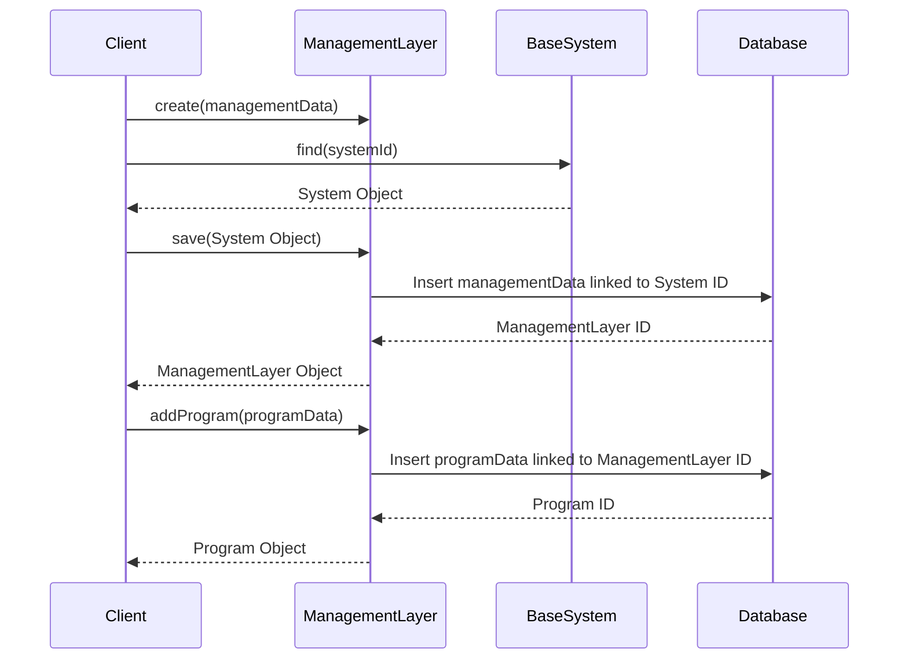

# Chapter 4: ManagementLayer

In the previous chapter, [SystemInterface](03_systeminterface.md), we learned how to create specific interaction points within an interface, like the "Admissions" page on a school website. Now, let's think about how the school actually *manages* things behind the scenes. This is where the `ManagementLayer` comes in.

## What problem does ManagementLayer solve?

Imagine Sunnyside Elementary needs to manage its after-school programs. They need to track enrollment, allocate teachers and classrooms, schedule activities, and measure the success of each program.  The `ManagementLayer` represents the operational part of the system, like the school's administrative staff. It handles the practical implementation of policies and manages programs and resources.

## Key Concepts

1. **Programs:** These are the specific activities managed by the `ManagementLayer`, like the "Chess Club" or the "Drama Club" after-school programs.  We'll learn more about programs in the next chapter, [ManagementProgram](05_managementprogram.md).

2. **Resources:** These are the things the programs need, like teachers, classrooms, and materials.  We'll cover resources in more detail in the chapter on [SystemResource](08_systemresource.md).

3. **Performance Metrics:** The `ManagementLayer` tracks things like how many programs are running, how well they're doing, and how efficiently resources are being used.

## Using ManagementLayer: Running Sunnyside's After-School Programs

Let's create a `ManagementLayer` for Sunnyside Elementary and add an after-school program.

```php
// Simplified example - see ManagementLayer.php for full implementation
use App\Models\ManagementLayer;
use App\Models\BaseSystem;

$school = BaseSystem::find(1); // Assuming Sunnyside Elementary has ID 1

$managementLayer = new ManagementLayer([
    'url' => 'https://sunnyside.edu/admin', // Example admin URL
]);

$school->managementLayer()->save($managementLayer);

// Add the Chess Club program (simplified)
$managementLayer->addProgram([
    'name' => 'Chess Club',
    'description' => 'Learn and play chess!',
    'status' => 'active'
]);
```

This code creates a `ManagementLayer` for Sunnyside Elementary and links it to the `BaseSystem`. We then add a new program, the "Chess Club," to the `ManagementLayer`.

## Internal Implementation

When you call `save` on the `managementLayer` relationship, it creates a new entry in the database representing the `ManagementLayer` and links it to the corresponding `BaseSystem`.  The `addProgram` function then creates a new [ManagementProgram](05_managementprogram.md) and links it to the `ManagementLayer`.



The code for saving the `ManagementLayer` leverages the relationship defined in `Gov/Entities/Base/BaseSystem.php`:

```php
// Gov/Entities/Base/BaseSystem.php (simplified)
public function managementLayer(): HasOne
{
    return $this->hasOne(ManagementLayer::class);
}
```

And in `Gov/Entities/ManagementLayer.php`:

```php
// Gov/Entities/ManagementLayer.php (simplified)
public function system(): BelongsTo
{
    return $this->belongsTo(BaseSystem::class);
}

public function addProgram(array $programData): ManagementProgram
{
    // ... (Simplified logic to add program to database) ...
    return $program;
}
```

These code snippets define the relationship between the `BaseSystem` and the `ManagementLayer` and show a simplified version of how a program is added.

## Conclusion

In this chapter, we learned about the `ManagementLayer`, which handles the operational aspects of a system. We saw how to create a `ManagementLayer` for Sunnyside Elementary and add an after-school program.  In the next chapter, [ManagementProgram](05_managementprogram.md), we'll explore the details of managing individual programs within the `ManagementLayer`.


---

Generated by [AI Codebase Knowledge Builder](https://github.com/The-Pocket/Tutorial-Codebase-Knowledge)