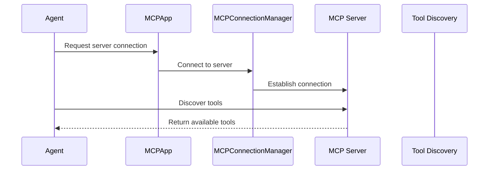

# Chapter 4: MCP Server

In the previous chapter, [Workflow](03_workflow.md), we learned how to orchestrate multiple [Agents](02_agent.md) to perform complex tasks.  Now, let's explore the tools those Agents use: *MCP Servers*.

## What problem does an MCP Server solve?

Imagine our news summarization assistant again.  Our `fetch_agent` needs a way to actually download web pages.  Where does it get this capability?  An MCP Server provides this functionality.  It's like a toolbox containing various tools (functions) that an Agent can use.  Our `fetch_agent` needs the "download webpage" tool from the "web" toolbox (MCP Server).

## Key Concepts

An MCP Server is essentially a provider of tools (functions).  These tools can be anything from fetching a webpage to reading a file to interacting with a database.  Each tool has a defined input and output, making it easy for Agents to use them correctly.

## Using an MCP Server

You typically interact with MCP Servers indirectly through [Agents](02_agent.md).  The Agent specifies which MCP Servers it needs access to via the `server_names` parameter.  Let's revisit our `fetch_agent` example:

```python
from mcp_agent.agents.agent import Agent

fetch_agent = Agent(
    name="fetch_agent",
    instruction="Fetch a webpage.",
    server_names=["fetch"], # This agent will use the 'fetch' MCP server
)

async with fetch_agent:
    # ... use the fetch_agent ...
```

This code creates a `fetch_agent` that has access to the "fetch" MCP Server.  Inside the `async with` block, the agent can now use the tools provided by the "fetch" server (like `fetch_webpage`).  We'll see how to actually use these tools in the next chapter, [AugmentedLLM](05_augmentedllm.md).

## Internal Implementation

When an [Agent](02_agent.md) is created with `server_names`, the [MCPApp](01_mcpapp.md) uses the [MCPConnectionManager](06_mcpconnectionmanager.md) to establish connections to the specified MCP Servers.  The Agent then queries the servers to discover the available tools.



The `MCPConnectionManager` handles the lifecycle of the server connections, ensuring they are started and stopped correctly.  Here's a simplified look at how the `get_server` function in `src/mcp_agent/mcp/mcp_connection_manager.py` might look:

```python
async def get_server(self, server_name):
    # ... check if server is already running ...
    if server_name not in self.running_servers:
        # ... launch the server ...
        self.running_servers[server_name] = await self._launch_server(server_name)
    return self.running_servers[server_name]
```

And a simplified `_launch_server` function:

```python
async def _launch_server(self, server_name):
    # ... get server configuration ...
    # ... start the server process ...
    # ... establish connection ...
    return session
```

The `ServerRegistry` in `src/mcp_agent/mcp_server_registry.py` stores the configuration for each MCP Server, which is loaded from the `mcp_agent.config.yaml` file.  Here's a simplified example of the configuration for a "fetch" server:

```yaml
mcp:
  servers:
    fetch:
      command: "uvx"
      args: ["mcp-server-fetch"]
```

## Conclusion

MCP Servers are the toolboxes of our AI application, providing the functionalities that our [Agents](02_agent.md) need to perform tasks.  The [MCPApp](01_mcpapp.md) and [MCPConnectionManager](06_mcpconnectionmanager.md) handle the management of these servers, allowing you to focus on building your Agents and [Workflows](03_workflow.md). In the next chapter, [AugmentedLLM](05_augmentedllm.md), we'll explore how Agents use these tools provided by MCP Servers to interact with the world and generate responses.


---

Generated by [AI Codebase Knowledge Builder](https://github.com/The-Pocket/Tutorial-Codebase-Knowledge)