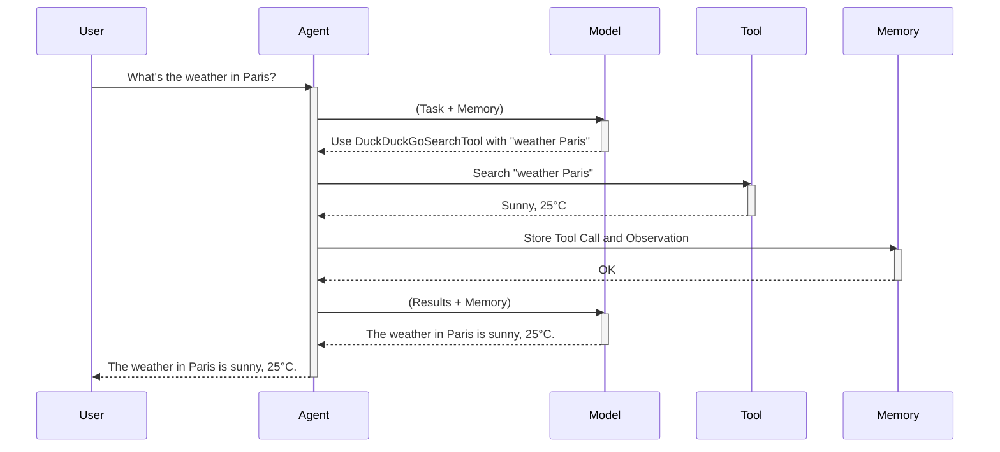

# Chapter 4: Memory

In the previous chapter, [Model](03_model.md), we learned how the model acts as the agent's brain, helping it decide what to do. But what if the agent needs to remember things from earlier in the conversation?  Imagine asking our chef agent to "Make a Caesar salad, but hold the croutons".  The agent needs to remember the "hold the croutons" part throughout the process. That's where **Memory** comes in.

## What is Memory?

The agent's memory is like a chef's notepad, storing the history of the interaction.  It keeps track of the initial task, the agent's thoughts, the actions taken, the tools used, and the observations made. This history helps the agent make informed decisions in subsequent steps, just like our chef referring to their notes to remember to skip the croutons.

## Using Memory

Let's see how memory is used within an agent.  Imagine the task is "What's the weather in Paris today and what's the historical average temperature for this date?".

```python
# ... (Agent and tool setup from previous chapters)

# The agent automatically stores each step in its memory
agent.run("What's the weather in Paris today and what's the historical average temperature for this date?")

# After the agent runs, you can access the memory
for step in agent.memory.steps:
    print(step)
```

This code runs the agent with a two-part task. The agent automatically stores each interaction step in its memory. After the agent finishes, you can access and examine the memory, which will contain a record of each step, including the initial task, the model's decisions, the tool calls, and the results.

## Inside Memory

Here's a simplified sequence diagram showing how memory is updated during an agent's interaction:



1. The user gives the agent a task.
2. The agent sends the task and its current memory to the [Model](03_model.md).
3. The model decides which [Tool](02_tool.md) to use.
4. The agent calls the tool.
5. The tool returns the result.
6. The agent stores the tool call and the result in its memory.
7. The agent sends the updated memory and results back to the model.
8. The model generates a response.
9. The agent returns the response to the user.

The `AgentMemory` class in the `memory.py` file handles the storage and management of the agent's memory.

```python
# Simplified code from memory.py
class AgentMemory:
    def __init__(self, system_prompt: str):
        self.steps = [] # List to store memory steps

    def reset(self):
        self.steps = [] # Clear the memory
```

The `steps` attribute is a list that stores each interaction step as a `MemoryStep` object.  Different types of steps (e.g., `ActionStep`, `PlanningStep`, `TaskStep`) inherit from `MemoryStep` and store relevant information for that step.

```python
# Simplified code from agents.py
class MultiStepAgent(ABC):
    # ...
    def run(self, task: str):
        # ...
        while not finished:
            # ...
            # 3. Update memory with observation
            self.memory.steps.append(action_step) # Add the current step to memory
            # ...
```

The `run()` method in the `agents.py` file shows how the agent adds each step to its memory.

## Conclusion

In this chapter, we learned about the `Memory` abstraction in `smolagents` and how it allows the agent to remember past interactions. We saw how memory is used within an agent and explored its internal implementation. Next, we'll learn about the [Gradio UI](05_gradio_ui.md) and how to interact with agents visually.


---

Generated by [AI Codebase Knowledge Builder](https://github.com/The-Pocket/Tutorial-Codebase-Knowledge)