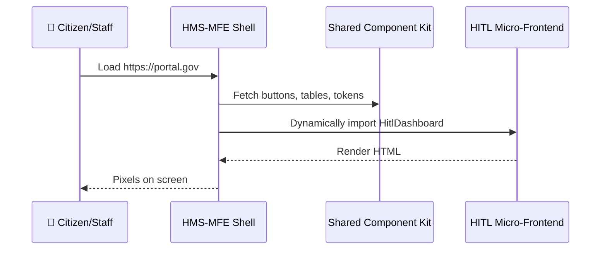

# Chapter 4: Micro-Frontend Interface Library (HMS-MFE)

*[Jump back to Chapter 3: Human-in-the-Loop (HITL) Oversight](03_human_in_the_loop__hitl__oversight_.md)*  

---

## 1  Why Do We Need HMS-MFE?

Imagine the Department of Motor Vehicles rolling out a **“Renew Driver License”** wizard for citizens **and** a behind-the-counter console for clerks—both in the same week.

Traditionally, the two web apps would:

1. Sit in separate repos with their own CSS.  
2. Drift apart in style (“Why is the ‘Submit’ button green over here but blue over there?”).  
3. Require a risky, big-bang deployment to stay in sync.

With **HMS-MFE** the DMV instead:

1. Treats each screen as a LEGO brick (a **micro-frontend**).  
2. Ships the citizen wizard Tuesday, the clerk console Thursday—no waiting on each other.  
3. Guarantees every button, font, and color still feels like “DMV.gov”.

In short, HMS-MFE gives every agency the superpower to release features independently **without** ruining the common look-and-feel promised in [Governance Layer / Admin Portal (HMS-GOV)](01_governance_layer___admin_portal__hms_gov__.md).

---

## 2  Key Concepts in Plain English

| Term | Plain-English Analogy |
|------|-----------------------|
| Micro-Frontend | A single LEGO brick—small web app that can live alone or snap into others. |
| Shell / Host | The LEGO baseplate—the first bundle the browser downloads; it decides which bricks to load. |
| Shared Component Kit | The official “building blocks” (buttons, tables, charts) stamped with the agency seal. |
| Design Tokens | The paint colors—variables for fonts, spacing, colors. |
| Independent Deployment | Each team pushes its brick to production whenever it’s ready—no more release trains. |

---

## 3  5-Minute Hands-On Tour  
*(Zero installs, just read the comments.)*

Below we add a **“ApproveDraftButton”** from HMS-MFE into the HITL dashboard you saw in Chapter 3.

```jsx
// HitlDashboard.jsx  (18 lines)
import { ApproveDraftButton } from 'hms-mfe/components';   // 1️⃣ grab LEGO brick
import { useApprove }        from 'hms-mfe/hooks';

export default function HitlDashboard({ draft }) {
  const approve = useApprove(draft.id);                    // 2️⃣ API hook

  return (
    <section className="card">
      <h2>{draft.title}</h2>
      <p>Status: {draft.status}</p>

      {/* 3️⃣ drop-in micro-frontend piece */}
      <ApproveDraftButton
        disabled={draft.status !== 'PENDING'}
        onClick={approve}
      />
    </section>
  );
}
```

Explanation  
1️⃣ Import the ready-made button—no CSS copy-paste needed.  
2️⃣ `useApprove` returns a callback that calls the HITL API you learned about.  
3️⃣ Button renders with official fonts, colors, hover states—guaranteed by HMS-MFE.

---

## 4  What Actually Happens in the Browser?



Plain-English Walkthrough:

1. Browser hits **Shell**—a tiny bundle (<30 KB).  
2. Shell downloads the **Shared Component Kit** once (cached).  
3. Shell lazy-loads the **Feature** bundle only when the user navigates to “Approvals.”  
4. The user sees the screen instantly, and every brick speaks the same design language.

---

## 5  Inside the Toolbox (for the Curious)

### 5.1 Folder Layout  

```
hms-mfe/
 ├─ packages/
 │   ├─ shell/           # baseplate
 │   ├─ components/      # buttons, inputs, charts
 │   └─ hitl-approvals/  # feature brick shown above
 └─ scripts/             # build & deploy helpers
```

### 5.2 Mini Module-Federation Config (8 lines)

```js
// packages/hitl-approvals/webpack.mfe.js
module.exports = {
  name: 'hitl',
  filename: 'remoteEntry.js',
  exposes: {
    './Dashboard': './src/HitlDashboard.jsx'
  },
  shared: ['react', 'hms-mfe/components']
};
```

Explain:  
• `name` registers this brick as **hitl**.  
• Anything in `exposes` can be imported by the Shell at runtime.  
• `shared` avoids downloading React twice.

### 5.3 Design Token Sample (5 lines)

```json
// tokens/colors.json
{
  "primary": "#0A5FFF",   // federal blue
  "success": "#17853B",   // approval green
  "danger":  "#B10E1E"    // rejection red
}
```

Every HMS-MFE component reads these tokens, guaranteeing brand consistency. Want a “Department of State” theme? Change the JSON—no code rebuild needed.

---

## 6  How Other Layers Benefit

| Layer | How It Uses HMS-MFE |
|-------|---------------------|
| [HMS-GOV](01_governance_layer___admin_portal__hms_gov__.md) | Builds dashboards from bricks like `<PolicyTable>` and `<AuditLogViewer>`. |
| [HMS-AGX](02_ai_representative_agent__hms_agx__.md) | Exposes a “Suggested Actions” brick that GOV can embed. |
| [HITL](03_human_in_the_loop__hitl__oversight_.md) | Renders approval queues with zero custom CSS. |
| Upcoming [HMS-OPS](12_operational_monitoring___logging__hms_ops__.md) | Ships real-time log panels as independent bricks. |

---

## 7  Frequently Asked Questions

**“Does every micro-frontend require React?”**  
No. The Shell speaks *Web Components* under the hood; React, Vue, or plain HTML all work as long as the bundle exposes a custom element.

**“How big should a brick be?”**  
Rough rule: if two different scrum teams could own it, make it a separate micro-frontend.

**“What about accessibility (Section 508)?”**  
The Shared Component Kit bakes in ARIA labels and keyboard support, so every brick inherits compliance automatically.

---

## 8  What You Learned

• HMS-MFE is the **LEGO kit** that keeps every screen in our platform consistent yet independently deployable.  
• You imported a ready-made “Approve” button in **5 lines**.  
• Under the hood, a tiny Shell lazy-loads feature bundles and a shared design system.  
• Other layers—GOV, AGX, HITL, OPS—all snap into this kit.

Ready to see where the buttons actually send their data?  
Continue to [Backend Service Layer & APIs (HMS-SVC)](05_backend_service_layer___apis__hms_svc__.md).

---

Generated by [AI Codebase Knowledge Builder](https://github.com/The-Pocket/Tutorial-Codebase-Knowledge)