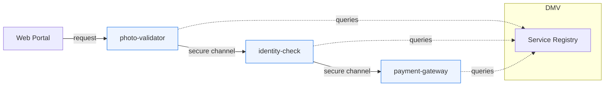
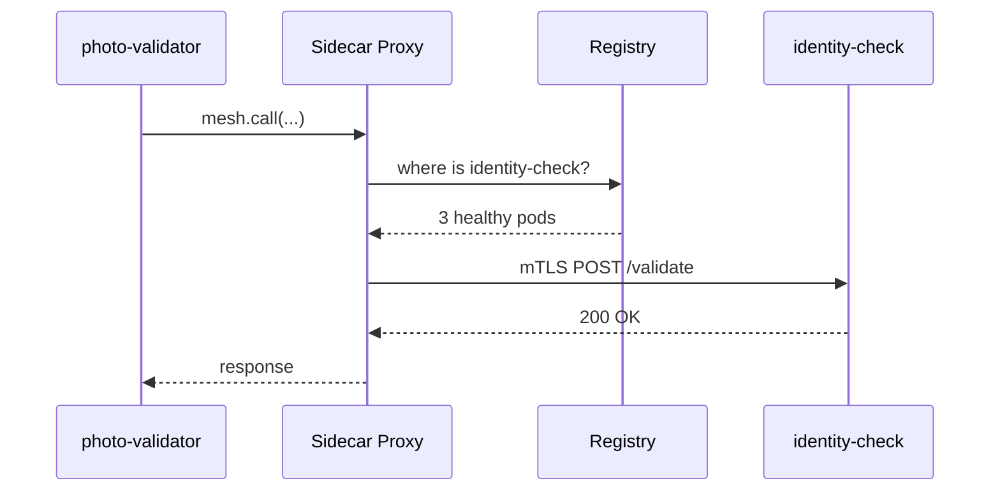

# Chapter 4: Microservices Mesh & Service Registry
*[Jump back to Chapter 3: Management Layer (HMS-SVC & HMS-ACH)](03_management_layer__hms_svc___hms_ach__.md)*  

---

## 1. Why Do We Need a Mesh?

Imagine the Bureau of Consular Affairs launching a new **“10-Minute Passport Renewal”** portal.  
Behind the web form sit **hundreds** of tiny services:

* `photo-validator`
* `identity-check`
* `payment-gateway`
* `passport-printer`

Questions that pop up immediately:

1. How does `photo-validator` know where `payment-gateway` lives today?
2. What if `identity-check` is restarting—should the request be retried or routed elsewhere?
3. How do we stop impostor services from eavesdropping on sensitive passport data?

A **service mesh** plus a **service registry** answer all three—with almost *no* code in your business services.

---

## 2. Key Concepts (Plain-English)

| Term | Friendly Analogy |
|------|------------------|
| Service Mesh | A city traffic grid with smart lights that can redirect cars (requests) around accidents (failures). |
| Sidecar Proxy | The police officer in every junction that enforces the traffic rules for its intersection. |
| Mutual TLS (mTLS) | Showing and checking passports at every intersection—both sides prove identity. |
| Retry Policy | An automatic “make a U-turn and try another road” when a street is blocked. |
| Service Registry | The DMV’s license-plate database—keeps the official list of cars (services) and their addresses. |
| Health Probe | Annual vehicle inspection stickers—prove a service is road-worthy before it’s allowed on the street. |

---

## 3. A 60-Second Mental Model



1. Every service start-up: “Hey DMV (Registry), here’s my plate & address.”  
2. Each call between services flows through **sidecar proxies**.  
3. The mesh auto-handles retries, load-balancing, and mutual TLS without touching application code.

---

## 4. Hands-On: Make a Service Discoverable in 3 Steps

We’ll register a *brand-new* `photo-validator` micro-service.

### 4.1 Declare Yourself

Create `hms.yml` (10 lines):

```yaml
service:
  name: photo-validator
  version: 1.0.0
  port: 7000
mesh:
  retries: 2          # auto-retry failed calls
  timeout: 800ms
  mtls: true          # turn on mutual-TLS
```

Explanation  
• Name, version, and port = your “license plate.”  
• `retries` & `timeout` are traffic rules.  
• `mtls: true` instructs the mesh to inject certificates automatically.

### 4.2 Start the Service in Dev Mode

```bash
hms-mesh dev
```

Console output (trimmed):

```
✔ Sidecar injected
✔ Certificate issued (CN=photo-validator)
✔ Registered with HMS-REG at reg.gov.local:9000
Service running on http://localhost:7000
```

No extra code—just run!

### 4.3 Call Another Service — No Hard-Coded URLs!

```js
// lib/idCheck.js  (Node, 12 lines)
import { mesh } from "@hms/sdk";

export async function verify(idData) {
  // ask mesh to find 'identity-check' and call /validate
  return mesh.call("identity-check", "/validate", {
    method: "POST",
    json: idData,
  });
}
```

What happens?  
1. `mesh.call` asks the **registry** for healthy instances of `identity-check`.  
2. Sidecar opens an mTLS channel.  
3. If the first instance fails, the mesh retries another one—*you wrote zero retry logic*.

---

## 5. Under the Hood (Peek Inside)

### 5.1 Life of a Single Request



### 5.2 Minimal Sidecar Logic

_File: `sidecar/router.go` (simplified, 18 lines)_

```go
func Handle(req Request) (Resp, error) {
    svc := req.TargetService
    addrs := registry.Lookup(svc)   // ask DMV
    for i, addr := range addrs {
        resp, err := mtlsSend(addr, req)
        if err == nil { return resp, nil }
        if i == retries { break }   // give up after N tries
    }
    return nil, errors.New("all endpoints failed")
}
```

Line-by-line  
1. Ask the registry for all healthy addresses.  
2. Loop through them with `mtlsSend`.  
3. Stop after configured retry count.

### 5.3 Registry Data Snapshot

```json
{
  "photo-validator": [
    { "ip": "10.1.3.4",  "port": 7000, "tlsCert": "...", "status": "healthy" },
    { "ip": "10.1.3.8",  "port": 7000, "tlsCert": "...", "status": "healthy" }
  ]
}
```

Updated in real-time by health probes the sidecars push every 10 seconds.

---

## 6. Common Troubles & Fixes

| Symptom | Likely Cause | Quick Fix |
|---------|--------------|-----------|
| `mesh.call` hangs | Service name typo | `hms-reg list` to view valid names |
| `TLS handshake failed` | Clock skew | Sync VM clock or enable NTP |
| Many 503 errors | Circuit breaker open | Check `hms-mesh dashboard` for failing upstream |

---

## 7. Mini-Lab: Observe Retries & mTLS

1. Open two terminals.  
2. Terminal A – watch logs:  
   ```bash
   hms-mesh tail --service identity-check
   ```  
3. Terminal B – simulate load:  
   ```bash
   hms-mesh curl photo-validator /stress-test
   ```  
4. Notice in Terminal A the **mesh** makes multiple attempts when pods are killed, and every log line includes `mtls=on`.

---

## 8. FAQ Corner

**Q: Do I still need Kubernetes Services or Ingress?**  
For internal traffic, the mesh handles discovery & routing; you only expose an Ingress for external clients.

**Q: Can non-HMS services join?**  
Yes—register them with `hms-reg add --external-url=https://legacy.agency.gov`.

**Q: How large can the registry grow?**  
Tested to 25 000 instances with sub-50 ms lookup time. Sharding kicks in automatically after 10 000.

---

## 9. What You Learned

• A **service mesh** removes boilerplate retry, security, and discovery code.  
• The **registry** is the authoritative phone-book + DMV for every service.  
• Registering a service is as simple as adding `hms.yml` and running `hms-mesh dev`.  

Next we’ll see how to **bridge** these well-behaved micro-services with *external* legacy or partner systems.  
*[Continue to Chapter 5: External System Adapter / Sync Bridge](05_external_system_adapter___sync_bridge_.md)*

---

Generated by [AI Codebase Knowledge Builder](https://github.com/The-Pocket/Tutorial-Codebase-Knowledge)