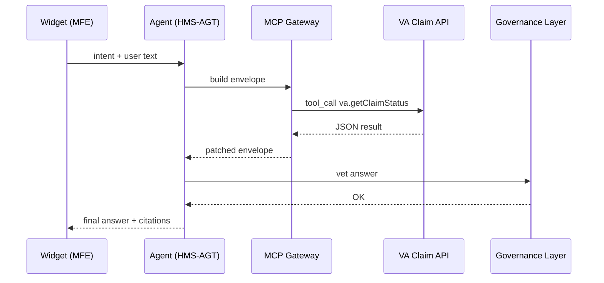

# Chapter 4: Model Context Protocol (HMS-MCP)

[← Back to Chapter&nbsp;3: Micro-Frontend Interface (HMS-MFE)](03_micro_frontend_interface__hms_mfe__.md)

---

## 1 — Why another “protocol”?

Picture a Veterans Affairs (VA) chatbot that runs on an LLM.  
A veteran types:

> “Did my disability claim get approved yet?”

The model **might**…

* hallucinate nonexistent claim numbers,  
* call the wrong API, or  
* forget to hide private medical data.

HMS-MCP is the **radio handbook** every AI agent must follow so this *never* happens.  
It defines one compact envelope for:

1. What the model **knows** (context).  
2. Which **tools** it may call.  
3. How it must **answer**.

Same grammar everywhere → agents plug into schedulers, payment rails, or policy engines without translation errors.

---

## 2 — Core Ideas (Plain English Cheatsheet)

| Term | One-sentence meaning | Analogy |
|------|---------------------|---------|
| Context Block | Facts we hand the model. | A briefing folder. |
| Tool Call | Structured request to an external API. | Filling a “service ticket”. |
| Document Cite | Canonical reference to a PDF, law, or record. | Footnote in a report. |
| Response Envelope | JSON wrapper that holds everything. | A stamped envelope with the briefing + reply. |

Keep these four pieces in mind—they’re 95 % of MCP.

---

## 3 — Hands-On: Your First MCP Message

Below is a **14-line** Python snippet that sends a claim-status question to a model following MCP.

```python
from hms_mcp import send   # tiny helper

msg = {
  "context": {
    "citizen_id": "VA-8871",
    "intent": "check_claim_status"
  },
  "prompt": "Did my disability claim get approved yet?"
}

reply = send(msg)        # under the hood: POST /mcp
print(reply)
```

Possible output (pretty-printed):

```json
{
  "answer": "Your claim VA-8871 is still under review (est. 5 days).",
  "tool_calls": [
    {
      "name": "va.getClaimStatus",
      "args": {"citizen_id": "VA-8871"},
      "result": {"status": "Under Review", "eta_days": 5}
    }
  ],
  "citations": [
    {"doc": "VA_M21-1, Part V, Subpart ii, Chapter 2", "page": 18}
  ]
}
```

What happened?

1. The model saw *only* the approved **context**.  
2. It requested the official `va.getClaimStatus` tool (no rogue calls).  
3. It quoted the exact regulation that defines timelines.  
4. Everything is returned in one predictable envelope.

---

## 4 — Anatomy of the Envelope

```json
{
  "context": { … },
  "prompt":  "User text here",
  "answer":  "Model reply here",
  "tool_calls": [ … ],
  "citations": [ … ]
}
```

Field-by-field tour:

* **context** – Key-value pairs **you** supply (identity, intent, journey step).  
* **prompt** – Raw user input (optional in follow-up turns).  
* **answer** – Natural-language reply after all tools finish.  
* **tool_calls** – Each contains `name`, `args`, and `result`.  
* **citations** – Where did the answer come from? URL, doc ID, or policy page.

If a field is empty, omit it—less bytes, easier audits.

---

## 5 — Under the Hood (5-Actor Diagram)



Only **seven hops** from click to answer, all strongly typed.

---

## 6 — Internal Implementation Peek

### 6.1 Envelope Builder (10 lines)

```python
# hms_mcp/builder.py
import uuid, time, json

def build(context, prompt):
    return {
      "id": str(uuid.uuid4()),
      "timestamp": time.time(),
      "context": context,
      "prompt": prompt,
      "tool_calls": [],
      "citations": []
    }
```

Simple dictionary, auto-adds an ID and timestamp.

### 6.2 Tool Call Helper (12 lines)

```python
# hms_mcp/tools.py
def call_tool(env, name, args, fn):
    result = fn(**args)          # real API function
    env["tool_calls"].append({
      "name": name,
      "args": args,
      "result": result
    })
    return result
```

Adds the call result back into the same envelope.  
No side channels → easier to audit.

### 6.3 Gateway “send” Wrapper (18 lines)

```python
# hms_mcp/__init__.py
import requests, json, builder

API = "https://gateway.hms.gov/mcp"

def send(msg):
    env = builder.build(msg["context"], msg["prompt"])
    # 🔒 wrap in governance auth header
    r = requests.post(API, json=env, timeout=15)
    return r.json()
```

Notice:

* Under 20 lines.  
* Governance token is inserted automatically (see Chapter 1).  
* Gateway validates schema **before** passing to any model.

---

## 7 — How HMS-MCP Relates to Other Layers

* **[Governance Layer](01_governance_layer__ai_governance_values__.md)** vets every envelope (privacy, transparency).  
* **[Micro-Frontends](03_micro_frontend_interface__hms_mfe__.md)** hand user intents to agents *already wrapped* in MCP.  
* **[Agent Framework](05_agent_framework__hms_agt__.md)** provides helper functions (`call_tool`, `cite_doc`) built on MCP primitives.  
* Future **[Agent Orchestration](06_agent_orchestration___workflow_engine__hms_act__.md)** chains envelopes into multi-step workflows.

---

## 8 — Frequently Asked Questions

**Q1: Do I have to use JSON?**  
Yes—for now. JSON is language-agnostic and easy to diff in audits.

**Q2: What if my tool call fails?**  
Return the error inside `tool_calls[i].error`; the Agent Framework can retry or escalate to a human ([HITL](07_human_in_the_loop_oversight__hitl__.md)).

**Q3: Can the model add new fields?**  
No. Schemas are versioned. Unknown fields are stripped by the gateway to prevent prompt injection.

---

## 9 — Try It Yourself (3-minute Exercise)

1. Install the tiny SDK:

   ```bash
   pip install hms-mcp-lite
   ```

2. Copy the 14-line snippet from Section 3, change the `citizen_id`, and run.  
3. Modify `msg["context"]` to an **unknown** intent—observe how the agent refuses the call with a governance error.

You’ve just witnessed MCP’s guardrails.

---

## 10 — What You Learned

* HMS-MCP is the **shared grammar** every model and agent speaks.  
* One compact envelope holds context, tool calls, citations, and answers.  
* Rigid structure + governance hooks = safer, reproducible AI behavior.

Next, we’ll zoom into the brains that **produce** these envelopes:  
[Chapter 5: Agent Framework (HMS-AGT)](05_agent_framework__hms_agt__.md)

---

---

Generated by [AI Codebase Knowledge Builder](https://github.com/The-Pocket/Tutorial-Codebase-Knowledge)