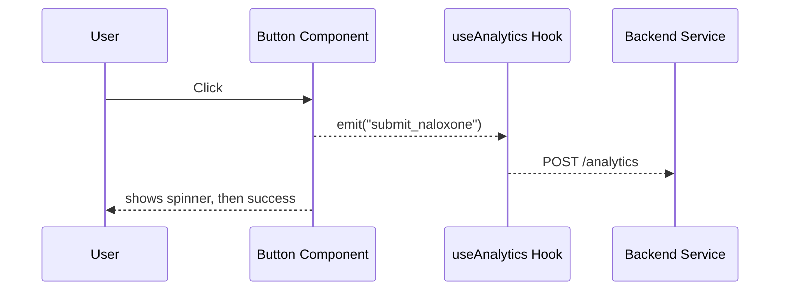

# Chapter 4: Modular Component Library  
*(Government-grade UI “Legos” you can snap together.)*

[← Back to Chapter 3: Role-Based Access Control (RBAC)](03_role_based_access_control__rbac__.md)

---

## 1. Why Bother?  

Picture **Sam**, a web lead at the **Substance Abuse and Mental Health Services Administration (SAMHSA)**.  
He just got a mandate:

> “Launch a public portal where citizens can request naloxone kits—go live in two weeks.”

Sam has no time to:

* Redesign buttons  
* Re-write form validation  
* Negotiate accessibility audits  
* Wire analytics events  
* Re-implement [RBAC](03_role_based_access_control__rbac__.md) checks

The **Modular Component Library (MCL)** gives him a shelf of **pre-approved, policy-compliant widgets** that already solve those headaches.  
He drags, drops, and ships.

---

## 2. What Exactly Is in the Box?

| Term | Plain-English Meaning | 1-Sentence Analogy |
|------|----------------------|--------------------|
| Component | A reusable chunk of UI + logic. | A LEGO brick. |
| Token | A single style value (`color.primary = #1A51FF`). | The paint color on the brick. |
| Hook | A small function that adds shared behavior (auth, analytics). | Glue that snaps bricks together. |
| Package | A versioned bundle of components (`@hms-nfo/mcl`). | A LEGO set in a box. |
| Theme | A JSON map that overrides tokens. | Switching from “Classic” to “Space” colors. |

All components **inherit**:

* WCAG 2.1 accessibility labels  
* [RBAC](03_role_based_access_control__rbac__.md) guard option  
* Analytics event emitters  
* FedRAMP-friendly security sanitizers

---

## 3. Quickstart: “Request Naloxone” Form in 3 Snippets

1. Install & wrap your app:

```tsx
// src/main.tsx  (18 lines)
import React from "react";
import ReactDOM from "react-dom";
import { ThemeProvider } from "@hms-nfo/mcl";
import healthTheme from "./healthTheme";

ReactDOM.render(
  <ThemeProvider theme={healthTheme}>
    <App />
  </ThemeProvider>,
  document.getElementById("root")
);
```

*Explanation:* `ThemeProvider` injects fonts, colors, and spacing into **every** component.

---

2. Compose the page:

```tsx
// RequestNaloxone.tsx  (16 lines)
import { Card, TextField, Button, Banner } from "@hms-nfo/mcl";
import { useState } from "react";

export default function RequestNaloxone() {
  const [sent, setSent] = useState(false);
  if (sent) return <Banner success text="Request received 🎉" />;

  return (
    <Card title="Free Naloxone Kit">
      <TextField label="Full Name" name="name" required />
      <TextField label="Address" name="addr" required />
      <Button
        onClick={() => setSent(true)}
        label="Submit Request"
        analyticsId="submit_naloxone"
      />
    </Card>
  );
}
```

*Explanation:* No CSS, no aria-labels, no analytics wiring—already baked in.

---

3. Show requests only to staff:

```tsx
// NaloxoneTable.tsx  (18 lines)
import { DataTable, withGuard } from "@hms-nfo/mcl";

function Table() {
  return (
    <DataTable
      title="Incoming Requests"
      columns={["Name", "Address", "Date"]}
      fetch="/api/naloxone"
    />
  );
}

export default withGuard(Table, "read:naloxone_requests");
```

*Explanation:* `withGuard` auto-calls `can(role, perm)` from [RBAC](03_role_based_access_control__rbac__.md). Citizens never hit the API.

---

## 4. How One Click Travels Through the Library



1. The **Button** already knows its `analyticsId`.  
2. `useAnalytics` sends a background event—no extra code for Sam.  
3. Button style, disabled state, keyboard focus ring all come from shared tokens.

---

## 5. Peeking Under the Hood (No Code)

1. **Design Tokens** live in a tiny JSON file—think “official paint catalog.”  
2. Each component references tokens with CSS-in-JS (`color: token.primary`).  
3. A **Security Hook** auto-sanitizes any string that reaches the DOM.  
4. **Accessibility Checker** runs in development; redlines if labels are missing.  
5. Versioned **NPM package** publishes under `@hms-nfo/mcl@x.y.z`.

---

### 5.1 Mini File Map

```
mcl/
  src/
    components/
      Button.tsx
      Card.tsx
      DataTable.tsx
      Banner.tsx
    hooks/
      useAnalytics.ts
      useGuard.ts
    tokens/
      default.json
    index.ts       // re-exports
```

---

### 5.2 Tiny Internal Example: Button (16 lines)

```tsx
// components/Button.tsx
import { colors, radius } from "../tokens";
import { useAnalytics } from "../hooks/useAnalytics";
import { useGuard } from "../hooks/useGuard";

export function Button({ label, onClick, variant = "primary", analyticsId }) {
  useGuard("ui:click");          // aborts if user blocked
  const send = useAnalytics();

  const style = {
    background: colors[variant],
    borderRadius: radius.sm,
  };

  return (
    <button
      style={style}
      onClick={(e) => {
        send(analyticsId);
        onClick?.(e);
      }}
    >
      {label}
    </button>
  );
}
```

*Highlights:*  
• Shared `colors` & `radius` tokens.  
• Automatic security & analytics hooks.

---

## 6. Theming in 10 Lines

```ts
// healthTheme.ts (10 lines)
export default {
  colors: {
    primary: "#00695C",      // teal
    danger: "#C62828",
    background: "#F5FDFC",
  },
  font: "'Public Sans', sans-serif",
};
```

Drop this into `<ThemeProvider>` and every component obeys—no CSS overrides.

---

## 7. Hands-On Exercise

1. `npm install @hms-nfo/mcl`  
2. Wrap your `<App/>` in `<ThemeProvider theme={{ colors: { primary: "#5B2C6F" } }}>`  
3. Add a `<Button label="Purple Test" />`  
4. Hit refresh → the button turns purple and still passes a11y contrast checks. 🎉

---

## 8. Common Pitfalls & Fast Fixes

| Pitfall | Symptom | Fix |
|---------|---------|-----|
| Forgot ThemeProvider | Components look unstyled | Wrap root with `<ThemeProvider>` |
| Duplicate analytics IDs | Events overwrite each other | Generate IDs with agency prefix (`samhsa_submit`) |
| Manual CSS overrides | Inconsistent a11y colors | Extend tokens instead of inline CSS |

---

## 9. What You Learned

You now have a **policy-compliant toolkit** to assemble portals at light speed:

* Drag-and-drop components  
* Built-in a11y, security, analytics, RBAC  
* Fully themeable via tokens

Sam meets his two-week deadline with days to spare.

Next we’ll see how the entire platform stays *governable* across agencies in [Governance Layer (HMS-GOV)](05_governance_layer__hms_gov__.md).

*Time to snap bigger LEGO builds!*

---

Generated by [AI Codebase Knowledge Builder](https://github.com/The-Pocket/Tutorial-Codebase-Knowledge)