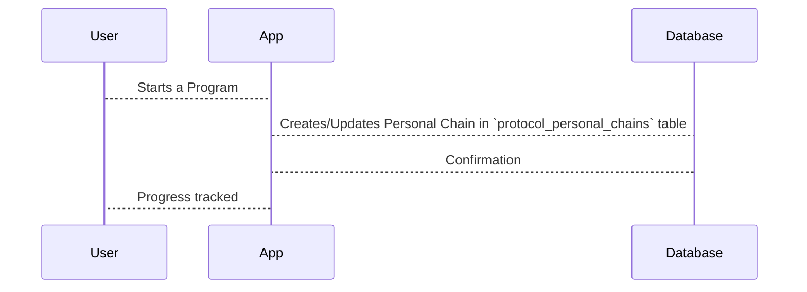

# Chapter 4: Personal Chains

In the previous chapter, [Protocols](03_protocols.md), we learned about the templates for workout routines. Now, let's see how we track an individual user's progress through a specific program. This is where *Personal Chains* come in.

Imagine Alice is following the "Beginner Strength Training" [Program](02_programs.md), which is based on a [Protocol](03_protocols.md) of the same name.  How do we know which exercises she's completed, her responses to any assessments, and her overall progress?  A Personal Chain tracks all of this information, like marking your place in a recipe as you bake.

## What is a Personal Chain?

A Personal Chain is like a personalized progress tracker for each user participating in a Program. It's specific to both the user and the program.  It stores the user's current step, their responses to assessments, and any other relevant data.

## Key Concepts in a Personal Chain

* **Current Step:** This indicates where the user is in the Program.  If the "Beginner Strength Training" program has steps like "Squats", "Push-ups", and "Lunges", the Personal Chain will store which step Alice is currently on.
* **Responses to Assessments:** If the Program includes assessments (like "How difficult were the squats?"), Alice's answers are stored in her Personal Chain.
* **Other Relevant Data:**  This could include things like the date and time Alice completed a step, any notes she added, or any feedback she provided.

## Creating a Personal Chain

When Alice starts the "Beginner Strength Training" Program, a new Personal Chain is created for her.  Here's a simplified example of how we might represent that in code:

```php
// File: factories/Core/Protocol/ProtocolPersonalChainFactory.php

use App\Models\Core\Protocol\ProtocolPersonalChain;

$personalChain = ProtocolPersonalChain::factory()->create([
    'user_id' => 1, // Alice's User ID
    'program_id' => 1, // The "Beginner Strength Training" Program ID
    'protocol_id' => 1, // The "Beginner Strength Training" Protocol ID
    // ... other fields ...
]);
```

This code creates a new entry in the `protocol_personal_chains` table.  We're skipping some details for now, like the `protocol_chain_id` which links to the specific sequence of steps within the Protocol.

## Updating a Personal Chain

As Alice progresses through the Program, her Personal Chain is updated.  For example, when she completes the "Squats" step, the `current_step_target` field in her Personal Chain is updated to reflect her progress.

## Under the Hood

When a Personal Chain is created or updated, the code interacts with the database to store the information.



The `CreateProtocolPersonalChainsTable` migration file defines the structure of the `protocol_personal_chains` table.

```php
// File: migrations/2022_06_08_092322_create_protocol_personal_chains_table.php
// ... code to create the protocol_personal_chains table ...
```

Other migration files, like `ExtendPersonalChainsTable`, add more columns to the `protocol_personal_chains` table as needed.

```php
// File: migrations/2023_06_28_015825_extend_personal_chains_table.php
// ... code to add fields like 'purchase_id', etc. ...
```

## Conclusion

In this chapter, we learned about Personal Chains, which track an individual user's progress through a specific Program. We saw how Personal Chains are created and updated. In the next chapter, we'll explore [Protocol Chains](05_protocol_chains.md), which define the specific sequence of steps within a Protocol.


---

Generated by [AI Codebase Knowledge Builder](https://github.com/The-Pocket/Tutorial-Codebase-Knowledge)