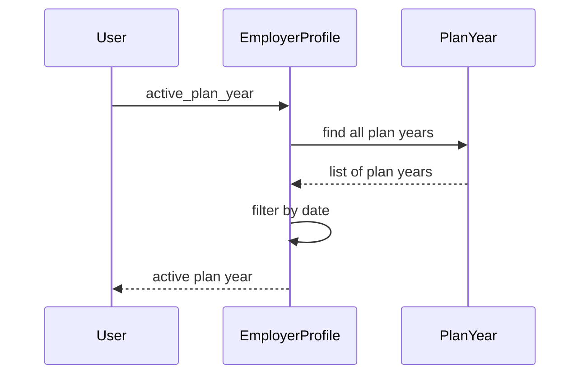

# Chapter 4: PlanYear

In the previous chapter, [EmployerProfile](03_employerprofile.md), we learned how employers are represented in our system.  This chapter introduces the `PlanYear` concept, which represents a specific period of time during which an employer offers health benefits.

## What problem does `PlanYear` solve?

Imagine Acme Corp wants to offer different health plans to its employees for 2024.  They also want to define the period when employees can enroll in these plans (Open Enrollment). How do we represent this annual cycle of benefits? The `PlanYear` model solves this. It's like an annual benefits calendar for an employer.

## Key Concepts:

1. **Start and End Dates:** A `PlanYear` has `start_on` and `end_on` dates, defining the period when the benefits are active.  For example, a 2024 `PlanYear` might start on January 1st, 2024 and end on December 31st, 2024.

2. **Open Enrollment Period:** The `open_enrollment_start_on` and `open_enrollment_end_on` dates define when employees can enroll in or change their health plans.  This period is usually a few weeks long and occurs before the `PlanYear` starts.

3. **Benefit Groups:** A `PlanYear` contains one or more [BenefitGroup](05_benefitgroup.md) objects.  Each `BenefitGroup` represents a set of health plans offered to a specific group of employees (e.g., full-time employees, part-time employees).

## Using the `PlanYear` model

Let's say we want to find the active `PlanYear` for Acme Corp and see when their open enrollment period starts:

```ruby
# ... other code ...

acme_corp = Organization.find_by(legal_name: "Acme Corp").employer_profile
active_plan_year = acme_corp.active_plan_year

if active_plan_year.present?
  puts "Open Enrollment starts on: #{active_plan_year.open_enrollment_start_on}"
end

# ... other code ...
```

This code first finds the `EmployerProfile` for Acme Corp, then gets the active `PlanYear`.  If an active `PlanYear` exists, it prints the open enrollment start date.

## Under the Hood

When you call `acme_corp.active_plan_year`, the following happens:

1. **Retrieve Plan Years:** The `EmployerProfile` retrieves all its associated `PlanYear` objects.

2. **Filter by Date:** It filters the `PlanYear` objects to find the one that is currently active based on the current date.



The code for this is in `employer_profile.rb`:

```ruby
# employer_profile.rb
class EmployerProfile
  # ... other code ...

  def active_plan_year
    # ... other code (simplified for brevity) ...
    plan_years.published_plan_years_by_date(today).first
  end

  # ... other code ...
end
```

This simplified code snippet shows how the `active_plan_year` method filters the `plan_years` collection by the current date (`today`).  The `published_plan_years_by_date` scope in `plan_year.rb` handles the date filtering.

```ruby
# plan_year.rb
class PlanYear
  # ... other code ...

  scope :published_plan_years_by_date, ->(date) {
    where(
      "$and" => [
        {:aasm_state.in => PUBLISHED }, # Only consider published plan years
        {:"start_on".lte => date, :"end_on".gte => date} # Check if the date falls within the plan year
      ]
    )
  }

  # ... other code ...
end

```

## Conclusion

This chapter introduced the `PlanYear` model, representing an employer's annual benefits cycle.  We learned about its key attributes and how it's used. In the next chapter, we'll explore [BenefitGroup](05_benefitgroup.md) in more detail.


---

Generated by [AI Codebase Knowledge Builder](https://github.com/The-Pocket/Tutorial-Codebase-Knowledge)