# Chapter 4: Policy Deployment Pipeline (CI/CD for Rules)

*(“DevOps-style shipping, but for laws instead of microservices”)*  

[← Back to Chapter 3: HMS-CDF Legislative Workflow Engine](03_hms_cdf_legislative_workflow_engine_.md)

---

## 1. Why Do We Need a Pipeline for Rules?

Picture this:

> Congress authorizes an **instant $5,000 wildfire-relief payment**.  
> The text is drafted in Chapter 3, but nothing is live yet.  
> Citizens start calling in 48 hours—**failure is not an option**.

Just like code, a new policy must be:

* Automatically tested (does it break budgets? contradict existing law?)  
* Reviewed & signed off (legal counsel, budget office, public comment)  
* Deployed to production with **one click**  
* Reversible **just as fast** if defects appear

That end-to-end conveyor belt is the **Policy Deployment Pipeline (PDP)**.

---

## 2. High-Level Use Case

We will follow the wildfire-relief rule called **Wildfire-Aid-2024** from:

1. Draft JSON (output of Chapter 3)  
2. Tests & peer review  
3. Staging, production, potential rollback

By the end you’ll run a mini pipeline locally and watch the rule reach “production” in under 90 seconds.

---

## 3. Key Concepts (Beginner Friendly)

| Stage | Friendly Analogy | What Happens |
|-------|------------------|--------------|
| Lint | Spell-check | Syntax & duplicate-law scan |
| Simulation | Wind-tunnel test | Run sample citizen data + budget limits |
| Review Gate | Two-person rule | Legal & finance sign with 👍 |
| Staging | Dress rehearsal | Rule active for test accounts only |
| Production | Showtime | All real traffic uses new rule |
| Rollback | UNDO button | Instantly revert to previous version |

---

### 3.1 Visual Overview


---

## 4. Trying the Pipeline Yourself

All commands use **HMS-CLI**; install stub with:

```bash
pip install hms-cdf-cli   # tiny mock package for this tutorial
```

### 4.1 Ship the Draft

```bash
# 1. Push rule to the pipeline
hms rule push wildfire-aid-2024.json
```

Sample output:

```
📤 Uploaded Wildfire-Aid-2024  (v1)
🔍 Lint ............. PASSED
🧪 Simulation ....... PASSED (Cost: $98M within budget)
⏳ Waiting for peer review ...
```

### 4.2 Approve the Gate (simulate two reviewers)

```bash
hms rule review wildfire-aid-2024 --user "LegalTeam"  --approve
hms rule review wildfire-aid-2024 --user "BudgetOffice" --approve
```

```
✅ All required reviews received.
🚀 Promoted to STAGING
```

### 4.3 Promote to Production

```bash
hms rule deploy wildfire-aid-2024 --env prod
```

```
🎉 Wildfire-Aid-2024 now LIVE (v1)
```

### 4.4 Emergency Rollback

```bash
hms rule rollback wildfire-aid-2024 --to previous
```

```
↩️  Reverted to v0 in 3.2s (Congress requested pause)
```

And that’s it—no manual editing on servers, no downtime.

---

## 5. What Happens Under the Hood?

```mermaid
sequenceDiagram
    participant LWE as Legislative Engine
    participant PDP as Deployment Pipeline
    participant TEST as Test Suite
    participant REV as Review Gate
    participant ENV as Prod Env

    LWE->>PDP: push(rule)
    PDP->>TEST: run_tests(rule)
    TEST-->>PDP: pass/fail
    PDP->>REV: request_approvals()
    REV-->>PDP: ✔️
    PDP->>ENV: deploy(rule)
```



1. LWE (from [Chapter 3](03_hms_cdf_legislative_workflow_engine_.md)) uploads a JSON rule.  
2. PDP triggers automated tests.  
3. At least two human approvals are required.  
4. If all green, the rule is promoted to **prod**; otherwise it stops cold.

---

## 6. Peek at the Code (≤ 20 lines each)

Below is a **super-mini** pipeline written in Python so you can grasp the mechanics.

### 6.1 Pipeline Skeleton

```python
# file: pipeline/core.py
STAGES = ["lint", "simulate", "review", "staging", "prod"]
rules, reviews = {}, {}

def push(rule_id, data):
    rules[rule_id] = {"v": 1, "data": data, "stage": "lint"}
    run_lint(rule_id)

def run_lint(rid):
    if "rule" not in rules[rid]["data"]:
        raise ValueError("Syntax error")
    rules[rid]["stage"] = "simulate"
    simulate(rid)
```

Explanation: Stores rule in memory and begins with lint.

### 6.2 Simulation Step

```python
def simulate(rid):
    # fake budget check
    if rules[rid]["data"].get("cost", 0) > 1e9:
        raise ValueError("Over budget")
    rules[rid]["stage"] = "review"
    reviews[rid] = set()
```

Explanation: Rejects rules above $1 B. If ok, waits for reviewers.

### 6.3 Peer Review & Deploy

```python
def approve(rid, user):
    reviews[rid].add(user)
    if len(reviews[rid]) >= 2:
        rules[rid]["stage"] = "staging"

def promote(rid, env):
    if rules[rid]["stage"] != "staging":
        raise PermissionError("Not ready")
    rules[rid]["stage"] = env   # 'prod'
```

Explanation: Needs two unique reviewers, then one command moves stage to production.

### 6.4 Rollback

```python
def rollback(rid):
    rules[rid]["v"] -= 1
    rules[rid]["stage"] = "prod"
```

Explanation: Decrements version pointer—instant undo.

---

## 7. How This Pipeline Interacts with Other Layers

* **Governance Layer** still blocks any rule that violates core principles—see [Chapter 1](01_governance_layer__ai_governance_model__.md).  
* **Human-in-the-Loop** overrides can surface bugs that trigger a rollback here—see [Chapter 2](02_human_in_the_loop__hitl__oversight_mechanism_.md).  
* After deployment, continuous audits feed the [Compliance Guardrail Framework (HMS-ESQ)](05_compliance_guardrail_framework__hms_esq__.md).  
* All metrics flow into [System Observability & Ops Center](19_system_observability___ops_center__hms_ops__.md).

---

## 8. 90-Second Lab: Run the Mini Pipeline

1. Save the four code snippets into `pipeline/`.  
2. Create a short driver script:

```python
from pipeline.core import push, approve, promote

rule = {"rule": "wildfire_aid", "max_payment": 5000, "cost": 9.8e7}
push("wildfire-aid-2024", rule)
approve("wildfire-aid-2024", "Legal")
approve("wildfire-aid-2024", "Budget")
promote("wildfire-aid-2024", "prod")
print("Stage:", __import__('pipeline.core').rules["wildfire-aid-2024"]["stage"])
```

3. Run `python driver.py` — you should see:

```
Stage: prod
```

Now break the rule (e.g., set `cost` to `2e9`) and watch the pipeline halt at simulation.

---

## 9. Recap

You learned:

1. **Why** policies need a DevOps-style pipeline  
2. The core stages: Lint → Simulation → Review → Staging → Prod  
3. How to **promote** and **rollback** rules with one command  
4. How a 20-line Python mock shows the moving parts  

Next stop: keeping those live rules continuously compliant with real-time guardrails.  
Continue to → [Compliance Guardrail Framework (HMS-ESQ)](05_compliance_guardrail_framework__hms_esq__.md)

---

---

Generated by [AI Codebase Knowledge Builder](https://github.com/The-Pocket/Tutorial-Codebase-Knowledge)