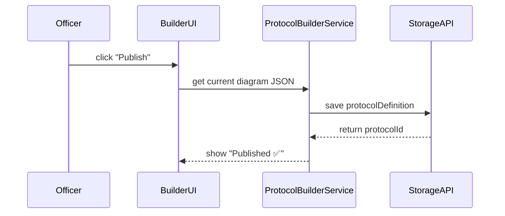

# Chapter 4: Protocol Builder

Welcome back! In [Chapter 3: Interface Layer](03_interface_layer_.md), we saw how users sign in, navigate, and fetch data. Now we’ll explore the **Protocol Builder**—a visual, drag-and-drop workspace that lets agency staff design and publish operational workflows (or “protocols”) without writing code.

---

## 1. Why Protocol Builder?

Imagine you’re an officer at the Bureau of Consular Affairs. You need to map out every step for processing a passport application:

  1. Citizen submits application.  
  2. Officer verifies identity.  
  3. Decision point: “Is ID valid?”  
     - Yes → Print passport.  
     - No → Request more documents.  
  4. Notify citizen.

Instead of drafting slides or spreadsheets, you open the **Protocol Builder**, drag “Submit Application”, “Verify Identity”, and a “Decision” node onto a canvas, connect them, set properties (roles, form IDs, timeouts), then click **Publish**. Behind the scenes, HMS-MKT converts your diagram into a JSON protocol that other services (like our [Program Module](05_program_module_.md)) can run.

---

## 2. Key Concepts

1. **Canvas**  
   The blank workspace where you build your flowchart.  

2. **Nodes**  
   - **Task Node:** A step (e.g., “Verify Identity”).  
   - **Decision Node:** A branch point (e.g., “ID Valid?”).  

3. **Edges**  
   Lines that connect nodes, defining the sequence.

4. **Properties Panel**  
   Sidebar where you configure node details: assigned role, API endpoint, notification message.

5. **Publish**  
   Export your diagram to a protocol definition (JSON) and store it for execution.

---

## 3. Using the Protocol Builder

Let’s walk through building a minimal “Passport Renewal” protocol.

### 3.1 Launch the Builder

```js
// Open the builder in your app
import { ProtocolBuilder } from '@hms-mkt/protocol-builder'

ProtocolBuilder.open({ canvasId: 'passport-renewal' })
// Shows blank canvas
```

> This call mounts the drag-and-drop workspace into your UI.

### 3.2 Add Nodes

```js
// Add a Task node for submission
const submitApp = builder.addNode('Task', {
  id: 'submit-application',
  label: 'Submit Application'
})

// Add a Decision node for verification
const verifyDecision = builder.addNode('Decision', {
  id: 'verify-id',
  label: 'Is ID Valid?'
})
```

> Each `addNode` creates a box on the canvas you can drag around.

### 3.3 Connect Nodes

```js
builder.connect(submitApp, verifyDecision)
// Later, connect decision branches
builder.connect(verifyDecision, 'print-passport', { condition: 'yes' })
builder.connect(verifyDecision, 'request-docs', { condition: 'no' })
```

> `connect` draws arrows between nodes and can carry a `condition` label.

### 3.4 Save and Publish

```js
// When you’re done designing:
const protocolJson = builder.publish()

// Example output (simplified):
/*
{
  nodes: [ { id: 'submit-application', type: 'Task' }, … ],
  edges: [ { from: 'submit-application', to: 'verify-id' }, … ]
}
*/
```

> The returned JSON is ready for downstream services to consume.

---

## 4. Under the Hood: Step-by-Step

Here’s what happens when you click **Publish**:



1. **UI** gathers nodes/edges.  
2. **ProtocolBuilderService** validates the graph.  
3. It calls **StorageAPI** to persist the definition.  
4. The user sees confirmation.

---

## 5. Internal Implementation

Here’s a sketch of how the `publish` method works.

### 5.1 Service File (src/protocol-builder/ProtocolBuilderService.js)

```js
export class ProtocolBuilderService {
  constructor(canvas) {
    this.canvas = canvas // holds nodes/edges
  }

  publish() {
    const diagram = this.canvas.export()   // get nodes & edges
    this.validate(diagram)                // simple check
    return fetch('/api/protocols', {      // save to backend
      method: 'POST',
      body: JSON.stringify(diagram)
    }).then(resp => resp.json())
  }

  validate(diagram) {
    // e.g., ensure one start node, no orphan nodes
    if (!diagram.nodes.find(n => n.isStart)) {
      throw new Error('Missing start node')
    }
  }
}
```

> `export()` walks the canvas internals to build a JSON structure.  
> `validate()` checks basic graph rules.  
> Then we `POST` to our backend to make the protocol available.

---

## 6. Analogy: Building with Track and Trains

Think of each **node** as a station, and **edges** as tracks connecting stations. The **Protocol Builder** is your railway workshop:

  • You place stations (Task nodes).  
  • Snap tracks (edges) between stations.  
  • Add switches (Decision nodes) to send trains down different tracks.  
  • Finally, you power on the system (Publish) and trains start running the route.

Just like building a model railway, you see the entire workflow and can adjust it visually.

---

## 7. Summary & Next Steps

You’ve learned how to:

  - Drag and drop Task and Decision nodes on a **Canvas**.  
  - Connect nodes with **Edges** and set conditional branches.  
  - **Publish** your design into a JSON protocol for other services.

Next, we’ll see how these protocols drive live processes in the [Program Module](05_program_module_.md).

---

Generated by [AI Codebase Knowledge Builder](https://github.com/The-Pocket/Tutorial-Codebase-Knowledge)