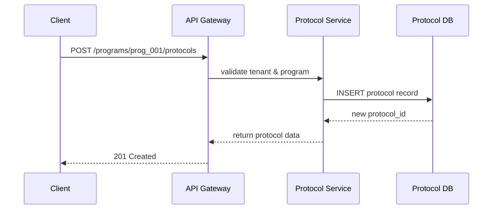

# Chapter 4: Protocol Model

In [Chapter 3: Program Model](03_program_model_.md), we saw how to bundle an entire service—like a Public Housing Application—under one **Program**. Now we’ll zoom in on the **Protocol Model**, which lays out each step of that service, just like a recipe card in a government kitchen. 

---

## 4.1 Why a Protocol Model?

Imagine you’ve created a “Public Housing Application” program. You still need a clear list of actions—“Verify Identity,” “Check Income,” “Collect Documents”—so both citizens and caseworkers follow the same process every time.

Use Case  
The State Housing Dept wants HMS-API to guide agents through a standard workflow when someone applies for housing:

1. Confirm the applicant’s identity  
2. Check their household income  
3. Upload proof of residency  
4. Approve or reject  

A **Protocol** captures these steps in order, with any conditions or data requirements.

---

## 4.2 Key Concepts

- **Protocol**  
  A container for an ordered list of **steps** (actions or checks) inside a **Program**.

- **Step**  
  An individual action or check (e.g., “Verify Identity”). Each step can have:
  - a name  
  - required inputs  
  - optional conditions (like “only run if income < $50k”).

- **Conditions**  
  Logic to skip or branch steps (e.g., skip “Tax Return” if applicant is employed).

- **Program Relationship**  
  Each Protocol links back to its parent Program by `program_id`.  

> Analogy: A Protocol is like a government form’s instruction sheet—step 1, step 2, step 3—so you never miss a requirement.

---

## 4.3 How to Use the Protocol Model

### 4.3.1 Create a Protocol

```http
POST /api/programs/prog_001/protocols
Content-Type: application/json

{
  "name": "Eligibility Screening",
  "steps": [
    { "name": "Verify Identity" },
    { "name": "Check Income", "conditions": { "maxIncome": 50000 } },
    { "name": "Upload Documents" }
  ]
}
```

What happens:  
- HMS-API checks your tenant and program context  
- Creates a new protocol linked to `prog_001`  
- Returns the protocol record

```json
{
  "id": "proto_100",
  "program_id": "prog_001",
  "name": "Eligibility Screening",
  "steps": [
    { "name": "Verify Identity" },
    { "name": "Check Income", "conditions": { "maxIncome": 50000 } },
    { "name": "Upload Documents" }
  ]
}
```

### 4.3.2 List Protocols for a Program

```http
GET /api/programs/prog_001/protocols
X-Tenant-ID: tenant_state_123
```

Response:
- An array of all protocols (and their steps) for `prog_001`.

---

## 4.4 What Happens Under the Hood?



1. **API Gateway** ensures your `X-Tenant-ID` and program exist.  
2. **Protocol Service** writes the protocol to the database.  
3. Data flows back to the client as JSON.

---

## 4.5 Internal Implementation

### File: app/Models/Core/Protocol/Protocol.php

```php
<?php
namespace App\Models\Core\Protocol;

class Protocol {
  protected $attributes = [];

  public function __construct(array $data = []) {
    $this->attributes = $data;
  }

  public function program() {
    // e.g. return $this->belongsTo(Program::class);
  }
}
```
This PHP model holds each protocol’s data and defines a link to its parent Program.

### File: models/protocol_model.js

```js
// models/protocol_model.js
class Protocol {
  constructor({ id, program_id, name, steps }) {
    this.id = id;
    this.programId = program_id;
    this.name = name;
    this.steps = steps;
  }

  static async create(data) {
    // Simplified DB insert
    const result = await db.insert('protocols', data);
    return new Protocol(result);
  }
}
module.exports = Protocol;
```
- `create()` inserts a new protocol and returns a Protocol instance.

### File: middleware/protocol.js

```js
// middleware/protocol.js
const Protocol = require('../models/protocol_model');

async function requireProtocol(req, res, next) {
  const proto = await Protocol.findById(req.params.protocolId);
  if (!proto) return res.status(404).json({ error: 'Protocol not found' });
  req.protocol = proto;
  next();
}
module.exports = requireProtocol;
```
- Verifies the protocol exists before handling requests.

---

## Conclusion

You’ve learned how the **Protocol Model** breaks a Program into clear, ordered steps—like a government “recipe” that guides users through every check and form. Next up, we’ll define and enforce high-level policies that govern these programs and protocols.  
[👉 Chapter 5: Policy Management API](05_policy_management_api_.md)

---

Generated by [AI Codebase Knowledge Builder](https://github.com/The-Pocket/Tutorial-Codebase-Knowledge)