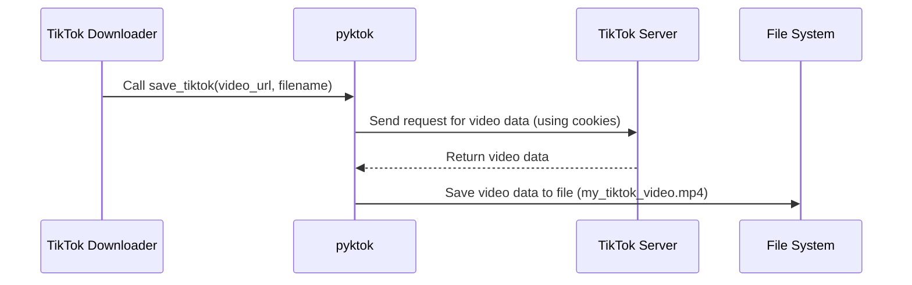

# Chapter 4: pyktok Library

In the previous chapter, [Platform-Specific Downloaders (TikTok, YouTube, Instagram)](03_platform_specific_downloaders__tiktok__youtube__instagram_.md), we saw how the TikTok downloader uses a special tool to fetch videos. This tool is the `pyktok` library, and this chapter will explore how it works.

## What Problem Does the `pyktok` Library Solve?

Imagine you want to download a TikTok video.  You could try to figure out how TikTok stores its videos and how to download them directly, but that's complicated! The `pyktok` library simplifies this process. It's like a specialized grabber tool designed specifically for picking up TikTok videos.

## Key Concepts

1. **`save_tiktok()` Function:** This is the main function in `pyktok` that does the heavy lifting.  It's like the claw of the grabber tool, reaching out and fetching the video.

2. **Cookies:**  TikTok requires cookies (small pieces of data) to allow access to its videos. `pyktok` handles these cookies behind the scenes, so you don't have to worry about them.  Think of cookies as a special key that unlocks the video.

3. **Video URL:** You need to tell `pyktok` which video to download by providing its URL. This is like pointing the grabber tool at the right video.

## Using `pyktok`

Here's a simplified example of how to use the `save_tiktok()` function:

```python
from lib.pyktok import save_tiktok

video_url = "https://www.tiktok.com/@example/video/12345"
file_name = "my_tiktok_video.mp4"
save_tiktok(video_url=video_url, save_video=True, browser_name="chrome", file_name=file_name)
# The video will be saved to the current directory as my_tiktok_video.mp4
```

This code imports the `save_tiktok` function, provides the TikTok video URL and the desired filename, and then calls the function to download the video.

## Internal Implementation

Here's a simplified sequence diagram showing how `save_tiktok()` works:



The `TikTok Downloader` calls `save_tiktok()` with the video URL and filename.  `pyktok` then sends a request to TikTok's servers, including the necessary cookies.  TikTok's servers send back the video data, and `pyktok` saves it to the specified file.

### Code Example: `lib/pyktok.py`

```python
# --- File: media-downloader/lib/pyktok.py ---
# ... (other code)

def save_tiktok(video_url, save_video=True, browser_name=None, file_name="default.mp4"):
    # ... (handle cookies and other details)

    # ... (extract video download URL from TikTok's response)
    tt_video_url = ... 

    # ... (download the video)
    tt_video = requests.get(tt_video_url, allow_redirects=True, headers=headers, cookies=cookies)
    with open(file_name, 'wb') as fn:
        fn.write(tt_video.content)

    # ... (other code)
```

This simplified code snippet shows the core of the `save_tiktok()` function. It retrieves the video download URL from TikTok's response and then uses the `requests` library to download the video data and save it to a file.

## Conclusion

In this chapter, we explored the `pyktok` library, the specialized tool for downloading TikTok videos. We learned about the `save_tiktok()` function and how it handles cookies and video URLs to fetch and save TikTok videos.  Next, we'll look at the [pytubefix Library](05_pytubefix_library.md), which is used for downloading YouTube videos.


---

Generated by [AI Codebase Knowledge Builder](https://github.com/The-Pocket/Tutorial-Codebase-Knowledge)