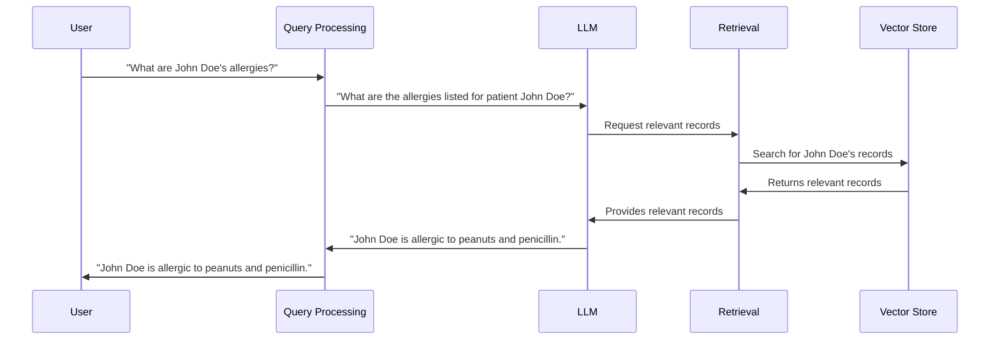

# Chapter 4: Retrieval

In the previous chapter, [Query Analysis](03_query_analysis.md), we learned how HMS-MED clarifies your questions. Now, let's see how it finds the right information to answer those questions. This is where Retrieval comes in.

Imagine you ask HMS-MED, "What allergies does John Doe have?". Retrieval is like a librarian searching the library (the [Vector Store](06_vector_store.md)) for books (medical records) containing information about John Doe's allergies.

## What Problem Does Retrieval Solve?

Retrieval helps us find the most relevant information within a vast amount of data.  Without it, the [LLM (Large Language Model)](02_llm__large_language_model_.md) would have to search through all the medical records, which would be very slow and inefficient.

## How Retrieval Works

Think of retrieval as a two-step process:

1. **Understanding the Question:**  Retrieval takes the clarified question from [Query Analysis](03_query_analysis.md) and figures out the key concepts, like "allergies" and "John Doe".

2. **Searching the Vector Store:** It uses these key concepts to search the [Vector Store](06_vector_store.md) for relevant pieces of information.  It's like searching a library catalog for books related to specific topics.

## Using Retrieval in HMS-MED

Let's continue with our example: "What allergies does John Doe have?".

1. The clarified question goes to the Retrieval component.
2. Retrieval identifies "allergies" and "John Doe" as key concepts.
3. Retrieval searches the [Vector Store](06_vector_store.md) for records related to John Doe and allergies.
4. It returns the most relevant records to the [LLM (Large Language Model)](02_llm__large_language_model_.md).

## Internal Implementation

Here's a simplified view of how Retrieval works within HMS-MED:



The code for retrieval can be found in `HMS-EHR/backend/retrieval.py`. Here's a simplified example:

```python
# ... other code ...

# This function creates the retriever object.
with make_retriever(config) as retriever:
    # This is where the retrieval happens.
    docs = retriever.get_relevant_documents(query)

# ... more code to process the retrieved documents ...
```

The `get_relevant_documents` function takes the query and returns the most relevant documents from the [Vector Store](06_vector_store.md).  The actual implementation is more complex, but this simplified example shows the core idea.  The `make_retriever` function sets up the connection to the [Vector Store](06_vector_store.md), as explained in the [Vector Store](06_vector_store.md) and [Ingestion](07_ingestion.md) chapters.

## Conclusion

Retrieval is a crucial step in finding the right information to answer your questions. It acts as a bridge between the clarified question and the vast amount of data stored in the [Vector Store](06_vector_store.md). Now, let's explore how we represent text as vectors, which is essential for efficient retrieval: [Embeddings](05_embeddings.md).


---

Generated by [AI Codebase Knowledge Builder](https://github.com/The-Pocket/Tutorial-Codebase-Knowledge)