# Chapter 4: Role-Based Access Control (RBAC) & Multi-Tenant Security  
*(“A Key for Every Door, A Wall for Every Office”)*  

[← Back to Chapter 3: Data Privacy & Compliance Engine](03_data_privacy___compliance_engine_.md)

---

## 1. Motivation — The “Shared Cloud, Separate Secrets” Story

Picture a single Kubernetes cluster that hosts **three very different tenants**:  

1. Centers for Medicare & Medicaid Services (CMS)  
2. Environmental Management Agency (EMA)  
3. A contractor building a *FOIA* chatbot for the Department of Labor  

All three push code to the same servers, but:

* **CMS** data contains protected health info (PHI).  
* **EMA** data contains hazardous-material routes (national-security sensitive).  
* **Contractor** data is draft code that nobody else should see.  

If a CMS clerk could accidentally query EMA’s database, or the contractor could peek at PHI, the platform would be shut down in minutes.

**RBAC + Multi-Tenant Security** solve this by giving every person exactly one *key* (role) and building invisible *walls* (tenants) between agencies.

---

## 2. Key Concepts (Beginner Edition)

| Concept | 1-line Definition | Analogy |
|---------|------------------|---------|
| Role | A named bundle of permissions (e.g., `citizen`, `clerk`) | Badge color on a lanyard |
| Permission | A single action you may take (`read:claim`, `write:policy`) | Door you can open |
| Tenant | A logical slice of the platform that owns its own data & configs | Separate office suite on the same floor |
| Policy | A file that maps roles → permissions inside a tenant | Office directory posted near the elevator |
| Least Privilege | Rule that you only get the doors you truly need | No master keys for interns |

---

## 3. Quick Start: Create a Tenant, Roles & Policies

We will build a **demo tenant** for CMS and show how a clerk views claims while an auditor sees logs.

### 3.1 Define the Tenant

`cms.tenant.yml`

```yaml
tenant: CMS
db_schema: cms_prod          # physical separation
network_namespace: cms_vnet  # virtual network slice
```

**Explanation:** Names a slice of database & network reserved for CMS.

### 3.2 Declare Roles & Permissions

`cms.roles.yml`

```yaml
roles:
  citizen:
    - read:my_claim
  clerk:
    - read:claim
    - write:claim
  supervisor:
    - *clerk
    - approve:claim
  auditor:
    - read:logs
```

*YAML tricks:* `*clerk` copies the clerk’s list.

### 3.3 Assign Users to Roles

`cms.users.yml`

```yaml
users:
  alice.ssa.gov: citizen
  bob.cms.gov:   clerk
  cara.oig.gov:  auditor
```

---

## 4. Using RBAC — 6 Lines of Python

```python
import rbac               # tiny helper module
rbac.bootstrap("cms")     # loads the three YAML files

user = "bob.cms.gov"
ok = rbac.allowed(user, "write:claim")
print(ok)                 # 👉 True
```

What happened?

1. `bootstrap("cms")` grabs tenant + roles + users for CMS only.  
2. `allowed()` checks if Bob’s role (`clerk`) contains `write:claim`.  

---

## 5. Under the Hood — The 5-Step Dance

```mermaid
sequenceDiagram
participant User as Bob
participant API as Claim API
participant RBAC as RBAC Service
participant CMSDB as CMS DB
User->>API: PUT /claim/123
API->>RBAC: Allowed("bob", "write:claim", tenant=CMS)?
RBAC-->>API: ✅ yes
API->>CMSDB: update claim 123
API-->>User: 200 OK
```



*If Bob tried `read:logs`, RBAC would reply ❌ and the request would stop.*

---

## 6. Multi-Tenant Isolation Tricks (No Code, Just Ideas)

1. **Separate Schemas** – Each tenant gets its own Postgres schema (`cms_prod`, `ema_prod`, …).  
2. **Network Policies** – Kubernetes NetworkPolicies block cross-tenant traffic.  
3. **Secret Stores per Tenant** – CMS tokens live in `vault/cms/`, EMA tokens in `vault/ema/`.  
4. **Resource Quotas** – Prevent one tenant from hogging CPU/Memory.  
5. **Namespace Labels** – Service Mesh only routes traffic inside the same tenant label.

You rarely touch these knobs directly—HMS-MCP sets them up automatically from `*.tenant.yml`.

---

## 7. Internal Implementation — Peeking Into the Files

### 7.1 Minimal RBAC Checker (`rbac/__init__.py` — 15 lines)

```python
import yaml, pathlib

DATA = {}

def bootstrap(tenant):
    for file in ["tenant", "roles", "users"]:
        path = pathlib.Path(f"{tenant}.{file}.yml")
        DATA[file] = yaml.safe_load(path.open())
        
def role_of(user):
    return DATA["users"]["users"].get(user)

def allowed(user, permission):
    role = role_of(user)
    if not role: return False
    return permission in DATA["roles"]["roles"][role]
```

*Super tiny:* Loads YAML once, then checks membership.

### 7.2 Tenant-Aware Database Helper (`db.py` — 12 lines)

```python
import psycopg2, rbac, contextvars
tenant_ctx = contextvars.ContextVar("tenant")

def connect():
    schema = rbac.DATA["tenant"]["db_schema"]
    conn = psycopg2.connect("dbname=hms")
    conn.cursor().execute(f"SET search_path TO {schema}")
    return conn
```

Every query is auto-scoped to the right schema—Bob can’t reach EMA tables.

---

## 8. Folder Map (Partial)

```
hms-rbac/
 ├─ rbac/            # tiny checker code
 ├─ db.py            # tenant-aware DB connector
 ├─ cms.tenant.yml
 ├─ cms.roles.yml
 ├─ cms.users.yml
 └─ ema.*.yml        # another tenant, similar pattern
```

---

## 9. Tips & Gotchas

* **Avoid “God Roles.”** A role with `*` (all permissions) defeats the point.  
* **Automate Audits.** Export `users → roles` weekly to HMS-GOV for oversight.  
* **Rotate Secrets.** Each tenant’s secret store should have its own rotation schedule.  
* **Cross-Tenant Services.** If a shared microservice is *really* needed, expose it through the [Backend API Gateway](07_backend_api_gateway__hms_api__.md) and add strict request tagging.

---

## 10. Recap & Next Steps

You now know how HMS-MCP:

1. Maps people → roles → permissions.  
2. Keeps tenants walled off even on the same cluster.  
3. Uses tiny YAML files + a 15-line helper to grant or deny every request.  

In the next chapter we’ll see **how services are deployed and versioned** within those tenants. Get ready for [Management Layer (HMS-MGT / HMS-SVC)](05_management_layer__hms_mgt___hms_svc__.md)!

---

Generated by [AI Codebase Knowledge Builder](https://github.com/The-Pocket/Tutorial-Codebase-Knowledge)